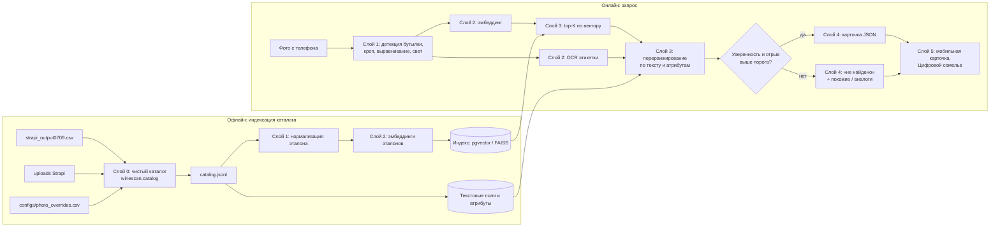

# Архитектура

Документ описывает целевой пайплайн сканера и границы слоёв, которые требует ТЗ:
нормализация фото → извлечение признаков → поиск по каталогу → выдача карточки →
дополнительный функционал. Реализован пока только слой 0 (данные каталога). Для остальных
слоёв зафиксированы контракты и план; решения в них — **предложения, ещё не проверенные
замерами**. Факты о данных, на которые опирается архитектура, — в [docs/DATA.md](docs/DATA.md).

## 1. Требования, которые определяют архитектуру

| Требование ТЗ / скрипта оценки | Следствие для архитектуры |
|---|---|
| Одна карточка на фото, точность 90–100% (50 баллов из 100) | главный слой — поиск с переранжированием; нужна калиброванная уверенность и отрыв top-1 от top-2 |
| Near-duplicates: одна этикетка, разный год, сезон, категория | глобальный эмбеддинг не различит; нужен текст этикетки (OCR) и атрибуты каталога |
| Эталон — одна студийная фотография на вино; запросы — фото с телефона у полки | нормализация запроса (найти и вырезать бутылку) и одинаковая нормализация эталонов |
| `POST` multipart, поле `image`, ответ `{"slug": "..."}` или `[{"slug": ...}]`; timeout 10 с; запросы строго последовательно | отдельный лёгкий эндпоинт оценки; прогретые модели; целевое время < 3 с |
| В API показать уверенность для top-1 и top-5 | ответ полного API содержит top-5 со скорами |
| Вина нет в каталоге → похожие вина или аналоги из других виноделен | порог уверенности (open-set) и отдельный поиск аналогов по атрибутам |
| Mobile-first карточка в стиле «Своё вино»; функция после поиска (20 баллов) | фронтенд отделён от сервиса поиска и потребляет только JSON-карточку |
| Рекомендованный стек: Nuxt, PostgreSQL + pgvector, SigLIP 2, Strapi, Docker | ориентир; ML-часть на Python, векторный поиск совместим с pgvector |
| Демо на компьютере команды, GPU есть не всегда | инференс работает и на CPU (медленнее), модели загружаются локально |

## 2. Пайплайн



## 3. Слои

### Слой 0. Данные каталога — **реализован**

**Задача.** Из CSV-выгрузки и папки uploads Strapi получить чистый каталог: одна запись на
вино, у каждой записи файл эталонного изображения и объяснение, почему выбран именно он.

**Вход.** `strapi_output0709.csv`, распакованная `strapi/uploads`,
`configs/photo_overrides.csv`.
**Выход.** `artifacts/catalog/` (состав — в README.md). Главный контракт для следующих слоёв —
`catalog.jsonl`:

```json
{
  "slug": "leto-kaberne-fran-2021-suhoe-krasnoe",
  "name": "LETO Каберне Фран 2021 сухое красное",
  "winery": "LETO", "region": "Кубань", "category": "Красное", "color": "Насыщенный рубиновый",
  "grapes": ["Каберне Фран"],
  "description": "…",
  "attributes": {"year": 2021, "sweetness": "dry", "sparkling": false, "volume_l": null},
  "image": {"file": "Vino_suhoe_krasnoe_KABERNE_FRAN_3c69650ca3.webp", "status": "manual",
            "width": 1918, "height": 2558, "source_photo_name": "Вино сухое красное КАБЕРНЕ ФРАН 2021 .webp"}
}
```

`image.file` — имя файла относительно `WINESCAN_UPLOADS_DIR`. `sweetness` ∈ `dry`, `semi_dry`,
`semi_sweet`, `sweet`, `brut`, `extra_brut`, `brut_nature` или `null`.

**Модули и границы.**

| Модуль | Отвечает за | Не знает про |
|---|---|---|
| `loader.py` | чтение CSV, дедупликация, нормализация пробелов, список сортов | файлы, изображения |
| `attributes.py` | год, сладость, игристое, объём из названия и slug | файлы, изображения |
| `strapi_names.py` | правила именования Strapi: транслит, ключи имён, уменьшенные копии | pandas, диск |
| `images.py` | чтение изображения: размеры, прозрачность, фон, sha256, pHash, «студийность» | каталог |
| `matching.py` | индекс uploads, кандидаты по имени, разрешение неоднозначностей, ручные решения | формат отчётов |
| `review.py`, `report.py` | контактные листы и markdown-отчёт | правила привязки |
| `build.py` | оркестрация и запись артефактов (единственный модуль с побочными эффектами на диске) | — |
| `config.py` | пути и переменные окружения | — |

**Алгоритм привязки фото** (`matching.py`). Дампа базы нет, поэтому связь восстанавливается
так:

1. **Кандидаты по имени.** Ключ имени = транслит как в slugify Strapi (`ц→cz`, `ь/ъ` выпадают,
   `№` выпадает), нижний регистр, только `[a-z0-9]`. Разделители игнорируются, потому что
   Strapi разбивает CamelCase (`DSC09173` → `DSC_09173`). Запасной ключ — с расширением
   (`x.png`, пересохранённый в webp, лежит как `x_png_<hash>.webp`). Уменьшенные копии
   `thumbnail_/small_/medium_/large_` исключаются, только если рядом есть оригинал.
2. **Если кандидатов несколько**, решения принимаются по порядку, первое сработавшее побеждает:

   | Шаг | Статус | Правило | Проверка |
   |---|---|---|---|
   | 1 | `same_content` | все кандидаты одинаковы: sha256 или pHash ≤ 6 | 20 случаев с разными байтами просмотрены: везде одна бутылка |
   | 2 | `exact_name` | ровно у одного кандидата имя совпадает с учётом границ слов | **2 из 4 случаев опровергнуты этикеткой** → исправлено вручную |
   | 3 | `upload_time` | кандидат загружен ≤ 2 ч от однозначных фото той же винодельни, следующий ≥ 24 ч | 13 из 13 верны по контактным листам |
   | 4 | `winery_batch` | кандидаты большинства других вин винодельни лежат в пределах 1 ч от этого кандидата | 9 из 9 верны |
   | 5 | `ambiguous` | догадка: самый «студийный» кадр, затем самый крупный | 4 из 6 верны → все 6 решены вручную |

   Основание для шагов 3–4: на однозначных привязках у 97% фото есть другое фото той же
   винодельни в пределах часа, а у фото чужой винодельни — только у 27%.
3. **Ручные решения** (`manual`) применяются последними. Для вин без найденного файла
   сборка предлагает кандидатов: похожие имена и непривязанные студийные фото из пачки
   загрузки винодельни. Все 5 таких вин в выгрузке 0709 решились этим способом.

**Итог на выгрузке 0709:** эталон есть у 2103 из 2103 вин; `unique` 2023, `same_content` 43,
`exact_name` 2, `upload_time` 13, `winery_batch` 9, `manual` 13.

**Почему так.**
- *Воспроизводимость.* Любое решение объяснено в `photo_matching.csv`, ручные решения лежат в
  git с причинами, артефакты пересобираются одной командой.
- *Не прятать неопределённость.* Неразрешённые случаи не выбрасываются: получают статус,
  попадают в отчёт и на контактные листы.
- *Пополнение каталога* (~50 вин в день по ТЗ) обрабатывается той же сборкой: новые
  неоднозначности всплывут в отчёте.

### Слой 1. Нормализация фото — план

**Контракт.** `normalize(image bytes) -> NormalizedImage` (RGB-кроп бутылки или этикетки
фиксированного размера + метаданные: bbox, угол, оценка качества). Одна и та же функция
применяется к эталонам (офлайн) и к запросам (онлайн).

**Почему нужен.** Эталоны на 92% с вырезанным фоном, соотношение сторон ~3,5 (одна бутылка во
весь кадр). Запросы — 3024×4032, в кадре соседние бутылки, ценники, блики, перспектива.
Организаторы прямо подсказывают, что нормализация заметно улучшает F1.

**План.**
1. Детекция бутылок (open-vocabulary детектор или YOLO, дообученный на эталонах) и выбор
   центральной и крупной. В каталоге не только бутылки: около 25 вин продаются в bag-in-box,
   тетрапаке и банках, поэтому детектор должен находить упаковку вообще.
2. Кроп бутылки, затем этикетки; выравнивание поворота и перспективы.
3. Нормализация освещения (баланс белого, CLAHE), подавление бликов.
4. Эталоны: заливка прозрачного фона и кроп по альфа-каналу.

Выбор детектора — по замеру на размеченных вручную запросах.

### Слой 2. Извлечение признаков — план

**Контракт.** `embed(NormalizedImage) -> vector[d]` (L2-нормированный) и
`read_label(NormalizedImage) -> LabelText` (токены и найденные год, сладость, объём).

**План.**
- Визуальный эмбеддинг: SigLIP 2 (рекомендован ТЗ). Сравнить размеры base и so400m по
  качеству и времени; при нехватке качества дообучить на аугментациях эталонов (перспектива,
  блики, фон полки, размытие, JPEG), чтобы сократить разрыв «студия ↔ полка».
- OCR этикетки: нужен именно для near-duplicates. Проверка на эталонах показала, что вина
  одной серии отличаются от повторных загрузок того же фото меньше, чем те — между собой
  (pHash 0–2, разница цвета на миниатюре 16×16 — 0,2–0,5 из 255). ТЗ предупреждает, что OCR
  увеличивает время ответа, поэтому его запуск можно ограничить случаями, когда top-кандидаты
  близки.

### Слой 3. Поиск и уверенность — план

**Контракт.** `search(query) -> Ranked[slug, score, evidence]` + `decision ∈ {found, not_found}`.

**План.**
1. Top-K (K ≈ 20–50) по косинусной близости визуального эмбеддинга (pgvector или FAISS;
   на 2–5 тыс. вин точный перебор укладывается в миллисекунды).
2. Переранжирование: визуальный скор + совпадение OCR-токенов с названием, винодельней и
   сортом + согласие атрибутов (год, сладость, игристое) с `catalog.jsonl.attributes`.
3. Группы вин с **одинаковым** эталоном (64 вина с байт-в-байт одинаковыми изображениями,
   см. docs/DATA.md) по изображению неразличимы: решает только текст.
4. Уверенность: калибровка скоров (например, температурный softmax по top-K), отрыв top-1
   от top-2; порог «не найдено» подбирается на валидации, включая вина вне каталога.

### Слой 4. API — план

| Эндпоинт | Назначение | Ответ |
|---|---|---|
| `POST /v1/eval/predict` (multipart `image`) | скрипт оценки кейсодержателя | `{"slug": "…"}` |
| `POST /v1/scan` (multipart `image`) | фронтенд | `{"status": "found" \| "not_found", "card": {…}, "confidence": {"top1": …, "top5": […]}, "alternatives": […]}` |
| `GET /v1/wines/{slug}` | открыть карточку | карточка из `catalog.jsonl` + ссылка на изображение |

Сервис инференса на Python держит модели в памяти. Бэкенд или BFF на Nuxt (рекомендация ТЗ)
проксирует запросы и отдаёт фронтенд. Всё в Docker Compose.

### Слой 5. Интерфейс и функция после поиска — план

Mobile-first карточка в стиле портала «Своё вино» (стили берём с портала, как разрешает ТЗ).
Функция после поиска: «Цифровой сомелье» (LLM задаёт наводящие вопросы, выбирает вино из
каталога) и подбор аналогов из других виноделен по сорту, региону, цвету и сладости.
Детализация — после слоёв 1–4.

## 4. Риски

| Риск | Где видно | Что делаем |
|---|---|---|
| Near-duplicates | 844 вина в 262 группах pHash ≤ 4; 64 вина с одинаковыми байтами эталона | OCR и атрибуты в переранжировании; валидация именно на этих группах |
| Разрыв «студия ↔ полка» | эталоны 336×1080 (медиана) с вырезанным фоном против 3024×4032 у полки | слой 1; аугментации эталонов; дообучение |
| Мало данных для валидации | публичный набор — 3 фото | собрать свою валидацию: снять бутылки, синтетика из эталонов |
| Вина вне каталога в проверке | 2 из 3 публичных фото не нашлись по названию | порог «не найдено», аналоги; уточнить у организаторов |
| Ошибки контента в каталоге | 11 файлов привязаны к двум винам сразу, часть — явно чужие фото; 2 эталона — атмосферные снимки без бутылки | не исправляем данные молча; список — в docs/DATA.md, передать организаторам |
| Время ответа | OCR дорогой, SLA 3 с | OCR по условию; замер на RTX 3090 и на CPU |

## 5. Журнал архитектурных решений

| # | Решение | Альтернативы | Почему |
|---|---|---|---|
| D1 | Привязка «вино → файл» по имени + времени загрузки + ручные решения | ждать дамп БД; визуальный поиск эталона | дампа нет; имя даёт 96% однозначно, остальное проверяемо глазами |
| D2 | Ручные решения — CSV в git с причиной на каждую строку | править CSV кейса; хардкод | прозрачно, воспроизводимо, переживает новую выгрузку |
| D3 | Артефакты не в git, собираются одной командой | коммитить parquet и листы | данные кейса чужие и большие; отчёт сборки фиксирует состояние |
| D4 | Слой данных на Python (pandas, Pillow) | Node/Nuxt | ML-слои тоже на Python; один язык для офлайн-части |
| D5 | Атрибуты вина — эвристики по названию и slug, с тестами | LLM-извлечение | детерминированно и быстро; для год/сладость этого достаточно на старте, покрытие года низкое (5,5%) — пересмотреть при переранжировании |
| D6 | `exact_name` оставлен автоматическим шагом, но его решения выводятся на контактный лист | убрать шаг | правило отражает связь из CSV буквально; в 2 из 4 случаев CSV сам ошибается, это видно только глазами |
