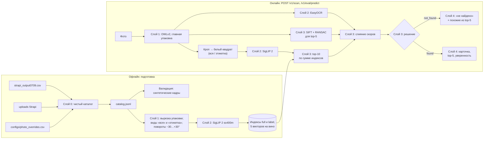

# Архитектура

Документ описывает пайплайн сканера и границы слоёв, которые требует ТЗ: нормализация
фото → извлечение признаков → поиск по каталогу → выдача карточки → дополнительный
функционал. Слои 0–5 реализованы; слои 0–4 измерены на синтетике и 3 публичных фото. Факты о данных — [docs/DATA.md](docs/DATA.md), все числа прогонов —
[docs/RESULTS.md](docs/RESULTS.md) (генерируется), ход работ — [docs/WORKLOG.md](docs/WORKLOG.md).

> Почти все метрики получены на **синтетической** выборке (раздел 4): в кадре те же пиксели,
> что в эталоне, поэтому числа оптимистичны. Пресет `v3` портит печать целевой упаковки (сдвиг
> цвета, тона и гаммы, растр, пересжатие) — на парных сценах это не меняет ничего: top-1 0,710
> против 0,703 в контроле (p = 0,56). Поблажку это не снимает: вёрстка и надписи остаются теми же
> пикселями эталона. Реальных полевых фото с разметкой у нас 3.

## 1. Требования, которые определяют архитектуру

| Требование ТЗ / скрипта оценки | Следствие для архитектуры |
|---|---|
| Одна карточка на фото, точность 90–100% (50 баллов из 100) | поиск + переранжирование кандидатов; уверенность и отрыв top-1 от top-2 в ответе |
| Near-duplicates: одна этикетка, разный год, сезон, категория | глобального эмбеддинга мало: вид «этикетка», локальные признаки (SIFT), текст (OCR) |
| Эталон — одна студийная фотография на вино; запросы — фото у полки | детекция упаковки и одинаковая нормализация эталона и запроса |
| `POST` multipart `image` → `{"slug": "..."}`; timeout 10 с; запросы последовательно | эндпоинт `/v1/eval/predict`, модели прогреты при старте, ответ всегда top-1 |
| Показать уверенность для top-1 и top-5 | `/v1/scan` отдаёт top-5 со всеми составляющими скора |
| Вина нет в каталоге → похожие / аналоги или честное «не найдено» | решение `decide` по визуальному скору и отрыву; top-5 как «похожие» |
| Mobile-first карточка, функция после поиска (20 баллов) | фронтенд отделён и потребляет только JSON |
| Рекомендованный стек: Nuxt, PostgreSQL + pgvector, SigLIP 2, Strapi, Docker | ориентир: SigLIP 2 используется; поиск — точный перебор в numpy (совместим с переносом в pgvector) |
| GPU может не быть | код работает на CPU, но пригоден лишь для дымовой проверки: на Xeon E5-2670 v2 полная конфигурация отвечает 86–88 с при таймауте скрипта 10 с, а облегчённая укладывается в 0,7–1,1 с ценой неверных ответов (docs/WORKLOG.md, раздел 6). Модели грузятся локально |

## 2. Пайплайн



## 3. Границы пакетов

| Пакет | Слой | Отвечает за | Может импортировать |
|---|---|---|---|
| `winescan.catalog` | 0 | CSV, правила имён Strapi, привязка фото, отчёт | pandas, Pillow |
| `winescan.vision` | 1–2 | `preprocess` (вырезка, кроп, квадрат, виды), `detector` (OWLv2, вес и выбор K рамок), `embedder` (SigLIP 2), `ocr` (EasyOCR), `vlm` (Qwen3-VL, поля этикетки), `cylinder` (поворот цилиндра для синтетики и галереи) | torch, transformers, easyocr |
| `winescan.search` | 3 | `index` (точный индекс, несколько векторов на вино), `build_index` (виды и ракурсы), `multi` (сумма индексов), `box_selection` и `box_ranker` (выбор рамки), `local_match` и `local_features` (SIFT и хранилище признаков эталонов), `deep_match` (ALIKED + LightGlue, тот же интерфейс; выключен, D21), `metric` (линейное преобразование эмбеддингов; выключено, D23), `verify` (признаки проверки, сопоставитель — параметр), `text_match`, `fields` (поля VLM), `fusion` (логистическая регрессия), `rerank` (слияние и решение) | vision, OpenCV, scikit-learn |
| `winescan.product` | 5 | `analogs` (аналоги других виноделен), `sommelier` (правила сочетаний) | только каталог |
| `winescan.service` | 4 | `pipeline` (Scanner и конфиг), `app` (FastAPI) | search, vision, product |
| `winescan.validation` | валидация | генератор синтетических кадров (пресеты v1, v2) | vision.preprocess, vision.cylinder |
| `winescan.eval` | измерения | метрики, прогоны, кэши запросов и офлайн-эксперименты, таблица кандидатов, обучение выбора рамки и слияния, IoU детектора, сводная таблица | search, vision, validation |
| `web/` | 5 | мобильный интерфейс (Nuxt 4), прокси `/api/**` на сервис | только HTTP API |

Правила: `service` не зависит от `eval` и `validation`; `text_match`, `rerank`, `fusion`,
`box_ranker`, `index`, `metrics`, `product` не требуют моделей и покрыты unit-тестами без GPU;
модели в `service.app` передаются фабрикой, поэтому API тестируется с поддельным сканером.
Обученные модели (`configs/box_ranker_v2.joblib`, `configs/fusion_v2.json`, а также выключенное
`configs/metric_v1.npz`) обучаются в `eval`, а сервис только читает файлы.

## 4. Слои

### Слой 0. Данные каталога — реализован

Из CSV-выгрузки и uploads Strapi собирается `catalog.jsonl` — одна карточка на вино с файлом
эталона. Дампа базы нет, поэтому связь «вино → файл» восстановлена по правилам имён Strapi,
времени загрузки и 13 ручным решениям; эталон есть у всех 2103 вин. Подробности алгоритма и
проверок — docs/DATA.md, раздел 4.

Контракт карточки (используется API и фронтендом):

```json
{
  "slug": "leto-kaberne-fran-2021-suhoe-krasnoe",
  "name": "LETO Каберне Фран 2021 сухое красное",
  "winery": "LETO", "region": "Кубань", "category": "Красное", "color": "Насыщенный рубиновый",
  "grapes": ["Каберне Фран"],
  "description": "…",
  "attributes": {"year": 2021, "sweetness": "dry", "sparkling": false, "volume_l": null},
  "image": {"file": "Vino_suhoe_krasnoe_KABERNE_FRAN_3c69650ca3.webp", "status": "manual",
            "width": 1918, "height": 2558, "source_photo_name": "Вино сухое красное КАБЕРНЕ ФРАН 2021 .webp"}
}
```

### Слой 1. Нормализация фото — реализован

**Контракт.** `detect(image) → [Detection]`, `choose_main_package(detections) → box`,
`reference_view(image, view)` / `query_view(image, box, view)` → RGB-квадрат.

- **Детекция упаковки:** OWLv2 base (`google/owlv2-base-patch16-ensemble`), zero-shot по
  подсказкам «a bottle of wine», «a box of wine», «a can of wine», «a carton of wine»:
  в каталоге около 25 вин в bag-in-box, тетрапаке и банках.
- **Выбор главной упаковки** (v3). Рамки с уверенностью < 0,15 отбрасываются. Вес рамки =
  уверенность × √min(площадь, 0,1) × (0,1 + 0,9 × центральность); если внутри рамки ≥ 2
  уверенные рамки (группа бутылок), вес × 0,5. Доля кадров синтетики с IoU ≥ 0,5:

  | стратегия | seed 0 (подбор) | seed 1 (проверка) |
  |---|---|---|
  | максимум уверенности | 0,613 | 0,618 |
  | v1: уверенность × √площадь × центральность | 0,838 | 0,835 |
  | v2: потолок площади 0,3, штраф группе 0,3 | 0,882 | 0,877 |
  | v3: параметры по сетке на seed 0 | 0,905 | 0,897 |

  На публичном фото Массандры v1 выбирал рамку вокруг группы бутылок; v2 и v3 выбирают
  центральную бутылку (v3 — её нижнюю часть с этикеткой). Задержка детектора ~200–320 мс.
- **Рамка пользователя отменяет выбор.** `POST /v1/scan` принимает `box` в долях кадра; тогда
  детектор не запускается. Это главный практический вывод замеров: идеальная рамка даёт top-1
  0,775 против 0,663 у автоматического выбора, и этот разрыв не берётся ни геометрией, ни
  уверенностью поиска, ни проверкой совпадений (WORKLOG, «Где на самом деле остался резерв»).
- **Обучаемый выбор из 3 рамок** (`search/box_ranker.py`, по умолчанию в сервисе).
  - Все 3 лучшие по весу рамки (IoU между ними ≤ 0,6) эмбеддятся одним батчем.
  - Бустинг по геометрии, уверенности детектора, весу и результату поиска по рамке выбирает
    одну. Метка при обучении — IoU с настоящей рамкой ≥ 0,5; обучение на fold 0 `synth_v1` и
    `synth_v2`.
  - Результат: верная рамка 0,817 → 0,845, top-1 `synth_v2` 0,642 → 0,661.
  - Ручное правило «вес + уверенность поиска» прироста не дало: соседние бутылки тоже есть в
    каталоге, и уверенность поиска по ним такая же (WORKLOG).
- **Нормализация:** эталон — вырезка по альфа-каналу или по белому фону, связанному с краем;
  запрос — кроп по рамке (+3%); оба вписываются в белый квадрат с полями 4% (процессор SigLIP
  растягивает кадр до квадрата, а бутылка вытянута в 3,5 раза). EXIF-поворот учитывается.
- **Виды:** `full` — вся упаковка; `label` — 0,40–0,97 высоты высокой упаковки, где обычно
  этикетка.

**Эффект нормализации** (so400m, один индекс, синтетика, top-1): весь кадр без кропа — 0,254;
кроп детектором v1 — 0,732; идеальный кроп — 0,853. Подсказка организаторов подтверждается.
На двух индексах детектор v3 даёт 0,819 против 0,904 с идеальным кропом. Потери при v3:
у ~10% кадров выбирается соседняя бутылка; каждая соседняя бутылка в кадре стоит ~2,5 п.п.

**Итог сквозного пайплайна с настройками сервиса** (синтетика, 2103 кадра: детектор v3, два
индекса, SIFT 0,15, текст 0,02):

| top-1 | top-5 | top-1 похожие вина | top-1 общий эталон | F1@1 |
|---|---|---|---|---|
| 0,858 | 0,911 | 0,818 | 0,458 | 0,859 |

С идеальным кропом тот же поиск даёт 0,942 / 0,990, так что главный резерв — детекция.

**Текущие умолчания сервиса.** Галерея с поворотами, 3 рамки с обучаемым выбором, гибрид
проверки кандидатов. Сквозной прогон `eval.scanner_eval --holdout` — только запросы, не
использованные при обучении моделей:

| Сплит | top-1 | top-5 | серии | верный ответ / неверный / отказ |
|---|---|---|---|---|
| `synth_v2` (533) | 0,702 | 0,780 | 0,703 | 0,685 / 0,220 / 0,096 |
| `synth_v1` (650) | 0,869 | 0,934 | 0,795 | 0,866 / 0,120 / 0,014 |

Задержка на свободной RTX 3090: p50 1,02 с, p95 1,59 с.

### Слой 2. Извлечение признаков — реализован

- **Визуальные эмбеддинги SigLIP 2.** На идеальном кропе top-1 / top-5: base-224 — 0,659 /
  0,907, so400m-384 — 0,853 / 0,987. Выбрана so400m (эмбеддинг на RTX 3090 ~30–60 мс).
- **Вид «этикетка»** — отдельный индекс той же модели.
- **OCR:** EasyOCR (ru + en) по кропу упаковки, 150–700 мс. На синтетике текст плохой
  (в среднем 29 символов, 6% пусто), на реальных фото крупные надписи читаются
  («МУСКАТЕЛЬ … 2023», «ARISTOV … БРЮТ 2023»).
- **Локальные признаки:** SIFT (2000 точек, CLAHE) на кропе упаковки и на эталоне.

### Слой 3. Поиск, слияние, решение — реализован

1. **Top-10 по сумме индексов** `full` и `label` (веса 0,5 / 0,5). Точный перебор:
   2103 × 1152 — миллисекунды. Идеальный кроп, top-1: только full — 0,853; 0,3/0,7 — 0,905;
   0,5/0,5 — 0,904; 0,7/0,3 — 0,893. Для похожих вин (pHash-группы) 0,796 → 0,866.
   - **Мультиракурсная галерея.** В каждом индексе у высокой упаковки 5 векторов: эталон,
     повёрнутый как цилиндр на −30, −15, 0, 15, 30°. Скор вина — максимум по его векторам;
     всего 10 483 вектора.
   - Первая рамка, top-1: `synth_v1` 0,812 → 0,826, `synth_v2` 0,618 → 0,642; с настоящей
     рамкой на `synth_v2` 0,743 → 0,768.
   - Оговорка: повороты запросов `synth_v2` делает та же функция, поэтому на v2 выигрыш может
     быть завышен.
2. **Слияние:** скор = визуальный + `local_weight` × бонус(SIFT-inliers) + `text_weight` ×
   сходство текста. Бонус = log(1+min(n,150)) / log(151).
   - SIFT на синтетике, top-1:
     - только full, идеальный кроп: 0,854 → 0,937 при весе 0,8;
     - два индекса, идеальный кроп: 0,901 → 0,942 при весе 0,2, дальше плато;
     - сквозной прогон с детектором v2: 0,806 → 0,847 при весе 0,15.
     **На реальном фото Массандры** у верного «Мускателя белого» 63 inliers, у «Мускателя
     розового» той же серии — 87: вёрстка одинакова, а SIFT не видит цвета. Вес больше ~0,24
     испортил бы этот ответ, поэтому по умолчанию берётся осторожный вес (раздел 6, D10).
   - Текст на синтетике почти ничего не даёт (+0,3 п.п. при весе 0,01) из-за плохого OCR;
     на реальном фото Массандры исправляет ответ уже при весе 0,02 («белый» +1,50 против
     «розовый» +1,07).
   - Сравнение текста: транслит, стоп-слова, нечёткое совпадение слов и по «скелету» согласных
     (`Chardonnay`/«Шардоне»); год и сладость дают ±0,3 / ±0,2.
3. **Обученное слияние и гибрид** (`search/verify.py`, `search/fusion.py`).
   - Для top-5 считаются признаки проверки: доля inliers, покрытие этикетки, NCC и цветовое
     расстояние после гомографии, перекрытие. Логистическая регрессия даёт логит «это то же
     вино».
   - Проверочная половина v1+v2: по top-1 слияние не лучше ручного веса (v2: 0,737 против
     0,754). Как уверенность для отказа оно лишь немного сильнее визуального скора: AUROC
     0,815 против 0,777. Прежние 0,95 были завышены утечкой в негативах (D18).
   - **Гибрид** (`WINESCAN_FUSION_RANK=0`): порядок — ручное слияние на inliers той же
     проверки, уверенность — логит слияния для лучшего кандидата. На общих отложенных запросах
     `synth_v2` сквозной top-1 — 0,702: у ручного слияния с SIFT на исходном кропе 0,690, у
     ранжирования слиянием 0,687.
4. **Решение** `decide`: «не найдено», если визуальный скор top-1 ниже порога (вина нет в
   каталоге), уверенность ниже порога логита слияния или отрыв меньше порога.
   - Порог логита — не больше 2% ложных отказов на синтетике (D15). Он отклоняет лишь ~3% вин
     вне каталога на синтетике и сидит в скоплении логитов около −1,0 у кандидатов без
     совпадений SIFT, поэтому хрупок. На двух реальных винах вне каталога логит выше порога.
   - Визуальный порог 0,74 на галерее с поворотами:

     | Сплит | ложные отказы | отклонено вин вне каталога |
     |---|---|---|
     | `synth_v1` | 1,9% | 6,9% |
     | `synth_v2` | 6,6% | 12,7% |

     Оба реальных вина вне каталога он отсекает: скоры 0,667–0,704, у вина из каталога — 0,84
     и выше. Честного отказа для вин той же серии, которых нет в каталоге, на синтетике
     добиться не удалось.
   - `/v1/eval/predict` решение не применяет и всегда отдаёт top-1.

### Слой 4. API — реализован

| Эндпоинт | Назначение | Ответ |
|---|---|---|
| `POST /v1/eval/predict` (multipart `image`) | скрипт оценки кейсодержателя | `{"slug": "…"}` |
| `POST /v1/scan` (multipart `image`, необязательное `box`) | фронтенд | `status`, `slug`, `card`, `confidence` (скор, визуальный скор, отрыв, причина решения, текст OCR), `top5` (со слагаемыми скора), `box`, `timings_ms`, `quality` (доли верных ответов в top-1 и top-5 из сводки прогонов — требование ТЗ). `box` на входе — рамка пользователя в долях кадра, она отменяет выбор детектора |
| `GET /v1/wines/{slug}` | карточка | запись `catalog.jsonl` |
| `GET /v1/wines/{slug}/image` | эталонное фото | файл из uploads |
| `GET /v1/metrics` | страница метрик интерфейса | сводка прогонов из `artifacts/eval/summary.json` (готовит `make report`); 404, если сводки нет |
| `GET /health` | готовность | `{"status": "ok", "wines": 2103}` |

Один процесс uvicorn; модели загружаются и прогреваются при старте; инференс под
блокировкой (запросы скрипта всё равно последовательны). Все параметры — `WINESCAN_*`
(README.md).

**Проверка контрактом организаторов:** `participant_test.sh` на 3 публичных фото с
настройками по умолчанию — 3 ответа, Массандра угадана, оба вина вне каталога в `/v1/scan` —
«не найдено». Задержка по замеру скрипта — 2,0–2,1 с на фото 3024×4032, внутри сервиса —
1,47–1,77 с: детекция ~210–230 мс, эмбеддинги 3 рамок и поиск ~310–340 мс, проверка
кандидатов ~350–560 мс, OCR ~200–400 мс. На выборке из 150 кадров синтетики на свободной
GPU — p50 1,02 с, p95 1,59 с. Без хранилища SIFT-признаков эталонов и прогрева на кадре с
текстом первый запрос занимал 8,3 с. Старт сервиса с прогревом — 53 с.

### Слой 5. Интерфейс и функция после поиска — реализован

- **Аналоги других виноделен** (`product/analogs.py`, `GET /v1/wines/{slug}/analogs`).
  - Жёсткие фильтры: другая винодельня, тот же цвет, игристость совпадает.
  - Скор: сорта (Жаккар без «общих» слов вроде «купаж»), сладость, регион, TF-IDF описаний.
  - Одно вино на винодельню; в ответе причины по совпавшим полям.
  - Что не получилось с первого раза: штраф −2 за игристость не спасал от брюта в аналогах
    тихого вина, а «купаж» совпадал у сотен вин. Отсюда фильтр и список общих сортов.
- **«Цифровой сомелье»** (`product/sommelier.py`, `/v1/sommelier/*`).
  - Вопросы-кнопки: блюдо (8 типов, обязательно), цвет, сладость, «лёгкое / насыщенное».
  - Кандидаты выбираются по весам категорий, сладости, сортов и выдержки для блюда; ничья
    разрешается детерминированно.
  - Ответ: 3 вина с объяснением по шаблону, нейтральный тон без призывов (38-ФЗ) и
    дисклеймер 18+.
  - LLM не используется: предоставленный шлюз недоступен из-за настроек прав, а LLM «из
    головы» выдумывает позиции. Шаблон — одновременно резерв на будущее.
- **Мобильный интерфейс** (`web/`, Nuxt 4 SSR).
  - Экраны: сканер (камера или галерея), **наведение рамки** (фото целиком, рамка с угловыми
    ручками — пользователь сам указывает бутылку, и сервис пропускает детектор), карточка с
    аналогами и техническими деталями уверенности, «нет в каталоге» с похожими, сомелье,
    история и «Хочу попробовать» (localStorage).
  - Прокси `/api/**` → `NUXT_API_BASE`; режим фикстур `NUXT_PUBLIC_MOCK=1` для демо без GPU.
  - Цвета и шрифты сняты с CSS vino-svoe.ru.
  - Страница `/metrics` показывает числа из прогонов оценки (точность, доля отказов, задержки),
    чтобы на демонстрации не пересказывать их устно; ссылка — в подвале.
  - Проверено сборкой и `nuxi typecheck`; на реальном телефоне не проверялось.

## 5. Валидация и метрики

- **Синтетика `synth_v1`:** по кадру на каждое из 2103 вин. Упаковка из эталона на фоне одного
  из 3375 непривязанных фото медиатеки (винодельни, события, полки), 0–3 соседние бутылки
  (в половине случаев той же винодельни), перспектива ±8%, поворот ±8°, свет, блики, шум,
  размытие, JPEG 35–90. Хранит настоящую рамку, поэтому слой 1 измеряется отдельно (IoU).
- **Подвыборки:** `in_phash_group` (844 вина с близким по pHash чужим эталоном — серии),
  `shares_image` (59 вин с байт-в-байт одинаковым эталоном — по изображению неразличимы).
- **Метрики** (`eval/metrics.py`): top-1, top-5, MRR@10; F1@k с возможностью отказа:
  precision = верные / данные ответы, recall = верные / все запросы из каталога; порог
  уверенности подбирается по отрыву или скору.
- **Публичный набор:** 3 фото с неофициальной разметкой (`configs/eval_public_labels.csv`),
  2 вина вне каталога.
- **Ограничение:** синтетика не воспроизводит другой тираж этикетки, изгиб бутылки, отражения
  стекла. Пример расхождения — SIFT (слой 3). Решения, подобранные на синтетике, проверяются
  на реальных фото; сейчас их всего 3.

## 6. Журнал архитектурных решений

| # | Решение | Альтернативы | Почему |
|---|---|---|---|
| D1 | Привязка «вино → файл» по имени + времени загрузки + ручные решения | ждать дамп БД | дампа нет; 96% однозначно, остальное проверяемо глазами |
| D2 | Ручные решения — CSV в git с причиной | править CSV кейса | прозрачно и воспроизводимо |
| D3 | Артефакты не в git, собираются командами; таблица результатов генерируется | коммитить данные | данные кейса чужие и большие |
| D4 | Весь ML на Python; Nuxt — только фронтенд (слой 5) | бэкенд на Nuxt | модели, OCR и OpenCV — Python-экосистема |
| D5 | Синтетическая валидация из эталонов | ждать полевые фото | 3 фото не дают метрик; синтетика даёт 2103 кадра с рамками |
| D6 | OWLv2 с текстовыми подсказками | YOLO COCO «bottle» | в каталоге коробки, тетрапаки, банки |
| D7 | Выбор рамки v3 со штрафом группе (сетка на seed 0, проверка на seed 1) | максимум уверенности; v3 без штрафа | IoU ≥ 0,5: 0,897 против 0,618; без штрафа на синтетике на 0,3 п.п. лучше, но штраф нужен для реального фото группы бутылок |
| D8 | SigLIP 2 so400m-384 | base-224 | top-1 0,853 против 0,659 при ~30–60 мс на RTX 3090 |
| D9 | Два индекса: вся упаковка + этикетка | один индекс | +5 п.п. top-1, +7 п.п. на сериях |
| D10 | SIFT-переранжирование с осторожным весом 0,15 | вес по синтетике (0,8; при перепроверке — 0,3) | на синтетике оптимум выше, но выигрыш незначим (сквозной прогон 0,711 против 0,702, парный тест 8:3, p = 0,23), а на единственном реальном фото серии запас над двойником падает вдвое (0,0168 → 0,0089) |
| D11 | Текст этикетки — малый вес, только для перестановки близких кандидатов | поиск по тексту | OCR шумный; поиск по тексту предложил бы неверные вина для вин вне каталога |
| D12 | Точный поиск в numpy вместо pgvector | pgvector (рекомендация ТЗ) | 2–5 тыс. вин — миллисекунды; перенос в pgvector не меняет контракт слоя 3 |
| D13 | Обучаемый выбор из 3 рамок (бустинг) | первая рамка по весу; ручное правило «вес + уверенность поиска» | правило не дало прироста; бустинг +1,9 п.п. top-1 на `synth_v2`. Модель — файл в `configs/`, сервис её только читает |
| D14 | Мультиракурсная галерея (5 поворотов эталона, максимум по векторам) | фронтальный эталон; дообучение SigLIP на поворотах | +2,4 п.п. top-1 на `synth_v2` и +1,4 на `synth_v1` без обучения; индекс в 5 раз больше (47 МБ), поиск остаётся миллисекундным |
| D15 | Порог отказа — не больше 2% ложных отказов на синтетике, а не максимум точности | порог «максимум точности» | порог с синтетики отклонил верный ответ на реальном фото Массандры: признаки проверки на реальных фото слабее |
| D16 | VLM (Qwen3-VL-4B) реализован, но выключен | включить в полосе сомнения | 10–14 с на фото при SLA 3 с; выдумывает сладость и сорта |
| D17 | Кэш эмбеддингов запросов и офлайн-эксперименты | сквозной прогон на каждое изменение | правила выбора рамки, пороги и галереи проверяются за секунды вместо часа |
| D18 | В негативах leave-one-out признаки пересчитываются так, как будто верного вина нет в индексе | те же признаки кандидатов | отставание от лучшего визуального скора подсказывало, что верное вино было: AUROC 0,95 оказался 0,815, доля отклонённых вин вне каталога — 3% вместо 60% |
| D19 | Сквозная проверка сервиса только на запросах, не использованных при обучении моделей | весь сплит | выбор рамки и слияние обучены на разных половинах; на пересечении проверочных остаётся ~25% запросов |
| D20 | Рамка пользователя в `/v1/scan` отменяет выбор детектора | только автоматический выбор бутылки | идеальная рамка даёт top-1 0,775 против 0,663 у автоматического выбора, и разрыв не берётся ни геометрией, ни уверенностью поиска, ни проверкой совпадений. Рамка передаётся в долях кадра: фото уменьшается и в браузере, и в сервисе, абсолютные координаты разъехались бы |
| D21 | Локальные признаки остаются SIFT; ALIKED + LightGlue в репозитории, но выключены | заменить SIFT на ALIKED | на отложенной половине `synth_v2` 0,722 против 0,723 (21:22, p = 1,0) при +118 мс на запрос и ~1 ГБ признаков эталонов вместо 322 МБ |
| D22 | Маски отличий внутри серий не используются | сравнивать кандидатов только внутри маски | маска улучшает свои признаки (NCC 0,701 → 0,753), но поверх текущего скора мешает: обученное правило 0,885 против 0,909 без неё |
| D23 | Обученное линейное преобразование эмбеддингов выключено | включить (+10 п.п. на винах, которых оно не видело) | в сервисе каждое вино — «виденное», а обучение на всех винах запоминает синтетический рендер: на единственном реальном фото из каталога верное вино уезжает с 1-го места на 36-е. Низкий ранг не спасает |
| D24 | Бэкбон остаётся `siglip2-so400m-patch14-384` | `so400m-patch16-512` | top-1 0,690 против 0,690 на рамках из разметки (34:34, p = 1,0) при +30% времени и пересборке всех индексов и кэшей |
| D25 | Текстовый канал кандидатов не строим | BM25 или триграммы по OCR + RRF с визуальным списком | RRF рушит top-1 (0,819 → 0,642) и не поднимает полноту: OCR на синтетике даёт в среднем 28 символов |
| D26 | Переранжирование ELViS не используется | ELViS поверх top-5 (ICLR 2026, Apache-2.0) | +4,7 п.п. на `synth_v2` (p < 0,001), но на `synth_v1` незначимо (p = 0,47) и без изменений на сериях, а на реальном фото первым встаёт розовый двойник вместо верного вина. Цена: 3,16 ГБ дескрипторов и второй бэкбон в онлайне |
| D27 | Эмбеддинги считаются для всех рамок в обоих видах | считать вид «этикетка» только для выбранной рамки | замер показал, что выбор по одному виду не хуже (0,666 против 0,663, p = 0,76) и экономит 130 мс из 1020, но требует второй модели выбора рамки и двухэтапного эмбеддинга — при запасе до SLA втрое размен невыгоден |
| D28 | Пресет синтетики `v3` — проверка устойчивости, а не нижняя граница точности | считать 0,710 на `v3` нижней границей для «другого тиража» | на парных сценах порча печати не меняет ответ (0,710 против 0,703, p = 0,56), потому что сохраняет вёрстку и надписи: в кадре по-прежнему пиксели эталона. Настоящая нижняя граница требует полевых фото |

## 7. Риски

| Риск | Где видно | Что делаем |
|---|---|---|
| Синтетика оптимистична, и сильнее всего — к сопоставителям локальных признаков | в кадре лежат пиксели самого эталона: SIFT даёт 135 inliers против 5–87 на реальных фото; ELViS выигрывает +4,7 п.п. на синтетике и проигрывает на реальном фото (D26) | осторожные веса; больше реальных фото (раздел 5) |
| Near-duplicates | 844 вина в pHash-группах; 212 групп одинаковых названий у одной винодельни | вид «этикетка», SIFT, текст; метрики по подвыборкам |
| Одинаковые эталоны у разных вин | 59 вин, top-1 ≈ 0,4–0,5 — по изображению неразличимы | решает только текст; вопрос организаторам |
| Вина вне каталога | 2 из 3 публичных фото | порог визуального скора; top-5 как похожие |
| Время ответа | p50 1,02 с, p95 1,59 с в сервисе; 2,0–2,1 с по замеру скрипта | SLA 3 с выдерживается; проверка кандидатов, OCR и число рамок отключаются переменными |
| Обучение на синтетике запоминает рендеры | линейное преобразование эмбеддингов: +10 п.п. на винах, которых не видело, и провал на реальном фото вина из обучения (1-е место → 36-е) | любое дообучение проверять и на реальных фото, и на винах **из обучения**, а не только на отложенных; для этого нужны несколько снимков одного вина |
| Общий сервер | GPU 0 и 1 заняты, load average до 800; долгие фоновые расчёты гасит нехватка памяти | `CUDA_VISIBLE_DEVICES`, замеры латентности на свободной карте; длинные прогоны — отдельной сессией, порциями, с продолжением с места обрыва |
