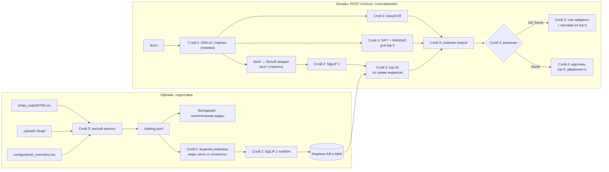

# Архитектура

Документ описывает пайплайн сканера и границы слоёв, которые требует ТЗ: нормализация
фото → извлечение признаков → поиск по каталогу → выдача карточки → дополнительный
функционал. Слои 0–4 реализованы и измерены, слой 5 (интерфейс, «Цифровой сомелье») —
план. Факты о данных — [docs/DATA.md](docs/DATA.md), все числа прогонов —
[docs/RESULTS.md](docs/RESULTS.md) (генерируется), ход работ — [docs/WORKLOG.md](docs/WORKLOG.md).

> Почти все метрики получены на **синтетической** выборке (раздел 4): в кадре те же пиксели,
> что в эталоне, поэтому числа оптимистичны. Реальных полевых фото с разметкой у нас 3.

## 1. Требования, которые определяют архитектуру

| Требование ТЗ / скрипта оценки | Следствие для архитектуры |
|---|---|
| Одна карточка на фото, точность 90–100% (50 баллов из 100) | поиск + переранжирование кандидатов; уверенность и отрыв top-1 от top-2 в ответе |
| Near-duplicates: одна этикетка, разный год, сезон, категория | глобального эмбеддинга мало: вид «этикетка», локальные признаки (SIFT), текст (OCR) |
| Эталон — одна студийная фотография на вино; запросы — фото у полки | детекция упаковки и одинаковая нормализация эталона и запроса |
| `POST` multipart `image` → `{"slug": "..."}`; timeout 10 с; запросы последовательно | эндпоинт `/v1/eval/predict`, модели прогреты при старте, ответ всегда top-1 |
| Показать уверенность для top-1 и top-5 | `/v1/scan` отдаёт top-5 со всеми составляющими скора |
| Вина нет в каталоге → похожие / аналоги или честное «не найдено» | решение `decide` по визуальному скору и отрыву; top-5 как «похожие» |
| Mobile-first карточка, функция после поиска (20 баллов) | фронтенд отделён и потребляет только JSON |
| Рекомендованный стек: Nuxt, PostgreSQL + pgvector, SigLIP 2, Strapi, Docker | ориентир: SigLIP 2 используется; поиск — точный перебор в numpy (совместим с переносом в pgvector) |
| GPU может не быть | всё работает на CPU (медленнее); модели грузятся локально |

## 2. Пайплайн



## 3. Границы пакетов

| Пакет | Слой | Отвечает за | Может импортировать |
|---|---|---|---|
| `winescan.catalog` | 0 | CSV, правила имён Strapi, привязка фото, отчёт | pandas, Pillow |
| `winescan.vision` | 1–2 | `preprocess` (вырезка, кроп, квадрат, виды), `detector` (OWLv2), `embedder` (SigLIP 2), `ocr` (EasyOCR) | torch, transformers, easyocr |
| `winescan.search` | 3 | `index` (точный индекс), `multi` (сумма индексов), `local_match` (SIFT), `text_match` и `rerank` (чистые функции слияния и решения) | vision, OpenCV |
| `winescan.service` | 4 | `pipeline` (Scanner и конфиг), `app` (FastAPI) | search, vision |
| `winescan.validation` | валидация | генератор синтетических кадров | vision.preprocess |
| `winescan.eval` | измерения | метрики, прогоны, подбор весов, IoU детектора, сводная таблица | search, vision, validation |

Правила: `service` не зависит от `eval` и `validation`; `text_match`, `rerank`, `index`,
`metrics` не требуют моделей и покрыты unit-тестами без GPU; модели в `service.app`
передаются фабрикой, поэтому API тестируется с поддельным сканером.

## 4. Слои

### Слой 0. Данные каталога — реализован

Из CSV-выгрузки и uploads Strapi собирается `catalog.jsonl` — одна карточка на вино с файлом
эталона. Дампа базы нет, поэтому связь «вино → файл» восстановлена по правилам имён Strapi,
времени загрузки и 13 ручным решениям; эталон есть у всех 2103 вин. Подробности алгоритма и
проверок — docs/DATA.md, раздел 4.

Контракт карточки (используется API и фронтендом):

```json
{
  "slug": "leto-kaberne-fran-2021-suhoe-krasnoe",
  "name": "LETO Каберне Фран 2021 сухое красное",
  "winery": "LETO", "region": "Кубань", "category": "Красное", "color": "Насыщенный рубиновый",
  "grapes": ["Каберне Фран"],
  "description": "…",
  "attributes": {"year": 2021, "sweetness": "dry", "sparkling": false, "volume_l": null},
  "image": {"file": "Vino_suhoe_krasnoe_KABERNE_FRAN_3c69650ca3.webp", "status": "manual",
            "width": 1918, "height": 2558, "source_photo_name": "Вино сухое красное КАБЕРНЕ ФРАН 2021 .webp"}
}
```

### Слой 1. Нормализация фото — реализован

**Контракт.** `detect(image) → [Detection]`, `choose_main_package(detections) → box`,
`reference_view(image, view)` / `query_view(image, box, view)` → RGB-квадрат.

- **Детекция упаковки:** OWLv2 base (`google/owlv2-base-patch16-ensemble`), zero-shot по
  подсказкам «a bottle of wine», «a box of wine», «a can of wine», «a carton of wine»:
  в каталоге около 25 вин в bag-in-box, тетрапаке и банках.
- **Выбор главной упаковки** (v2): уверенность × √min(площадь, 0,3) × (0,25 + 0,75 ×
  центральность), штраф ×0,3 рамке, внутри которой ≥ 2 уверенные рамки (группа бутылок).
  На 400 синтетических кадрах средний IoU с настоящей рамкой 0,857 (IoU ≥ 0,5 у 88%)
  против 0,819 у v1 и 0,596 при выборе по максимальной уверенности. На публичном фото
  Массандры v1 выбирал рамку вокруг группы бутылок, v2 — центральную бутылку.
- **Нормализация:** эталон — вырезка по альфа-каналу или по белому фону, связанному с краем;
  запрос — кроп по рамке (+3%); оба вписываются в белый квадрат с полями 4% (процессор SigLIP
  растягивает кадр до квадрата, а бутылка вытянута в 3,5 раза). EXIF-поворот учитывается.
- **Виды:** `full` — вся упаковка; `label` — 0,40–0,97 высоты высокой упаковки, где обычно
  этикетка.

**Эффект нормализации** (so400m, синтетика, top-1): весь кадр без кропа — 0,254; кроп
детектором (v1) — 0,732; идеальный кроп — 0,853. Подсказка организаторов подтверждается.

### Слой 2. Извлечение признаков — реализован

- **Визуальные эмбеддинги SigLIP 2.** На идеальном кропе top-1 / top-5: base-224 — 0,659 /
  0,907, so400m-384 — 0,853 / 0,987. Выбрана so400m (эмбеддинг на RTX 3090 ~30–60 мс).
- **Вид «этикетка»** — отдельный индекс той же модели.
- **OCR:** EasyOCR (ru + en) по кропу упаковки, 150–700 мс. На синтетике текст плохой
  (в среднем 29 символов, 6% пусто), на реальных фото крупные надписи читаются
  («МУСКАТЕЛЬ … 2023», «ARISTOV … БРЮТ 2023»).
- **Локальные признаки:** SIFT (2000 точек, CLAHE) на кропе упаковки и на эталоне.

### Слой 3. Поиск, слияние, решение — реализован

1. **Top-10 по сумме индексов** `full` и `label` (веса 0,5 / 0,5). Точный перебор:
   2103 × 1152 — миллисекунды. Идеальный кроп, top-1: только full — 0,853; 0,3/0,7 — 0,905;
   0,5/0,5 — 0,904; 0,7/0,3 — 0,893. Для похожих вин (pHash-группы) 0,796 → 0,866.
2. **Слияние:** скор = визуальный + `local_weight` × бонус(SIFT-inliers) + `text_weight` ×
   сходство текста. Бонус = log(1+min(n,150)) / log(151).
   - SIFT на синтетике (только full): top-1 0,854 → 0,925 при весе 0,2, максимум 0,937 при 0,8.
     **На реальном фото Массандры** у верного «Мускателя белого» 63 inliers, у «Мускателя
     розового» той же серии — 87: вёрстка одинакова, а SIFT не видит цвета. Вес больше ~0,24
     испортил бы этот ответ, поэтому по умолчанию берётся осторожный вес (раздел 6, D10).
   - Текст на синтетике почти ничего не даёт (+0,3 п.п. при весе 0,01) из-за плохого OCR;
     на реальном фото Массандры исправляет ответ уже при весе 0,02 («белый» +1,50 против
     «розовый» +1,07).
   - Сравнение текста: транслит, стоп-слова, нечёткое совпадение слов и по «скелету» согласных
     (`Chardonnay`/«Шардоне»); год и сладость дают ±0,3 / ±0,2.
3. **Решение** `decide`: «не найдено», если визуальный скор top-1 ниже порога (вина нет в
   каталоге) или отрыв меньше порога. На синтетике порог 0,74 отсекает 2,6% запросов из
   каталога; оба реальных вина вне каталога имеют скор 0,66 и 0,70, вино из каталога — 0,84.
   `/v1/eval/predict` решение не применяет и всегда отдаёт top-1.

### Слой 4. API — реализован

| Эндпоинт | Назначение | Ответ |
|---|---|---|
| `POST /v1/eval/predict` (multipart `image`) | скрипт оценки кейсодержателя | `{"slug": "…"}` |
| `POST /v1/scan` (multipart `image`) | фронтенд | `status`, `slug`, `card`, `confidence` (скор, визуальный скор, отрыв, причина решения, текст OCR), `top5` (со слагаемыми скора), `box`, `timings_ms` |
| `GET /v1/wines/{slug}` | карточка | запись `catalog.jsonl` |
| `GET /v1/wines/{slug}/image` | эталонное фото | файл из uploads |
| `GET /health` | готовность | `{"status": "ok", "wines": 2103}` |

Один процесс uvicorn; модели загружаются и прогреваются при старте; инференс под
блокировкой (запросы скрипта всё равно последовательны). Все параметры — `WINESCAN_*`
(README.md).

**Проверка контрактом организаторов:** `participant_test.sh` на 3 публичных фото —
3 ответа, Массандра угадана, задержка по замеру скрипта 1,1–1,6 с (включая загрузку фото
3024×4032), обработка в сервисе 0,75–0,83 с (без SIFT и OCR).

### Слой 5. Интерфейс и функция после поиска — план

Mobile-first карточка в стиле «Своё вино» поверх `/v1/scan`; экран «не найдено» показывает
top-5 как похожие; «Цифровой сомелье» (LLM задаёт вопросы и выбирает из каталога) и подбор
аналогов других виноделен по сорту, региону, цвету и сладости.

## 5. Валидация и метрики

- **Синтетика `synth_v1`:** по кадру на каждое из 2103 вин. Упаковка из эталона на фоне одного
  из 3375 непривязанных фото медиатеки (винодельни, события, полки), 0–3 соседние бутылки
  (в половине случаев той же винодельни), перспектива ±8%, поворот ±8°, свет, блики, шум,
  размытие, JPEG 35–90. Хранит настоящую рамку, поэтому слой 1 измеряется отдельно (IoU).
- **Подвыборки:** `in_phash_group` (844 вина с близким по pHash чужим эталоном — серии),
  `shares_image` (59 вин с байт-в-байт одинаковым эталоном — по изображению неразличимы).
- **Метрики** (`eval/metrics.py`): top-1, top-5, MRR@10; F1@k с возможностью отказа:
  precision = верные / данные ответы, recall = верные / все запросы из каталога; порог
  уверенности подбирается по отрыву или скору.
- **Публичный набор:** 3 фото с неофициальной разметкой (`configs/eval_public_labels.csv`),
  2 вина вне каталога.
- **Ограничение:** синтетика не воспроизводит другой тираж этикетки, изгиб бутылки, отражения
  стекла. Пример расхождения — SIFT (слой 3). Решения, подобранные на синтетике, проверяются
  на реальных фото; сейчас их всего 3.

## 6. Журнал архитектурных решений

| # | Решение | Альтернативы | Почему |
|---|---|---|---|
| D1 | Привязка «вино → файл» по имени + времени загрузки + ручные решения | ждать дамп БД | дампа нет; 96% однозначно, остальное проверяемо глазами |
| D2 | Ручные решения — CSV в git с причиной | править CSV кейса | прозрачно и воспроизводимо |
| D3 | Артефакты не в git, собираются командами; таблица результатов генерируется | коммитить данные | данные кейса чужие и большие |
| D4 | Весь ML на Python; Nuxt — только фронтенд (слой 5) | бэкенд на Nuxt | модели, OCR и OpenCV — Python-экосистема |
| D5 | Синтетическая валидация из эталонов | ждать полевые фото | 3 фото не дают метрик; синтетика даёт 2103 кадра с рамками |
| D6 | OWLv2 с текстовыми подсказками | YOLO COCO «bottle» | в каталоге коробки, тетрапаки, банки |
| D7 | Выбор рамки v2 со штрафом группе | максимум уверенности | IoU 0,857 против 0,596 |
| D8 | SigLIP 2 so400m-384 | base-224 | top-1 0,853 против 0,659 при ~30–60 мс на RTX 3090 |
| D9 | Два индекса: вся упаковка + этикетка | один индекс | +5 п.п. top-1, +7 п.п. на сериях |
| D10 | SIFT-переранжирование с осторожным весом | вес по синтетике (0,8) | на синтетике оптимально 0,8, но реальный пример серии ломается при > 0,24 |
| D11 | Текст этикетки — малый вес, только для перестановки близких кандидатов | поиск по тексту | OCR шумный; поиск по тексту предложил бы неверные вина для вин вне каталога |
| D12 | Точный поиск в numpy вместо pgvector | pgvector (рекомендация ТЗ) | 2–5 тыс. вин — миллисекунды; перенос в pgvector не меняет контракт слоя 3 |

## 7. Риски

| Риск | Где видно | Что делаем |
|---|---|---|
| Синтетика оптимистична | SIFT на синтетике 135 inliers у top-1, на реальных фото 5–87 | осторожные веса; больше реальных фото (раздел 5) |
| Near-duplicates | 844 вина в pHash-группах; 212 групп одинаковых названий у одной винодельни | вид «этикетка», SIFT, текст; метрики по подвыборкам |
| Одинаковые эталоны у разных вин | 59 вин, top-1 ≈ 0,4–0,5 — по изображению неразличимы | решает только текст; вопрос организаторам |
| Вина вне каталога | 2 из 3 публичных фото | порог визуального скора; top-5 как похожие |
| Время ответа | детекция ~0,2–0,6 с, OCR ~0,2–1,3 с на загруженной машине | SLA 3 с выдерживается; OCR отключаемый |
| Общий сервер | GPU 0 и 1 заняты, load average до 800 | `CUDA_VISIBLE_DEVICES`, замеры латентности повторить на свободной машине |
