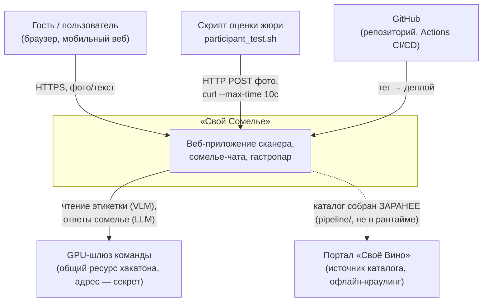
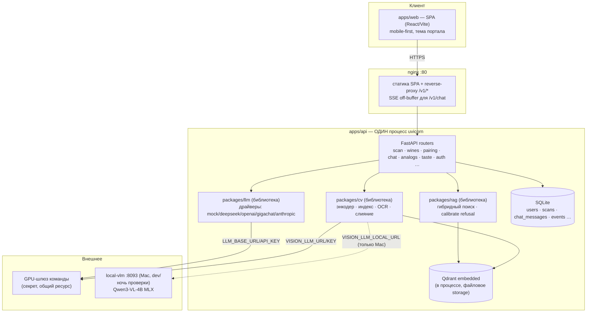
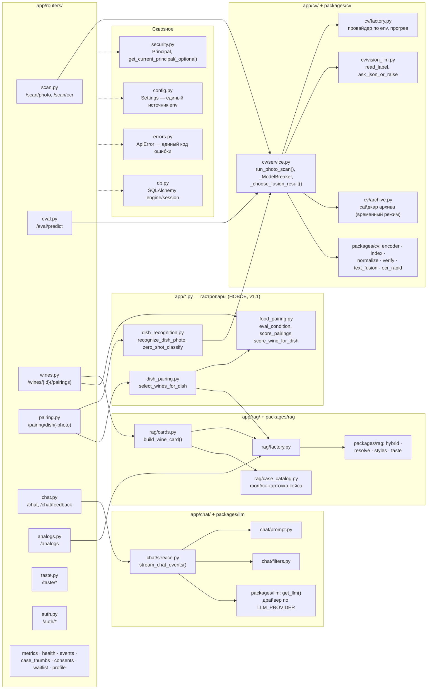
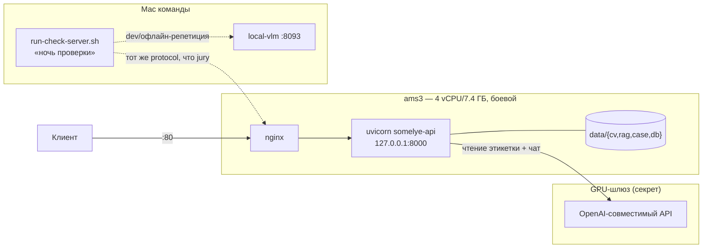
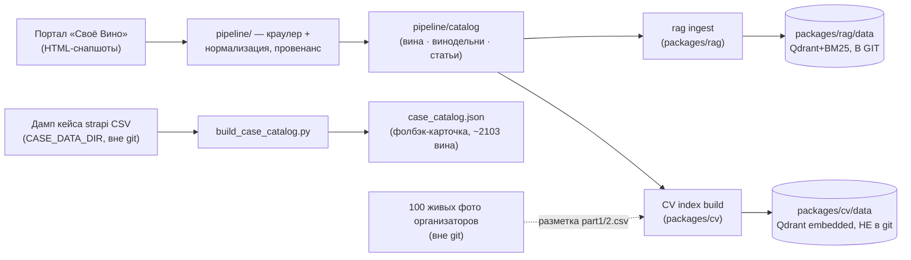

# HLD — «Свой Сомелье» (High-Level Design)

Автор: architect. Дата: 22.09.2026. Задача тимлида (22.09, решение Вячеслава): полная
архитектурная документация в `docs/architecture/`. Как читать весь пакет — `docs/architecture/
README.md`. Секреты (адрес GPU-шлюза, ключи) нигде не приводятся — только имена env-переменных;
IP стенда ams3 (`89.110.72.101`) секретом не считается (уже открыт во всех отчётах команды).

Что НЕ входит в этот файл (не дублируется, только ссылка):
- Модели/алгоритмы CV-пайплайна, числа точности по волнам, отвергнутые CV-альтернативы —
  `docs/architecture/models-and-algorithms.md` (ml-lead).
- RAG-поиск, чат, гастропары «вино→блюдо» — глубоко — `docs/architecture/lld-rag-chat-pairing.md`
  (backend). Здесь — только интеграционный уровень (кто кого вызывает).
- Эксплуатация: пайплайн выката, секреты, ранбуки, полный env стенда — `docs/architecture/
  operations.md` (devops). Здесь — только архитектурный снимок топологии (§5).
- Детальные sequence-диаграммы, справочник env, модели данных, обработка ошибок, стратегия
  тестов — `docs/architecture/LLD.md` (этот же автор, другой документ).

## 1. Контекст и цели

«Свой Сомелье» — решение команды на хакатоне ЛЦТ 2026, кейс №10 РСХБ «Сканер российских вин»
(`case.md`). Продукт: мобильное/веб-приложение — фотографируешь этикетку российского вина →
получаешь карточку с достоверной информацией (не гадание, а сопоставление с каталогом), плюс
«цифровой сомелье» (чат с цитатами), гастропары и аналоги импортных вин по стилю. Заказчик
(РСХБ) в чате кейса прямо сформулировал приоритет: **точность важнее скорости** («92% за 2
минуты предпочтительнее 87% за 2 секунды»).

Критерии оценки (`case.md` строки 79–87, вес из 100): (1) достоверность выдачи (F1 топ-1/топ-5)
— **50**; (2) удержание после поиска (гастропары/аналоги/чат/паспорт вкуса) — **20**; (3)
архитектура (разделение слоёв, воспроизводимость) — **15**; (4) дизайн под гайдлайны портала —
**10**; (5) скорость на своём железе — **5**. Архитектурный принцип, проходящий через весь
пайплайн: **сопоставление важнее распознавания** — одиночный снимок у полки магазина всегда
неидеален (блик, ракурс, сжатие мессенджером), точность добирается не «более умной моделью
one-shot», а мульти-ракурсным каталожным индексом, калиброванными порогами уверенности и (где
доступно) текстом этикетки поверх визуального сходства.

### C4 Уровень 1 — System Context

Приватная проверка (звонок с организаторами, по расписанию, дата не в пакете кейса) шлёт
живые фото на тот же путь, что `jury` на диаграмме — тот же контракт, без специального режима.

### Успех — что доказывает архитектура

- Живые фото организаторов (100 шт., 62 с вином из каталога, 38 честных `NONE`) — метрика
  считается **только** на них (не на синтетике/девелоперских фото) с 21.09; текущий боевой
  снимок стенда — **top-1 96.8% (60/62), top-5 98.4% (61/62)**, p50/p95/max 4.4/5.2/6.9 с
  (`qa/scan-eval-runs/real-photos-stand/README.md`, hack-v15; полный разбор волн —
  `docs/architecture/models-and-algorithms.md` §3.2).
- Жёсткий лимит скрипта оценки (10 с/фото) не нарушен НИ РАЗУ ни на одной волне hack-v6…v15.
- Честный отказ вместо уверенной ошибки: `not_in_catalog` + похожие/аналоги вместо выдумывания
  slug'а; в чате — `refusal` вместо галлюцинации при пустой выдаче ретривера.

## 2. Нефункциональные требования (NFR)

### 2.1 Точность

Основной критерий (50/100). DoD — F1 top-1/top-5 (macro), match-rate, задача ТЗ прямо требует
эту метрику «видимой в API» (`GET /v1/metrics/scan`). Порог `not_in_catalog`
(`CV_ABS_FLOOR`/`CV_MARGIN_FLOOR`) — официально «стартовые точки» до приватного датасета
организатора (структурная неизбежность, не пробел исполнения). Полная история измерений и
методика — `docs/architecture/models-and-algorithms.md` §3; потолок каталога (доля позиций с
годным эталоном) — **97.7–97.9%** (`docs/strategy/tco.md`, `reports/{f4-data-hygiene,
d1-ref-collisions}.md`) — то есть текущие 96.8% это **99.1%** от теоретически достижимого на
этом каталоге, а не «96.8% из 100 возможных».

### 2.2 Жёсткий лимит — 10 секунд

Задан скриптом оценки кейсодержателя (`curl --connect-timeout 5 --max-time 10`,
`case-data/eval/participant_test.sh`) — превышение = потерянный ответ на приватной проверке,
не «медленно, но досчитано». Измеренный максимум по волнам hack-v9…v15 — **5.7–6.9 с**
(`qa/scan-eval-runs/real-photos-stand/README.md`) — примерно 30–40% запаса на CPU-стенде без
выделенного GPU. Мягкая цель ТЗ (≤3 с) заведомо не выполняется на CPU-пути (осознанный выбор
точности над скоростью — §2.5 ниже, ADR-1).

### 2.3 Мягкий бюджет — 7.5 секунды

Внутренний, не видимый заказчику SLA — `CV_SCAN_BUDGET_S` (дефолт **7.5 с** от начала запроса)
ограничивает OCR и near-dup `verify()`; отдельно `VISION_LLM_TIMEOUT_S` (дефолт **6.0 с**)
ограничивает КАЖДЫЙ вызов модели (VLM-шлюз/vlm_local). Оба — от одного якоря времени `t0`,
оба меньше жёсткого лимита 10 с — запас на сборку ответа/сеть/детерминированные шаги
конвейера. Это ДВУХСЛОЙНЫЙ бюджет: внешний контракт (10 с) заказчика и внутренний бюджет
конвейера (7.5/6.0 с), с которым живёт код — если процесс начнёт систематически подходить к
7.5–8 с, это сигнал тревоги РАНЬШЕ, чем ответ реально потерян на внешней проверке. Механизм
подробно, с sequence-диаграммой — `LLD.md` §3.2 и `models-and-algorithms.md` §2.9.

### 2.4 Отказоустойчивость

- **Несгораемость.** `flat`-режим `/scan/photo` и его алиас `/eval/predict` (путь скрипта
  оценки) ловят ЛЮБОЕ исключение → всегда валидный `{"slug": "..."}`, никогда 4xx/5xx —
  пустой ответ гарантированно мимо приватной таблицы, лучший доступный кандидат имеет шанс.
  Тот же принцип у `/pairing/dish-photo`: сбой классификации → честный `status="unsure"`,
  не 500 (`contracts/post-scan.md` §4).
- **Деградация цепочкой, не отказ целиком.** Чтение этикетки: VLM-шлюз → локальная модель на
  Mac → RapidOCR → пустая строка (CV-скор без текста всё ещё работает). Классификация блюда:
  VLM-шлюз/локальная модель (параллельно) → zero-shot по CV-энкодеру → честный `unsure`.
  Ретривер чата: пустая выдача ДО обращения к LLM → `refusal`, не выдуманный ответ.
- **Предохранитель на внешние модели** (`_ModelBreaker`, свой на `"vlm"`/`"vlm_local"`) —
  `VISION_LLM_BREAKER_FAILS=3` сбоя/таймаута подряд → открыт на `VISION_LLM_BREAKER_
  COOLDOWN_S=60` с, следующие запросы сразу идут по локальному пути без траты дедлайна на
  заведомо мёртвый шлюз. Один и тот же предохранитель (то же состояние процесса) обслуживает
  и скан, и подбор вина к фото блюда — один физический шлюз, одна история сбоев (ADR-9).
  Живьём подтверждено: 60/60 честных ответов на 4 видах сбоя шлюза, 0 ошибок
  (`reports/qa-auto-scan-budget.md`).
- **Раздельные пулы потоков** (`_FUSION_OCR_POOL`/`_FUSION_MODEL_POOL`) — зависший сетевой
  вызов к шлюзу не крадёт поток у CPU-OCR следующего запроса того же процесса.

### 2.5 Безопасность и данные

- **Auth** — Bearer JWT (HS256), одна таблица `users` и для гостя, и для зарегистрированного
  (гость — NULL-identity, апгрейд при регистрации сохраняет историю той же строки). 18+ гейт —
  проверка НА БЭКЕНДЕ (не только в UI), иначе обходима прямым вызовом API. `/scan/photo` и
  `/pairing/dish-photo` — единственные пути с ОПЦИОНАЛЬНЫМ принципалом (сознательное отступление
  — сюда бьёт скрипт оценки без токена); остальные (`chat`/`wines`/`pairing/dish`/`analogs`)
  требуют принципала безусловно. Детали модели авторизации — `lld-rag-chat-pairing.md` §4.1.
- **Согласия (152-ФЗ)** — append-only `consent_ledger` (scope `base`/`profiling`/`geo`/
  `marketing`), отзыв — новая строка, не удаление; ledger НАМЕРЕННО без FK на `users` —
  обязан пережить удаление аккаунта (доказуемость отзыва).
- **Минимизация ПД.** В LLM-промпты никогда не попадают email/user_id/сырые события/
  геолокация (`contracts/llm-adapter.md` «Гигиена»); вкусовой профиль передаётся безымянным
  вектором (`sweetness=0.3 acidity=0.7 ...`). Продуктовая аналитика (`contracts/events.md`) —
  только структурные props, никогда свободный текст.
- **Секреты.** Адрес и ключ GPU-шлюза (`VISION_LLM_URL/KEY`, `LLM_BASE_URL/API_KEY`),
  `JWT_SECRET`, `GIGACHAT_AUTH_KEY` — только в `somelye.env` на сервере (600, владелец
  `somelye`), никогда в git/логах/отчётах команды. Транспорт — только stdin по SSH через
  единый `ControlMaster`-канал (`operations.md` §5). Аудит истории репозитория (223 коммита,
  `trufflehog3`+grep) секретов не нашёл (`reports/devops-repo-hygiene.md`).
- **Данные кейса** (`case-data/`: живые фото, CSV-разметка, дамп каталога организаторов) —
  вне git всегда (`.gitignore`), read-only для всех ролей кроме ml-lead/devops по своим зонам.
- **Правило ссылок** (ратифицировано 22.09, `contracts/openapi.yaml` шапка) — любой список
  вин в ответах API (цитаты чата, аналоги, кандидаты скана, подбор к блюду) ведёт СНАЧАЛА на
  внутреннюю карточку `/app/wine/:wineId`; внешняя ссылка на портал — только из карточки, не
  как прямая ссылка из списка. Архитектурная причина, не только косметика: карточка — точка,
  где пользователь востребует НАШ контекст (гастропары, аналоги, «спросить сомелье») ДО того,
  как уйдёт на сторонний домен.

### 2.6 TCO

Полная методика, источники цен (с датой обращения), допущения — `docs/strategy/tco.md`
(architect, 22.09); операционный срез — `operations.md` §9. Headline-цифры: боевая
конфигурация (CPU-стенд 4 vCPU, без выделенного GPU) — **91.9% top-1** за **≈60 ₽/1000
сканов**, в 25–35 раз дешевле любой GPU-конфигурации; следующая десятая доли процента точности
(до 95.2%, CPU+GPU-шлюз+Mac) стоит **≈50–102 ₽/1000 сканов** в зависимости от аренды/покупки.
Предельная цена GPU-шлюза ПРЯМО СЕЙЧАС — трафик и время ответа (ресурс общий на хакатон,
амортизирован между проектами), не полная аренда выделенного узла — таблица `tco.md` отвечает
на другой, полезный для заказчика вопрос: «сколько стоит поднять сравнимый узел с нуля».

## 3. C4 Уровень 2 — Containers

**Важно:** это НЕ микросервисы. `apps/api` — один процесс (`uvicorn`, 1 воркер), в который
`packages/cv`/`packages/rag`/`packages/llm` импортированы как обычные Python-библиотеки, не
подняты отдельными сетевыми сервисами. Qdrant — **embedded** (`qdrant-client(path=...)`,
файловое хранилище внутри процесса), не отдельный сервер; Docker на боевом стенде вообще не
используется (WireGuard-конфликт, ADR-8). Единственный РЕАЛЬНО отдельный процесс — `local-vlm`
на Mac (порт 8093, MLX-сервер), и то только для разработки/ночи проверки, не в проде.

Данные на диске процесса (`CV_DATA_DIR`/`RAG_DATA_DIR`/`CASE_DATA_DIR`/`DATABASE_URL`) —
пути и их происхождение (git/не git) — §6 ниже и `LLD.md` §5.

## 4. C4 Уровень 3 — Components (внутри `apps/api`)

Однострочные обязанности модулей — таблица `LLD.md` §1. Алгоритмы ВНУТРИ `packages/cv` —
`models-and-algorithms.md` §2; ВНУТРИ `packages/rag`/`app/chat`/`app/food_pairing.py` —
`lld-rag-chat-pairing.md` §1–3.

## 5. Топология (deployment)

Три физических места, ни одно не публикует адрес GPU-шлюза:

1. **Стенд ams3** — боевой VPN-бокс (`exit-ams3`, Ubuntu, 4 vCPU/7.4 ГБ RAM), нативно (без
   Docker — WireGuard-форвардинг конфликтует с политикой `FORWARD=DROP`, которую ставит
   Docker при установке). Публичный IP — `89.110.72.101`, порты `:80` (nginx) и
   `127.0.0.1:8000` (uvicorn) — остальные заняты VPN-службами команды (ADR-8).
2. **GPU-шлюз команды** — OpenAI-совместимый (LiteLLM) сервис на выделенном GPU-сервере,
   **общий ресурс хакатона**, не наш выделенный узел. Два независимых потребителя, разные
   пары env на одном физическом адресе: чтение этикетки (`VISION_LLM_URL/KEY`, `packages/cv`)
   и сомелье-чат (`LLM_BASE_URL/API_KEY`, драйвер `openai` в `packages/llm`) — секрет,
   TLS Let's Encrypt.
3. **Mac команды** — рабочая машина; служба `local-vlm` (порт 8093, Qwen3-VL-4B MLX) для
   `vlm_local`/`vlm_both` при разработке; `infra/local-check/run-check-server.sh` — лучшая
   локальная конфигурация (обе модели + 8 CV-кропов) для «ночи проверки» (см. ниже) и общих
   репетиций официального `participant_test.sh` вне стенда.

**«Ночь проверки»** — не отдельная система, а РЕЖИМ Mac-машины: временно поднятый
`apps/api` на порту 8080 (тот дефолт, что зашит в `participant_test.sh`) с максимальной
локальной конфигурацией точности (обе VLM-модели + 8 CV-кропов), используется для генеральных
репетиций официального скрипта оценки ВНЕ боевого стенда — тот же код и контракт, другое
железо/конфигурация. Полный ранбук — `operations.md` §7.1. Живая архитектурная диаграмма с
портами/сервисами systemd/правилами бокса — `operations.md` §1.5/§8 (здесь — только
архитектурный снимок, не операционная инструкция).

## 6. Потоки данных

### 6.1 Построение каталога и индексов (офлайн, не в рантайме запроса)

### 6.2 Скан этикетки → карточка (рантайм, живой запрос)

Полная sequence-диаграмма — `LLD.md` §3.1/§3.2. Кратко: фото → нормализация/детект этикетки →
SigLIP2-эмбеддинг → ANN-поиск по каталожному индексу (мульти-ракурсный, ≥20 синтетических
ракурсов на эталон) → слияние с текстом этикетки (OCR/VLM, параллельно) → гейт уверенности →
карточка (наш каталог либо фолбэк каталога кейса) ИЛИ честный `not_in_catalog` + похожие.

### 6.3 Сомелье-чат (рантайм)

Вопрос → извлечение фильтров из текста → гибридный поиск (BM25+вектор+RRF+реранкер,
intent-роутинг) → пусто → `refusal` БЕЗ обращения к LLM; есть кандидаты → промпт с цитатами →
потоковая генерация (SSE, без буферизации) → цитаты `[n]` → сохранение. Полная диаграмма —
`lld-rag-chat-pairing.md` §5.1, здесь — `LLD.md` §3.4 (сжатая версия + правило ссылок).

### 6.4 Гастропары — оба направления (рантайм)

«Вино → блюдо» (карточка после скана, реализовано с 22.09): три уровня по убыванию точности
(`catalog`/`sensory`/`heuristic`) — `contracts/post-scan.md` §1, диаграмма —
`lld-rag-chat-pairing.md` §5.2. «Блюдо по фото → вино» (НОВОЕ, `contracts/post-scan.md` §4,
v1.1, 22.09) — зеркальное направление, тот же движок правил (`food_pairing_rules.yaml`), та же
пара уровней (`catalog`/`rules`), диаграмма — `LLD.md` §3.6.

## 7. Ключевые архитектурные решения (ADR)

Формат: решение → отвергнутые альтернативы (с числами) → источник. Решения по моделям/
алгоритмам CV помечены **[CV]** — разобраны ml-lead подробно, здесь только вывод с ссылкой;
решения этого документа — архитектурные (API/данные/инфраструктура/продукт).

| № | Решение | Отвергнутые альтернативы | Источник |
|---|---|---|---|
| ADR-0 | **Сопоставление важнее распознавания** — точность строится каталожным индексом с мульти-ракурсной аугментацией (≥20 синтетических видов на эталон) и калиброванными порогами, а не «одна умная модель отвечает с одного взгляда» | Модель-классификатор без каталожного индекса — при тысячах визуально похожих российских вин (близнецы линеек, разные года/объёмы одной этикетки) неотличима без сопоставления с конкретным эталоном | `ARCHITECTURE.md`, arXiv:2404.08820 (метод аугментации) |
| ADR-1 | CPU-путь (RapidOCR, двухмасштабный + кроп этикетки 3-м проходом) — основной боевой конфиг; GPU-шлюз — опциональное усиление, не обязательное условие | GPU/VLM как ЕДИНСТВЕННЫЙ путь — отверг по стоимости (TCO §2.6) и по риску единой точки отказа (общий ресурс хакатона, деградация от 4 параллельных запросов) | `docs/strategy/tco.md`, `models-and-algorithms.md` §3.4 |
| ADR-2 | **[CV]** Кроп этикетки — только 3-й проход-добавка к OCR, не основной вход | Кроп этикетки как основной вход (79.0% против 90.3% у кропа бутылки, RapidOCR) | `models-and-algorithms.md` §4 п.1 |
| ADR-3 | **[CV]** Единый пайплайн «CV + текст слитно», без каскада ступеней | Отдельный индекс «этикетка→этикетка» + каскад «сначала этикетка, при уверенности — не идти дальше» (82–89% против 90.3% полного цикла при ЛЮБЫХ порогах) | `models-and-algorithms.md` §4 п.2 |
| ADR-4 | **[CV]** Бикубика при апскейле + многомасштабный OCR вместо «цифрового зума» отдельных строк/областей | Построчный зум из оригинала (`6b3ba15`, «минус, узкое место детектор») и зум всей области этикетки крупнее 1280px (офлайн +0 фото) | `models-and-algorithms.md` §4 п.3; независимо — цифровой зум 6–10× не восстанавливает текст, потерянный при сжатии мессенджером (`reports/qa-manual-field-photos.md`, 5 фото) |
| ADR-5 | **[CV]** Qwen3-VL-4B (MLX) — локальная модель для `vlm_local`, не Gemma 3 4B | gemma3:4b — 85.5% top-1 против 95.2% у Qwen3-VL-4B, ХУЖЕ и по точности, и по скорости (6.9с/фото против ~3с) | `models-and-algorithms.md` §4 п.5 |
| ADR-6 | **[CV]** Локализация «полка→бутылка» — код в main, но ВЫКЛЮЧЕНА (`CV_SHELF_CROP=false`); диагностика превращена в UX-подсказку («одна бутылка крупно») | Автоматический детект+кроп отдельной бутылки на фото целой полки — ДВА раунда живой приёмки, каждый со своей регрессией того же класса (геометрический X-центр не совпадает с «правильной» бутылкой) — отвергнут как боевая CV-фича после исчерпания варианта v1+v2 | `models-and-algorithms.md` §4 п.8 |
| ADR-7 | **[CV]** Дообучение собственной модели — сознательно отложено, а не отвергнуто по данным; выбрана лестница мер БЕЗ обучения (гигиена интейка → верификатор → готовый больший чекпойнт) до потолка на приватном датасете | Fine-tune СЕЙЧАС на синтетических рендерах студийных эталонов — риск переобучения на домен эталонов подтверждён числом (7/7 фото плотных полок сошлись в один и тот же ложный топ-1 с высокой уверенностью); честный holdout для контроля переобучения требует полевых данных, которых не было в поставке | `models-and-algorithms.md` §4 п.7, `ml-handoff/` (пакет передачи) |
| ADR-8 | Нативный (без Docker) деплой на ams3, systemd-юнит с cgroup-лимитами | Docker/compose на самом стенде — ставит `FORWARD=DROP`, режет WireGuard-выход VPN-бокса (правило бокса «VPN важнее стенда»); compose-файлы (`infra/compose*.yml`) готовы на будущее, не для ЭТОГО хоста | `infra/ams3/README.md`, `operations.md` §1.1 |
| ADR-9 | Общий предохранитель (`_ModelBreaker`) на GPU-модель между сканом (`app/cv/service.py`) и подбором вина к фото блюда (`app/dish_recognition.py`) — буквально те же объекты, не копии | Независимый предохранитель на каждый эндпоинт — один физический шлюз лёг бы «наполовину» (скан уже знает, что шлюз мёртв, а подбор блюда всё ещё ждёт полный дедлайн на каждый запрос) | `contracts/post-scan.md` §4.1, `reports/ml-eng-scan-budget.md` |
| ADR-10 | Правило ссылок: список вин в выдаче ведёт на внутреннюю карточку `/app/wine/:wineId` первой, внешняя ссылка на портал — только из карточки | Прямая внешняя ссылка из списка/цитаты (было в `ChatScreen.tsx::CitationBadge` — найденное отклонение при ратификации, исправлено frontend тем же днём, `5d7772a`) — теряет наш контекст (гастропары/аналоги/чат) в момент, когда пользователь готов уйти на сторонний домен | `contracts/openapi.yaml` шапка («Ссылки на вино в выдаче»), §2.5 выше, `reports/frontend-dish-photo-links.md` |
| ADR-11 | Индекс `packages/rag/data` (Qdrant+BM25, ~90 МБ) — **в репозитории**, коммитится осознанно | Держать индекс вне git (как `packages/cv/data`, ~2.5 ГБ, и `case-data/`) — отверг для RAG-индекса специально: проект должен запускаться «из коробки» без отдельного шага сборки/скачивания для судей и новых участников команды; CV-индекс и данные кейса остаются вне git (велики и/или производные от закрытых данных кейса) | Решение Вячеслава, задача тимлида 22.09; `.gitignore` (`packages/cv/.gitignore: data/`, корневой `.gitignore: case-data/`), подтверждено `git ls-files`: `packages/rag/data` — 13 файлов в git, `packages/cv/data` — 0 |
| ADR-12 | Подбор вин «блюдо → вино» сканирует ВЕСЬ наш каталог (2103 карточки через `case_catalog.json`+`build_wine_card()`) на процесс-уровневом кэше (`@lru_cache`, прогрев фоновым потоком при старте, 12.0 с холодно / ~50 мс тепло) | Первая версия — пул top-30 `Retriever.search()` по тексту запроса — **реализована, живьём проверена тимлидом и ОТКЛОНЕНА** («колода свайп-дегустации — разнообразие без учёта блюда, к стейку предложат лучшее из колоды, а не из каталога», needs-work `451c481`); дороже по времени первого запроса (12 с), но правильна по продукту — рекомендация обязана видеть весь каталог, не top-K по нерелевантной метрике сходства текста | `contracts/post-scan.md` §4.3; коммиты `3e5e9fc`→`451c481`; `reports/backend-dish-photo.md` |
| ADR-13 | LLM-адаптер — единый `Protocol` (`chat`/`chat_stream`), 4 прод-драйвера + обязательный `mock` за одним фабричным `get_llm()`, выбор только через `LLM_PROVIDER` | Захардкоженная интеграция с одним провайдером (сначала предполагался только GigaChat) — отверг: ключа GigaChat не было большую часть разработки, `mock`-драйвер позволил вести API и клиент параллельно без единого ключа; когда ключ GigaChat так и не появился к хакатону — переключение на `openai`-драйвер (свой GPU-шлюз, Qwen 27B) заняло одну строку env, без правок `apps/api` | `contracts/llm-adapter.md`, `reports/backend-llm-openai.md` |
| ADR-14 | Чат принимает опциональный `ChatRequest.wine_id` — резолвится → кандидат №1 в выдаче ретривера ДО обычного `search()`, без дедупликации; не резолвится/пуст → поведение прежнее | Полагаться только на текстовый `search()` по шаблонному вопросу «Расскажи про {name} от {winery}» — измерено **91.82%** точных попаданий на полном каталоге 2103 (было 88.45% на 1978); промахи — вина-«близнецы» одной серии (Союз-Вино/Золотая Балка, несколько SKU с почти идентичным названием), для которых текстовый поиск структурно не может выбрать «то самое» без ID; дедупликация против `search()` тоже отвергнута (сложнее, чем цена редкого дублирования цитаты) | `contracts/openapi.yaml` `/chat` v0.3.5, `reports/backend-rag-rebuild.md` §3–4 |

### Индекс в репозитории — что это значит на практике (ADR-11, развёрнуто)

Решение Вячеслава (задача тимлида 22.09): `packages/rag/data/` (описания вин каталога,
фрагменты знаний, Qdrant-хранилище, BM25-пиклы, `manifest.json`) коммитится в git как
**фича**, не забытый артефакт — `git clone` + `uv sync` + `uvicorn` поднимают рабочий чат и
поиск без отдельного шага «сначала собери индекс откуда-то». dense-модель
`paraphrase-multilingual-MiniLM-L12-v2`, реранкер `jinaai/jina-reranker-v2-base-multilingual`
(`packages/rag/data/manifest.json`; ⚠ расходится с текстом `contracts/rag-interface.md` v0.1,
где реранкер назван `bge-reranker-v2-m3` — контракт не переиздавался при смене модели,
находка этого прохода, не блокирует, см. «Риски» §8).

**Пересобран под полный каталог кейса (22.09, задача тимлида, подтверждено этой же
правкой)** — `manifest.json` на диске сейчас: версия `20260922.1`, **2103 вина**, 138
виноделен, 5592 знания (было `20260828.1`/1978); механизм — `rag/case_data.py::
build_supplemental_wine_records()` (коммит `a686bf4`) дополняет коллекцию `wines` 125
позициями из `case_catalog.json`, которых нет в основном индексе пайплайна vines
(`1978 + 125 = 2103`). На момент этой правки файл **изменён в рабочем дереве, ещё не
закоммичен** (`git status` — `M packages/rag/data/manifest.json`) — коммит и синхронизация
на стенд (`operations.md` §3.3, blue/green ещё не формализован для RAG-индекса) остаются
открытым шагом за тем, кто коммитит `packages/rag/`.

**Корневая причина «кнопка сомелье не той про то вино» — не только покрытие каталога.**
Первично казалось, что 125 недостающих вин объясняют проблему целиком; реальный разбор
(`reports/backend-rag-rebuild.md`) нашёл БАГ РОУТИНГА: вопрос кнопки «Спросить сомелье об
этом вине» (`t("chat.prefillAskAboutWine")` = «Расскажи про {name} от {winery}») матчился
эвристикой `intent.py` в `_FACT_RE` («расскаж…про») → маршрутизировался в
`collections=("knowledge",)` — коллекция **`wines` не участвовала в поиске вообще, ни для
одного вина каталога**, индексировано оно или нет. Без фикса `intent.py` (новый
`_ASK_ABOUT_WINE_RE`, точная форма шаблона, проверяется первым → маршрут `"pairing"`,
wines-приоритет) исходный симптом был бы у ЛЮБОГО вина, не только у новых 125 — это и есть
находка, ради которой ADR-14 (`wine_id` в чате) вообще понадобился: даже с починенным
роутингом и полным каталогом текстовый поиск попадает в ИМЕННО ТО вино только в **91.82%**
случаев (было 88.45% на 1978) — рост от роутинга и покрытия вместе, остаток — структурная
неоднозначность вин-близнецов одной серии, которую текстовый поиск принципиально не решает.

Другая половина того же решения: то, что остаётся вне git, остаётся вне git БЕЗ исключений —
живые фото организаторов, CSV-разметка (`real-photos-labels/`), боевой CV-индекс сканера
(`packages/cv/data`, ~2.5 ГБ — построен из объёма, для которого GitHub не место, и частично
производен от закрытых данных кейса), сам дамп каталога кейса (`case-data/`). Разница в
критерии простая: RAG-индекс — наш собственный контент (описания/знания, которые мы вправе
публиковать), CV-индекс и дамп кейса — либо слишком велики, либо производны от данных, которые
организаторы предоставили команде, не для публикации.

## 8. Риски (архитектурные, не проектные)

Проектные риски (репозиторий не открыт, видео/слайды не готовы) — `agents/BOARD.md` «Нужно от
Вячеслава»/«Сдача», не архитектурные, здесь не повторяются.

1. **Один uvicorn-воркер, один процесс.** Нет горизонтального масштабирования из коробки —
   осознанный выбор простоты для хакатон-стенда (4 vCPU и так не оправдывают много воркеров).
   При росте нагрузки — либо несколько процессов за общим nginx (без изменений в API), либо
   вынос Qdrant/БД из процесса. Не блокирует сдачу — throughput стенда (~750–870 фото/ч по
   p50) кратно перекрывает ожидаемую нагрузку демо/проверки.
2. **Embedded Qdrant однопроцессный.** Второй процесс поверх того же `CV_DATA_DIR`/
   `RAG_DATA_DIR` либо тихо отдаёт пустые ответы, либо падает 500 (без ошибок при старте) —
   известная ловушка команды при параллельной разработке (`ORCHESTRATION.md`). В проде —
   не риск (один systemd-юнит), в разработке — источник трудноуловимых пустых ответов, если
   не соблюдать «свои копии данных на параллельный запуск».
3. **GPU-шлюз — общий ресурс, не выделенный.** Измеренная деградация при 4 параллельных
   запросах (хвост к лимиту 10 с, `docs/strategy/tco.md` §5); шлюз используется ДВУМЯ путями
   одновременно (чтение этикетки + чат + теперь фото блюда) — при реальной параллельной
   нагрузке от нескольких пользователей все три делят одну и ту же пропускную способность.
   Смягчение — общий предохранитель (ADR-9), деградация к CPU-пути не требует ручного
   вмешательства.
4. **SQLite в проде, схема спроектирована под Postgres.** `contracts/schema.sql` — Postgres
   v0.1; боевой стенд — `sqlite:////opt/somelye/data/db/somelye.db`. Осознанное упрощение
   объёма хакатона (нет параллельной записи в конкурентных транзакциях, которой боится
   SQLite при реальной многопользовательской нагрузке) — не пересмотрено отдельным ADR,
   фиксирую как факт для будущего решения при переходе за пределы демо.
5. **Индекс `packages/rag/data` пересобран (2103 вин, ADR-11) и закоммичен (`8cd0355`).** На
   стенд он ещё не синхронизирован — до выката hack-v16 стенд отвечает на индексе 1978 вин,
   поэтому цифры отчётов до этой даты считаны на старом снимке; процедура blue/green замены RAG-индекса
   без простоя ещё не формализована так же, как для CV-индекса (`operations.md` §3.3 уже
   фиксирует это как открытый пункт). MRR на голд-сете просел на -0.0088 (объяснимо — новые
   легитимные конкуренты у 2 «pick»-вопросов, ответ остаётся в top-8) — решение принять
   регресс несмотря на правило «не хуже» было явным, не молчаливым (задача тимлида 22.09).
6. **Ограниченный параллелизм ONNX/RapidOCR на 4 vCPU стенда.** Зависший OCR-вызов не
   отменяется (Python не умеет прервать поток), продолжает конкурировать за CPU со СЛЕДУЮЩИМИ
   запросами — предохранитель покрывает только сетевые вызовы к модели, не CPU-занятые OCR-
   потоки. Тикет в очереди (`agents/BOARD.md`, `ml-eng-ticket-onnx-threads`), не блокер (нетто
   эффект на сдачу — 0, но корень исходного хвоста задержек hack-v13).
7. **Холодный кэш подбора «блюдо → вино» — 12 секунд один раз на процесс (ADR-12).**
   Смягчено фоновым прогревом при старте (не первому пользователю), но рестарт процесса без
   прогрева (например, ручной `systemctl restart` мимо обычного деплоя) на 12 с оставляет
   первый запрос `/v1/pairing/*` медленным (ленивая сборка). Не измерено, растёт ли кэш
   памятью пропорционально росту каталога сверх текущих 2103 — не проверено на бо́льших
   объёмах.
8. **`ChatRequest.wine_id` без дедупликации против `search()` (ADR-14).** Осознанный
   компромисс — то же вино теоретически может процитироваться дважды (candidate №1 +
   найдено ещё раз через `search()`), если модель расставит `[n]` на оба вхождения. Не
   измерено, как часто это реально происходит (фича только landing, 22.09) — первый кандидат
   на приёмочный прогон, когда backend/frontend закончат и qa-auto дойдёт до этой волны.

## Как читать этот документ дальше

`LLD.md` (тот же пакет) — модули, sequence-диаграммы, модели данных, справочник env,
обработка ошибок, стратегия тестов. Полное оглавление — `docs/architecture/README.md`.
