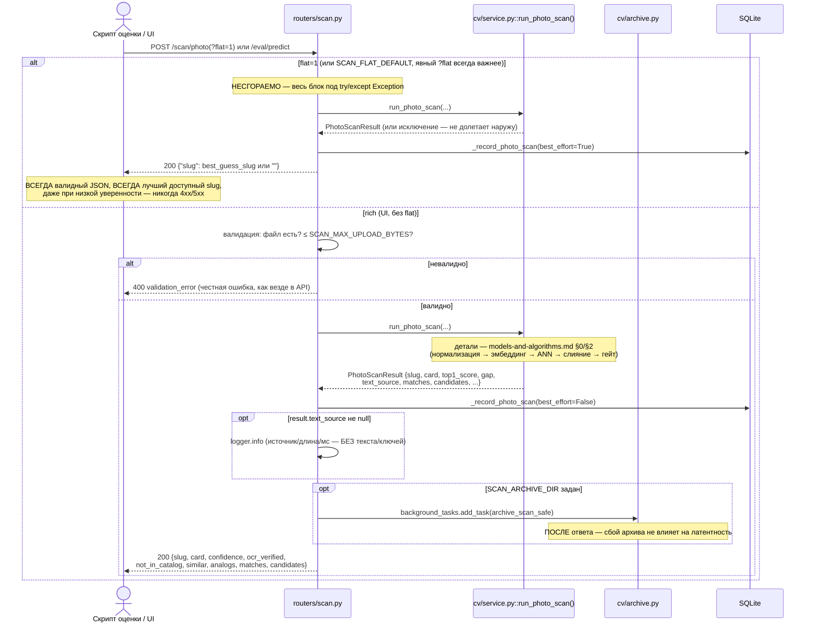
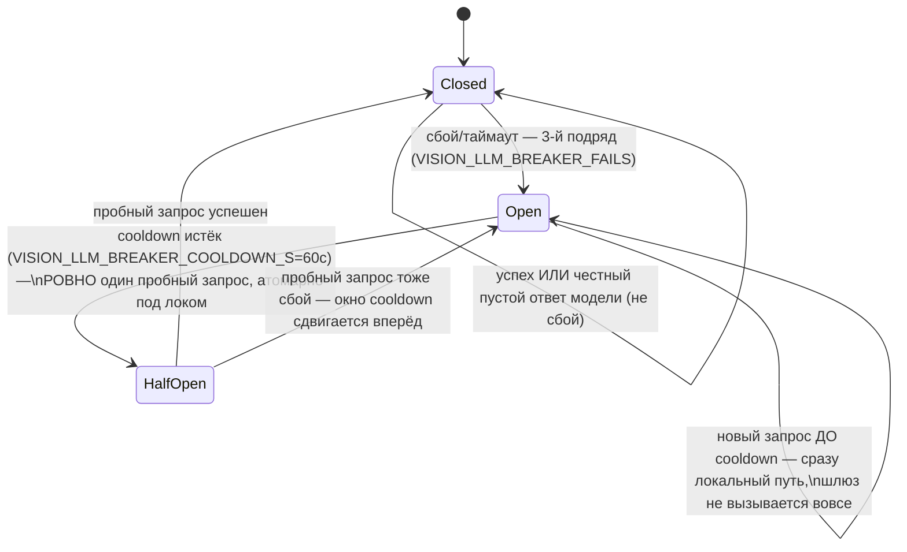
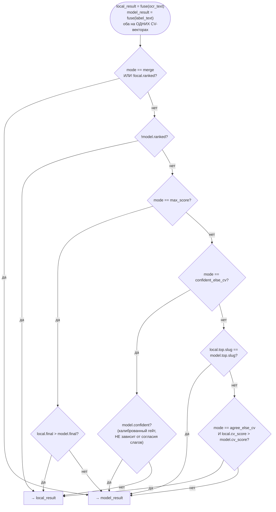
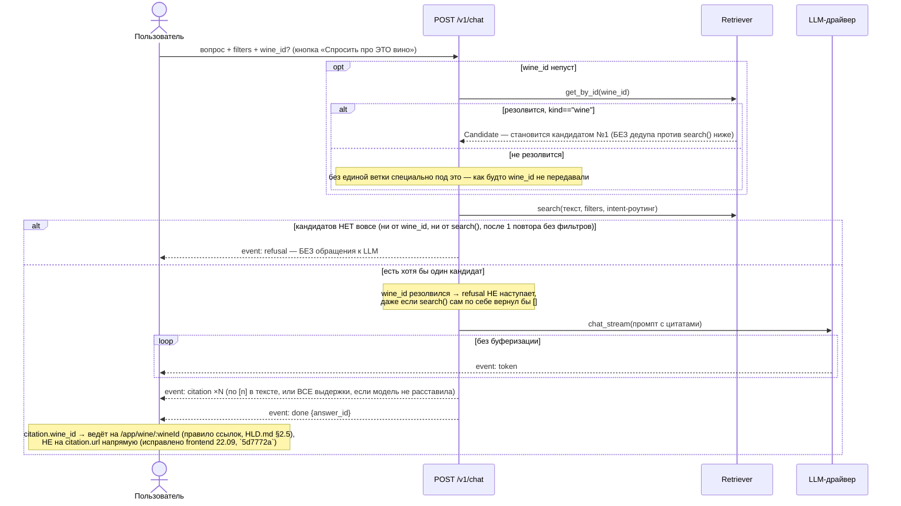
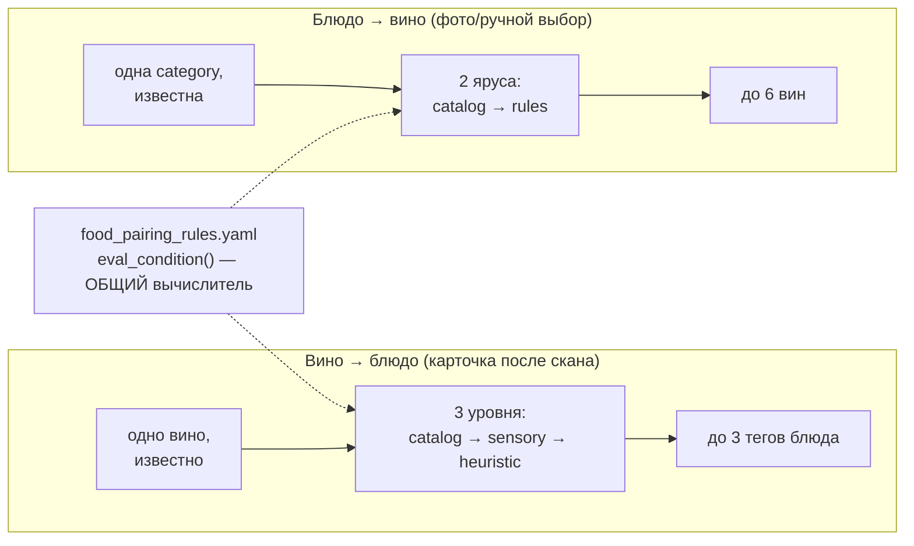
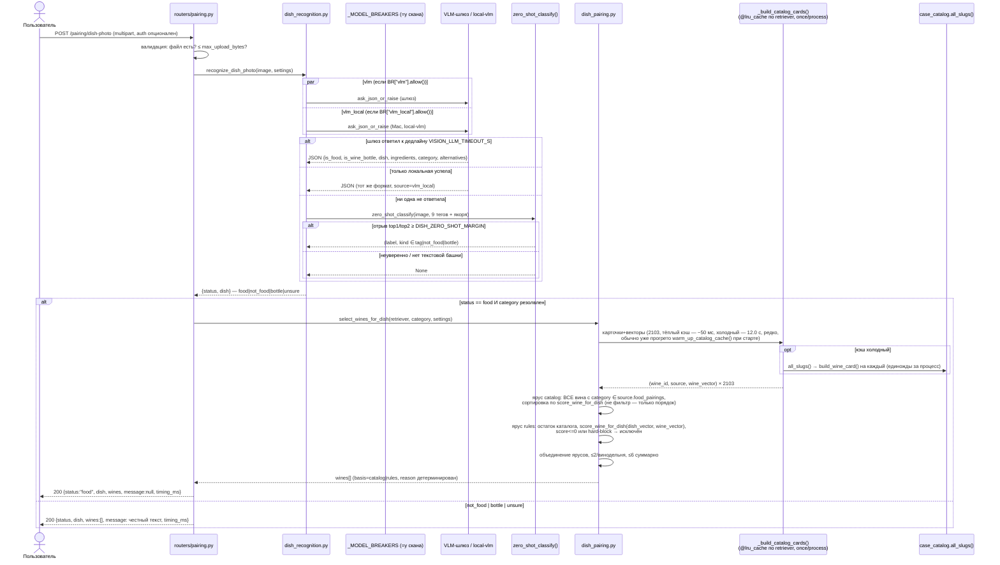

# LLD — «Свой Сомелье» (Low-Level Design)

Автор: architect. Дата: 22.09.2026. Часть пакета `docs/architecture/`, продолжение `HLD.md`
(контекст/NFR/C4/топология/ADR — там). Этот файл: модули, sequence-диаграммы, модели данных,
env, обработка ошибок, стратегия тестов. Оглавление всего пакета — `docs/architecture/README.md`.

Что НЕ входит сюда (ссылка, не копия): алгоритмы CV изнутри — `models-and-algorithms.md`;
RAG/чат/гастропары изнутри, включая их собственные sequence-диаграммы (чат, «вино→блюдо») —
`lld-rag-chat-pairing.md`; выкат/секреты/ранбуки/полный env стенда — `operations.md`. Диаграммы
здесь либо про то, чего нет в тех трёх файлах (скан целиком, предохранитель как машина
состояний, выбор ответа как решающее дерево, подбор вина к фото блюда — новая ветка), либо
сжатая интеграционная версия того, что там расписано подробно, с явной ссылкой на раздел.

## 1. Модули — однострочный справочник

### `apps/api/app/` (backend, FastAPI, один процесс)

| Модуль | Роль |
|---|---|
| `main.py` | Сборка приложения, роутеры, CORS, логгер `app` (единый на процесс), `/v1/docs` |
| `config.py` | `Settings` — единственный источник чтения env для `apps/api` (не для `packages/*`, см. §4) |
| `security.py` | `Principal`, `get_current_principal(_optional)`, JWT | 
| `errors.py` | `ApiError` → `{"error": {"code", "message"}}`, словарь кодов |
| `db.py`, `models.py` | SQLAlchemy engine/session, ORM-модели (зеркало `contracts/schema.sql`) |
| `routers/*.py` | Один файл на группу путей — `scan`, `eval`, `wines`, `pairing`, `chat`, `analogs`, `taste`, `auth`, `consents`, `events`, `metrics`, `health`, `case_thumbs`, `waitlist`, `profile` |
| `cv/service.py` | Оркестрация скана: `run_photo_scan()`, `_ModelBreaker`, `_choose_fusion_result()` — см. §3.1–3.3 |
| `cv/factory.py` | Провайдер `ImageIndex`/`LabelVerifier` по env (`mock`/`real`), прогрев при старте |
| `cv/vision_llm.py` | HTTP-клиент к VLM-шлюзу: чтение этикетки (`read_label*`) и (новое) `ask_json_or_raise` для фото блюда |
| `cv/archive.py` | Сайдкар архива сканов (временный режим, `contracts/image-scan.md` v0.4.10/v0.4.15) |
| `rag/cards.py` | `build_wine_card()` — резолюция `wine_id`: наш RAG → фолбэк каталога кейса |
| `rag/case_catalog.py` | Чтение `case_catalog.json` (фолбэк-карточка) |
| `rag/factory.py` | Провайдер `Retriever` по env |
| `chat/service.py` | `stream_chat_events()` — retrieval → промпт → LLM-стрим → цитаты |
| `chat/prompt.py`, `chat/filters.py` | Сборка промпта; извлечение `Filters` из текста вопроса |
| `food_pairing.py` | Движок `food_pairing_rules.yaml`: `eval_condition`, `score_pairings` (вино→блюдо), `score_wine_for_dish` (блюдо→вино), три уровня вектора вина |
| `dish_recognition.py` | **Новое, v1.1.** Классификация фото блюда: VLM/vlm_local (параллельно) → zero-shot (SigLIP2 текстовая башня) → `unsure`; `resolve_category()` (точное/синоним/нечёткое) |
| `dish_pairing.py` | **Новое, v1.1.** `select_wines_for_dish()` — пул `Retriever.search()` → ярусы `catalog`/`rules` → диверсификация ≤2/винодельня, ≤6 |

### `packages/cv/cv/` (библиотека, импортируется `apps/api`, тесты отдельным `.venv`)

`encoder.py` (SigLIP2), `index.py` (`ImageIndex`, ANN + `search_fusion`), `normalize.py`
(EXIF/HEIC/кроп/развёртка), `verify.py` (`LabelVerifier`, near-dup OCR), `ocr_rapid.py`
(RapidOCR, многомасштабный), `text_fusion.py` (слияние CV+текст, гомоглифы, гейт винодельни),
`text_rerank.py`, `label_crop.py`, `shelf_crop.py` (код есть, флаг выключен — ADR-6 в `HLD.md`),
`families.py` (near-dup семьи), `store.py`/`audit.py`. Полностью — `models-and-algorithms.md` §1–2.

### `packages/rag/rag/` (библиотека)

`base.py` (`Retriever` protocol, `Filters`, `Candidate`), `hybrid.py` (BM25+dense+RRF),
`rerank.py`, `resolve.py`/`styles.py` (аналоги, `resolve_style`), `taste.py` (вкусовой паспорт),
`calibrate.py` (порог refusal), `ingest.py`, `config.py` (env, отдельно от `apps/api`, см. §4).
Полностью — `lld-rag-chat-pairing.md` §1.

### `packages/llm/llm/` (библиотека)

`base.py` (`LLM` protocol, `get_llm()` фабрика), `drivers/{mock,deepseek,openai,gigachat,
anthropic}.py`, `drivers/_openai_compat.py` (общая HTTP/SSE-механика `deepseek`+`openai`),
`drivers/_http.py` (ретраи/таймаут). Контракт — `contracts/llm-adapter.md` v0.2.

### `apps/web/src/` (frontend, React/Vite, SPA)

Маршруты — ровно 6 под `/app`: `onboarding`, `scan`, `wine/:wineId`, `chat`, `taste`,
`profile` (`AppShell.tsx`) плюс лендинг `/`. `lib/apiClient.ts`+`apiTypes.ts` — типизированный
клиент поверх `contracts/openapi.yaml`. `components/WineCardContent.tsx` — ЕДИНЫЙ компонент
карточки вина, используется и экраном скана, и прямым переходом `/app/wine/:wineId` (одна
форма карточки — `card` в `ScanPhotoRichResponse` буквально равна ответу `GET /wines/{id}`).
`mocks/` — MSW-моки для разработки без бэкенда (`VITE_API_MODE=mock|real`).

## 2. Модели данных

### 2.1 Реляционная БД

`contracts/schema.sql` — Postgres v0.1 (заморожен, правит architect): `users` (одна таблица
для гостя И зарегистрированного, гость — NULL-identity, `is_guest`), `consent_ledger`
(append-only, БЕЗ FK на `users` — обязан пережить удаление аккаунта), `swipes`+`taste_profiles`
(вкусовой паспорт, 7 осей), `scans`, `chat_messages` (`citations`/`trace` — jsonb), `events`
(продуктовая аналитика, словарь имён — `contracts/events.md`), `waitlist`, `feedback`.

**Факт (не отдельный ADR, зафиксировано как есть — `HLD.md` §8 риск 4):** боевой стенд
использует **SQLite** (`DATABASE_URL=sqlite:////opt/somelye/data/db/somelye.db`), не Postgres
— `apps/api/app/models.py` (SQLAlchemy ORM) описывает схему совместимо с обоими, но
DDL-детали (`jsonb`, `gen_random_uuid()`) в `schema.sql` — целевой прод-профиль, не буквально
исполняемый на текущем стенде файл.

### 2.2 Индексы поиска (не реляционные)

| Индекс | Формат | Где | В git? |
|---|---|---|---|
| CV (сканер) | Qdrant embedded — эмбеддинги эталонов + синтетических ракурсов | `CV_DATA_DIR` | **Нет** (`packages/cv/.gitignore: data/`) |
| RAG (чат/поиск) | Qdrant embedded (коллекции `wines`/`knowledge`/`wineries`) + BM25-пиклы | `RAG_DATA_DIR` | **Да**, `packages/rag/data/` (см. `HLD.md` ADR-11) |
| Каталог кейса (фолбэк) | `case_catalog.json`, из strapi CSV | `CASE_DATA_DIR` | Нет (вне git целиком) |

### 2.3 Карточка вина — единая форма

`WineCardResponse` (`{wine_id, source, derived, source_url, similar, similar_wines}`) — форма
ОДНА на весь продукт: `GET /wines/{id}`, поле `card` в `ScanPhotoRichResponse` (v0.4.1, «своей
формы у карточки скана нет»), и подразумеваемо там, где backend резолвит `wine_id` для
гастропар/подбора к блюду. `similar` — DEPRECATED голые слаги (v0.3.6, жюри увидело их
напрямую в блоке «Похожие вина», `reports/qa-manual-hack-v16.md`); `similar_wines` —
{wine_id,name,winery,image_url} тех же слагов, тот же класс исправления применён к
`GET /taste/profile.top_styles`→`top_styles_named` (найдено тем же аудитом, не реализовано).
`source` — сырые поля каталога (наш — полные, каталог кейса — подмножество:
`name/winery_name/region_name/grapes/color/category/description/image_url`, БЕЗ
`sugar_category/vintage/abv_percent/serving_temp_c/food_pairings`, см. `contracts/
post-scan.md` §1 «Находка»); `derived` — вычисленное (`sensory`, `style_tags`,
`reference_style_matches`), только у нашего каталога, `{}` у фолбэка.

### 2.4 Схемы API

Единственный источник схем ответов — `contracts/openapi.yaml` (`components/schemas`) +
прозаические контракты (`image-scan.md`, `post-scan.md`, `rag-interface.md`,
`llm-adapter.md`). `apps/web/src/lib/apiTypes.ts` — ручное зеркало на TypeScript (не
codegen); `apps/api/app/schemas.py` — Pydantic-модели FastAPI (генерируют живой
`/v1/openapi.json`, доступный со стенда — `reports/backend-swagger.md`). Три источника ОДНОЙ
формы — расхождения между ними ловит architect (эта роль) при ревью, не автоматика.

## 3. Sequence-диаграммы

### 3.1 Скан — flat (скрипт оценки) против rich (UI)

Оба режима зовут ОДИН и тот же `run_photo_scan()` — разница только в обработке ошибок и форме
ответа, не в самом CV-пайплайне (архитектурная заметка `image-scan.md` v0.4.14).

### 3.2 Отказ модели и предохранитель — состояния

Полная sequence-диаграмма ожидания/пулов/дедлайнов уже есть — `models-and-algorithms.md`
§2.9 (не дублируется). Здесь — дополняющий взгляд, машина состояний ОДНОГО предохранителя
(их два инстанса в процессе, `"vlm"` и `"vlm_local"`, независимые друг от друга, но ОБЩИЕ
между сканом и подбором вина к фото блюда — `HLD.md` ADR-9):

«Сбой» ≠ «модель честно ничего не увидела» — различаются через `VisionLLMError`
(`read_label_or_raise`/`ask_json_or_raise` бросают, обычный `read_label` схлопывает оба
случая в `""` для старых вызывающих кодов). Валидный пустой ответ НЕ открывает
предохранитель — иначе гейт спутал бы серию нечитаемых/тёмных фото со сломанным шлюзом.

### 3.3 Выбор ответа — `CV_FUSION_CHOOSE`

Код и измеренные числа — `models-and-algorithms.md` §2.10 (псевдокод + таблица точности/
устойчивости к галлюцинации, не дублируется). Здесь — то же решение как диаграмма (другая
форма представления, не копия):

Код-дефолт `CV_FUSION_CHOOSE="merge"` (`apps/api/app/config.py`); боевой стенд ams3 явно
переопределяет `confident_else_cv` env-строкой с hack-v15 (решение тимлида — расходятся
осознанно, не баг). Оба ответа (`local_slug`/`model_slug`/`answers_agree`/
`chosen_answer_side`) идут ТОЛЬКО в архив/лог — `contracts/image-scan.md` v0.4.15, не в
HTTP-ответ.

### 3.4 Чат — сжатая версия

Полная диаграмма (7 участников, все ветки refusal/citation) — `lld-rag-chat-pairing.md` §5.1.
Здесь — интеграционный уровень, включая `ChatRequest.wine_id` (ADR-14, v0.3.5, 22.09 —
landing на момент этой диаграммы, см. §8 риск 8 в `HLD.md`):

### 3.5 Гастропары — оба направления, сжато

«Вино → блюдо» (реализовано) — полная диаграмма `lld-rag-chat-pairing.md` §5.2. «Блюдо →
вино» (новое, §3.6 ниже) — зеркало того же движка правил в обратную сторону:

### 3.6 Фото блюда → вина каталога (v1.2) — полная диаграмма

Авторитетная версия на 22.09 (контракт `contracts/post-scan.md` §4, v1.2 — подбор вин
переписан на весь каталог+кэш после того, как v1.1/пул-30 отклонил тимлид, `451c481`;
заменяет более раннюю диаграмму-набросок `lld-rag-chat-pairing.md` §5.3, помеченную там
самим backend как «ПЛАН, не реализовано» до контракта):

`POST /pairing/dish` (ручной выбор, auth ОБЯЗАТЕЛЕН) — та же диаграмма БЕЗ верхней половины
(нет `DR`/`GW`/`ZS`): `category` идёт через `resolve_category()` (точное → синоним →
нечёткое rapidfuzz, порог 60) напрямую в `DP`. Полная спецификация статусов/полей/tie-break —
`contracts/post-scan.md` §4.

## 4. Справочник env — что здесь, а что в `operations.md`

**Полный справочник (дефолт кода + фактическое значение стенда, без секретов) —
`operations.md` §4 — НЕ дублируется здесь.** Ниже — только (а) переменные, которых нет в той
таблице (dev/build-time, не относятся к боевому стенду), и (б) новые переменные волны 22.09
(дообавить в `operations.md` §4 при следующей ревизии devops).

### 4.1 Новое на 22.09 (пока не в `operations.md` §4)

| Переменная | Смысл | Дефолт кода |
|---|---|---|
| `DISH_ZERO_SHOT_MARGIN` | Порог отрыва top1/top2 для zero-shot классификации фото блюда | `0.03` |

### 4.2 Dev/build-time (не читаются боевым стендом, не в `operations.md` — тот файл
специально «справочник env СТЕНДА»)

| Переменная | Смысл | Где |
|---|---|---|
| `VITE_API_MODE` | `mock`\|`real` — источник данных фронтенда | `apps/web`, build-time |
| `VITE_THEME` | `portal` — тема портала «Своё Вино» поверх дефолтной | `apps/web`, build-time |
| `RAG_GOLDSET`/`RAG_VINES_ROOT`/`RAG_BUILD_DIR`/`RAG_CATALOG_DIR`/`RAG_REF_DIR` | Пути сборки/оценки RAG-индекса (`rag ingest`/`rag eval`) | `packages/rag`, только на машине сборки индекса |
| `CV_FAMILIES_JSON`/`CV_WINERY_ALIASES_JSON`/`CV_CASE_CATALOG_CSV` | Переопределение путей вспомогательных справочников CV (тесты/эксперименты) | `packages/cv` |
| `CV_DEVICE` | Принудительный выбор устройства энкодера (`mps`/`cuda`/`cpu`); `None` = автовыбор | `packages/cv/cv/config.py` |
| `RAG_ONNX_THREADS` | Параллелизм ONNX у reranker/embeddings (дефолт `4`) | `packages/rag/rag/config.py` — СВЯЗАНО с `HLD.md` риском 6 (ONNX-параллелизм на 4 vCPU), но пока не тронуто той же правкой |

### 4.3 Архитектурная заметка: два разных владельца чтения env

`apps/api/app/config.py::Settings` — единственный источник для РОУТЕРОВ и `app/cv/service.py`
(включая новые `dish_recognition.py`/`dish_pairing.py`). Но `CV_OCR_*` (движок/масштабы/
пороги детектора) читаются ЖИВЬЁМ ВНУТРИ `packages/cv` (`cv/verify.py`, `cv/ocr_rapid.py`),
МИМО `Settings` — задокументированная архитектурная асимметрия (`contracts/image-scan.md`
«Архитектурная заметка», не блокер, но источник путаницы при поиске «откуда читается X» —
искать по имени переменной в обоих местах).

## 5. Обработка ошибок

**Единый словарь кодов** (`contracts/openapi.yaml` шапка, менять нельзя — придумывать новые
коды запрещено): `validation_error | invalid_credentials | unauthorized | age_restricted |
consent_required | not_found | rate_limited | unknown_event | llm_unavailable |
not_implemented | internal_error`. Форма ошибки везде одна: `{"error": {"code", "message"}}`
(`app/errors.py::ApiError`).

**Принцип «несгораемости» — не везде одинаковый, по слоям:**
1. **`/scan/photo?flat=1`, `/eval/predict`** — ЛЮБОЕ исключение → валидный `{"slug": ""}}`,
   HTTP 200 всегда. Обоснование: скрипт оценки не даёт права на 4xx/5xx, а закрытая таблица
   на стороне организатора сверяет ЛЮБОЙ ответный slug — пустой гарантированно мимо.
2. **`/scan/photo` rich, `/pairing/dish-photo`, `/pairing/dish`** — структурно плохой запрос
   (нет файла, битый multipart, `category` не резолвится) — обычные 4xx; сбой ВНУТРИ
   пайплайна (шлюз недоступен, OCR упал, модель вернула мусор) — НИКОГДА 500, деградация до
   честного состояния (`not_in_catalog`/`status=unsure`).
3. **`/chat`** — пустая выдача ретривера → `refusal`-событие, не ошибка HTTP (весь ответ —
   SSE 200); `LLMUnavailable` до первого токена → тоже `refusal`; после первого токена →
   поток закрывается как есть (нельзя отозвать уже показанные токены).
4. **Всё остальное** (`/wines/{id}`, `/analogs`, `/auth/*`, …) — обычные HTTP-ошибки словарём
   кодов выше, без специальной деградации.

**Circuit breaker как часть обработки ошибок** — §3.2 выше; **rate limit** — 5 запросов/60 с
на IP для `/auth/*` (`RATE_LIMIT_WINDOW_SECONDS`/`RATE_LIMIT_MAX_REQUESTS`), `429 rate_limited`.

## 6. Стратегия тестов

| Пакет | Раннер | Зелёных тестов | Источник/дата |
|---|---|---|---|
| `apps/api` | pytest, свой `.venv` | **524 passed, 12 skipped** (было 454/12 до фичи «фото блюда») | прогнано architect лично, 22.09 (3-я волна, после `451c481`+калибровки ml-lead) |
| `packages/cv` | pytest, свой `.venv` | **422 passed** | прогнано architect лично, 22.09 |
| `packages/llm` | pytest, свой `.venv` | **32 passed** | прогнано architect лично, 22.09 |
| `apps/web` | vitest | **104 passed** (17 файлов, было 84 до фичи «фото блюда»+правила ссылок) | прогнано architect лично, 22.09 (3-я волна) |
| `packages/rag` | pytest, свой `.venv` | **115 passed** (было 98) | коммит `a686bf4` (backend, тот же день) — см. оговорку ниже |
| `qa/` | pytest, свой `.venv` | «130+» (`ARCHITECTURE.md`, не пересчитано ни этим, ни прошлым аудитом) | `reports/architect-submission-audit.md` «Желательно» п.4 — точный счётчик остаётся открытым пунктом |

**Оговорка `packages/rag` (22.09, architect) — не финальное число, а хронология трёх
замеров тем же вечером:** `reports/backend-chat-retrieval.md` (15:44) — **98 passed**, все
зелёные. Мой собственный прогон позже тем же вечером (пока RAG-индекс пересобирался другим
агентом параллельно, `HLD.md` ADR-11) — **95 passed / 3 failed** (`test_eval_runner.py`,
`test_ingest_idempotent.py`, `test_refusal.py` — все трое трогают файлы индекса, правдоподобно
конкуренция за диск с параллельной пересборкой, не регрессия кода; не расследовано глубже —
`packages/rag` не моя зона). Коммит `a686bf4` (landed позже тем же вечером, механизм
supplemental-записей случая — `HLD.md` §7 «В процессе на 22.09») заявляет в своём сообщении
**98→115 passed** — новых тестов на новый модуль `rag/case_data.py` и починку `rag/intent.py`,
без упоминания отказов. Собственного прогона architect ПОСЛЕ этого коммита не делал (сам факт
коммита увидел уже во время финальной сверки этого документа) — число 115 взято из commit
message, не перепроверено живым прогоном этой волной.

**Единообразие подхода к тестам по всему проекту:**
- Python-пакеты (`apps/api`, `packages/{cv,rag,llm}`) — pytest, каждый в своём изолированном
  `.venv` (`uv venv`+`uv pip install`), интеграционные тесты (реальный RapidOCR/PaddleOCR,
  живой HTTP) — за explicit env-гейтом (`RUN_CV_INTEGRATION=1` и т.п.), не в дефолтном прогоне.
- `apps/web` — vitest, MSW-моки вместо живого API (`VITE_API_MODE=mock`).
- Контракты — не юнит-тест, а `yaml.safe_load()`/построчная сверка architect при каждой правке
  (см. «Как проверить контракт» в `reports/architect-post-scan.md`, тот же приём применён и
  в этой волне для `contracts/openapi.yaml`).
- Приёмка через живой API (не моки) — отдельная роль `qa-auto`, живёт в `qa/tests/`+
  `qa/acceptance.md`, включена в путь «код → бой» (`TEAM.md` «Протокол» п.3) ПОСЛЕ юнит-тестов
  реализующей роли, ДО деплоя на стенд.
- Eval-гейт версий индекса: просевшие метрики не публикуют новую версию индекса
  (`ARCHITECTURE.md`) — тот же принцип и для `packages/rag/data`, когда пересборка завершится.

## Как читать этот документ дальше

`HLD.md` (тот же пакет) — контекст, NFR, C4 1–3, топология, ADR, риски. Полное оглавление —
`docs/architecture/README.md`.
