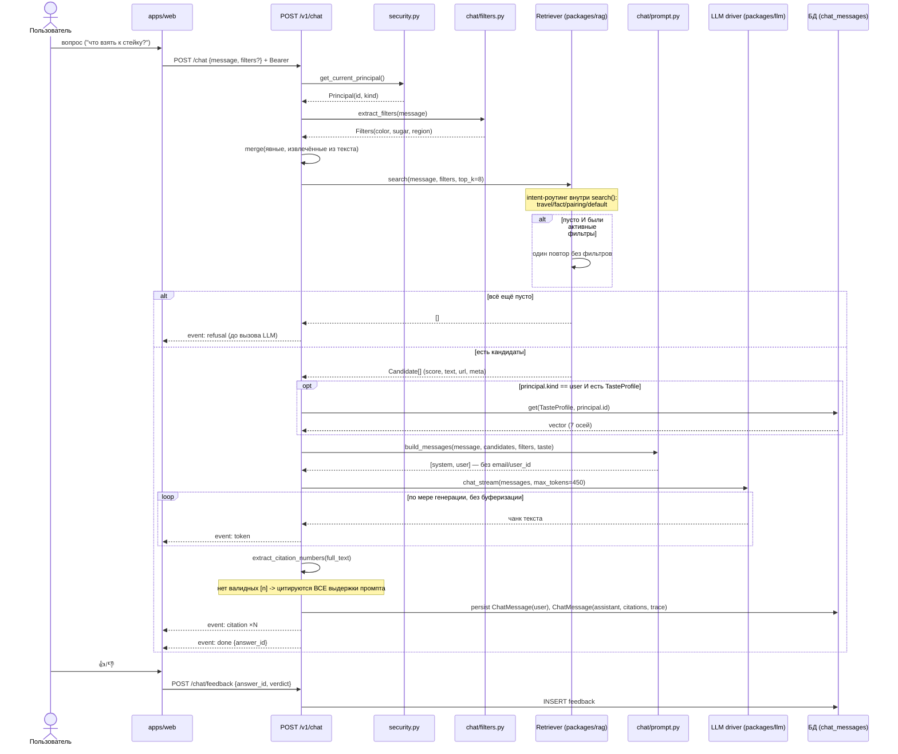
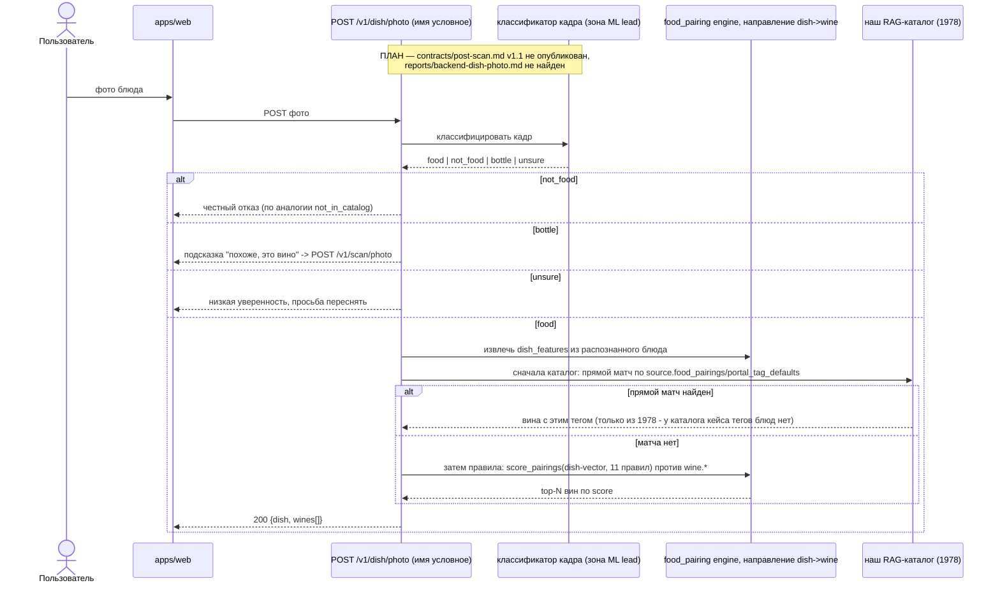

# LLD: RAG-поиск, чат-сомелье и гастропары

Детальный раздел LLD «Свой Сомелье», по заданию тимлида 22.09 (решение Вячеслава). Автор — backend,
по коду (не по намерениям): `packages/rag`, `packages/llm`, `apps/api/app/{chat,rag}`,
`apps/api/app/food_pairing.py`, `apps/api/app/routers/{wines,analogs,auth}.py`, `apps/api/app/security.py`,
`apps/api/app/cv/archive.py`, плюс контракты (`contracts/{rag-interface,llm-adapter,post-scan,image-scan,
openapi,schema.sql}`) и все `reports/backend-*.md`. Ссылается из `HLD.md`/`LLD.md` архитектора (на момент
написания ещё не опубликованы в `docs/architecture/`). Модели CV/OCR/VLM и сам пайплайн скана (шаги 1-4
`ARCHITECTURE.md`) — вне объёма, см. `models-and-algorithms.md` ML lead. Эксплуатация/выкат/секреты —
`docs/architecture/operations.md` (devops). Адрес GPU-шлюза и ключи нигде ниже не приводятся —
только имена env-переменных.

Все цифры ниже — снимок 22.09 (индекс версии `20260828.1`, ветка `main`, тесты прогнаны заново при
подготовке документа). Где раздел описывает ещё не реализованное — сказано явно, отдельным заголовком.

---

## 0. Место в системе

Слой 5 `ARCHITECTURE.md` («ДОП-ФУНКЦИОНАЛ ПОСЛЕ ПОИСКА») — всё, что работает уже ПОСЛЕ того, как
CV-пайплайн (слои 1-4) отдал `wine_id`/карточку. Три независимых по коду, но связанных по данным блока:

```
apps/api/app/routers/{chat,wines,analogs}.py   — HTTP/SSE-фасад (контракты)
        │
        ├── apps/api/app/chat/{service,prompt,filters}.py   — оркестрация чата
        │         │
        │         ├── packages/rag  (через apps/api/app/rag/*)  — поиск и цитаты
        │         └── packages/llm                              — генерация текста
        │
        ├── apps/api/app/food_pairing.py                     — гастропары (без LLM)
        │         └── pipeline/ref/food_pairing_rules.yaml    — движок правил (зона ml-lead, read-only)
        │
        └── apps/api/app/analog_lookup.py → packages/rag       — «аналог импортного» (без LLM)
```

`packages/rag` и `packages/llm` — независимые пакеты со своими заморожен­ными контрактами
(`contracts/rag-interface.md` v0.1, `contracts/llm-adapter.md` v0.1); `apps/api/app/rag/` — тонкий слой
интеграции (`factory.py` — фабрика по `RAG_PROVIDER`, `cards.py` — резолюция карточки вина,
`case_catalog.py` — фолбэк на каталог кейса, `mock.py`/`fixtures.py` — офлайн-режим для dev/тестов).

---

## 1. RAG (`packages/rag`, `apps/api/app/rag`)

### 1.1 Сборка индекса

**Точка входа.** Консольная команда `rag` (`packages/rag/pyproject.toml`, entry point `rag.cli:main`):
`rag ingest --source <build_dir> --catalog <catalog_dir> --version <YYYYMMDD.N>` →
`packages/rag/rag/ingest.py::run_ingest()`. Идемпотентно: id каждой записи стабилен (wine slug /
`winery:<slug>` / `article:<id>#<n>`), точка в Qdrant адресуется `uuid5(namespace, id)`
(`rag/store.py::point_id`) — повторный прогон перезаписывает точку, не дублирует; payload-файлы,
BM25-пиклы и `labels.jsonl` перезаписываются целиком.

**Источники и провенанс.** Сами тексты не собираются в `packages/rag` — это отдельный шаг
`pipeline/crawler/run.py build-index`, который превращает выкачку портала vino-svoe.ru (`pipeline/catalog/`)
в плоские `pipeline/build/*.jsonl`. `rag ingest` читает уже готовое:

| Источник | Коллекция | Обогащение из `catalog/` |
|---|---|---|
| `build/index.jsonl` | `wines` | `catalog/wines/<slug>.json` → блоки `source`/`derived` целиком |
| `build/wineries.jsonl` | `wineries` | `catalog/wineries/<slug>.json` → блок `source` |
| `build/articles.jsonl` (уже нарезан на чанки по заголовкам разделов, мягкий лимит 2000 символов) | `knowledge` | — |

Путь к данным — `RAG_VINES_ROOT`/`RAG_BUILD_DIR`/`RAG_CATALOG_DIR`/`RAG_REF_DIR` (env, `rag/config.py`);
дефолт — `pipeline/` внутри репозитория (побайтовая копия внешнего `vines/`), а не абсолютный
dev-путь — правка после падения `FileNotFoundError` на первом деплое на ams3.

Провенанс фиксируется на шаге краулера, не в `packages/rag`: `pipeline/crawler/run.py` пишет в каждую
карточку `provenance = {source_url, fetched_at, content_hash, parser_version}` (факт `source` отделён
от вычисленного `derived`, `pipeline/README.md`). В payload индекса этот блок **не копируется** —
из него в `Candidate.url` попадает только `source_url`; `fetched_at`/`content_hash`/`parser_version`
до RAG не доезжают (не требовались контрактом retrieval-слоя).

Данные выкачаны **2026-08-25**; индекс собран из них **2026-08-27** (манифест: версия `20260828.1`,
`created: 2026-08-27T22:31:38Z`).

**Коллекции wines / wineries / knowledge — состав и объёмы** (`packages/rag/data/manifest.json`,
сверено построчным счётом `payloads/*.jsonl`):

| Коллекция | id | Текст для эмбеддинга/BM25 | Payload (сверх текста) | Объём |
|---|---|---|---|---|
| `wines` | wine-slug | `name · winery_name · region_name · grapes · color · sugar_category · color_in_glass · food_pairings · description` (в среднем 390 симв., максимум 1987; у 1 вина текст пуст) | `filters{color,sugar,region,winery,grapes,food,rating,abv,stillness,reference_style_matches}` (внутреннее, для фильтрации/ранжирования) + `sensory{7 осей}` + `source`/`derived` карточки целиком | **1978** |
| `wineries` | `winery:<slug>` | name/region_name/locality/climate/description/about (в среднем 2933, максимум 8050 симв.) | `filters{region, vineyard_area_ha, founded_year, wines}`, `wine_slugs`, `source` | **138** |
| `knowledge` | `article:<slug>#<n>` | чанк статьи по заголовку раздела (в среднем 1006, максимум 6412 симв. — лимит 2000 мягкий, абзац не режется; у 2339 из 5592 чанков нет заголовка) | `filters{rubric, author, published_date, year}`, `title`, `heading`, `article_id` | **5592** (из 1297 статей — 1 из 1298 без заголовка/тела пропущена; в среднем 4.31 чанка/статью) |

Итого **7708 текстов**, вектор — 384 измерения, косинусная метрика, одинаково для всех трёх коллекций.
Показательные срезы по `wines.filters` (для понимания, что реально фильтруется): цвет — белое 933 /
красное 750 / розовое 274 / оранжевое 16 / пусто 5; регион — Кубань 1016, Крым 723, Дагестан 80,
Долина Дона 78, остальные < 50; `reference_style_matches` непуст у 1886 из 1978; **`derived.price_tier`
пуст у ВСЕХ 1978 записей** — в данных портала (и в каталоге кейса, `strapi_output0709.csv`) цены нет
структурно нигде, что напрямую объясняет честный отказ чата обсуждать бюджет (§2.1).

Отдельно — корпус `labels.jsonl` (1978 строк: `id, name, winery_name, search_text, text, url`) для
`resolve_label` (fuzzy-резолюция текста этикетки в `/scan/resolve`, вне объёма этого документа) —
векторы не участвуют, только rapidfuzz.

**Тайминги полного ingest** (манифест): чтение источников 0.28 с, эмбеддинги 120.8 с, upsert в Qdrant
3.9 с, калибровка refusal 41.8 с — **итого 177.9 с** (~3.0 мин; при параллельной нагрузке других
агентов на общей dev-машине наблюдалось до ~5.2 мин). Контрактный DoD «ingest ≤ 10 мин» — выполнен
с запасом.

**Модели.**

| Роль | Модель | Детали |
|---|---|---|
| Dense-эмбеддер | `sentence-transformers/paraphrase-multilingual-MiniLM-L12-v2` (env `RAG_DENSE_MODEL`), 384-мерный (env `RAG_DENSE_DIM`) | Через `fastembed.TextEmbedding` (реестр fastembed 0.8.0 подставляет ONNX-экспорт `qdrant/paraphrase-multilingual-MiniLM-L12-v2-onnx-Q`, apache-2.0, окно 512 токенов, ~240 текстов/с на CPU дев-машины). Документы — `embed(batch_size=64)`; запрос — `query_embed()` (для этой модели ведёт себя как обычный embed — отдельного query-префикса нет). Кэша эмбеддингов запросов нет. |
| Реранкер | `jinaai/jina-reranker-v2-base-multilingual` (env `RAG_RERANKER_MODEL`, пустая строка выключает стадию) | Через `fastembed.rerank.cross_encoder.TextCrossEncoder`, 1.1 ГБ, окно 1024 токена. **Лицензия модели — cc-by-nc-4.0 (некоммерческая)** — стоит явно свериться с юр-требованиями кейса перед публикацией/использованием вне хакатона (находка при подготовке этого документа, отдельно не обсуждалась командой). |
| Потоки ONNX | `RAG_ONNX_THREADS=4` | Общий лимит для эмбеддера и реранкера — без него onnxruntime разбирает все ядра общей dev-машины, конкурируя с параллельными агентами. |

**Важное расхождение с контрактом**: `contracts/rag-interface.md` называет `bge-m3` (dense) и
`bge-reranker-v2-m3` (реранкер) — обе модели отсутствуют в реестре установленной версии fastembed 0.8.0
(`TextEmbedding.list_supported_models()`/`TextCrossEncoder.list_supported_models()` их не содержат;
добавление потребовало бы `add_custom_model` с ручным ONNX-экспортом вне бюджета задачи). Бриф прямо
разрешал замену с документированием (`reports/a-report.md`, «Модели: выбор и обоснование») — код
является источником истины, контракт эту деталь текстуально не актуализировал (см. §8.1).

Устойчивость: `CrossEncoderReranker` ловит ЛЮБОЕ исключение загрузки/инференса (нет сети, нет кэша,
битые веса) и молча откатывается на порядок RRF (`rag/rerank.py`) — реранк никогда не роняет retrieval
целиком, только тихо теряет своё улучшение ранжирования. Стоимость реранка на CPU определяется в первую
очередь ДЛИНОЙ документа, не только числом кандидатов (полный текст статьи ~4000 симв. в top-50 давал
10-50 **секунд**/запрос на первых замерах) — три компенсации в `rag/config.py`: `RERANK_POOL=20`
(реранкаем top-20 из RRF top-50, а не весь пул), `RERANK_TRUNCATE_CHARS=500` (обрезка текста),
`RAG_ONNX_THREADS=4`. После фикса — ~0.6-1.1 с/запрос (Mac).

**BM25**: `rank_bm25.BM25Okapi` (версия rank-bm25 0.2.2, дефолтные параметры библиотеки `k1=1.5, b=0.75,
epsilon=0.25`) — отдельный индекс на коллекцию, `.pkl`-пиклы (`data/bm25/{wines,wineries,knowledge}.pkl`,
~13 МБ). Токенизация (`rag/textutil.py`): regex `[0-9a-zA-Zа-яёА-ЯЁ]+`, lower-case, русский стемминг
(`nltk.stem.snowball.SnowballStemmer("russian")`, без скачивания словарей) — одинаково для документов
и запроса. Без стемминга словоформы не пересекались токенами («крымское» / «Крым», «из Дагестана» /
«Дагестан») — фикс дал hit@8 0.78→0.87 на голд-сете (волна 1-2).

**Векторное хранилище: embedded Qdrant, однопроцессность.** `qdrant-client` (1.19.1 в `packages/rag`,
1.19.0 в `apps/api` — версии слегка разошлись, не проверялось на бинарную совместимость формата),
`QdrantClient(path=...)` — локальный файловый режим без Docker, дефолт для dev И для текущего стенда
(сетевой `QDRANT_URL`/`RAG_MODE=qdrant` — контрактный прод-сценарий для compose, на ams3 сейчас не
используется, см. `operations.md`). Три коллекции, cosine distance, батч-upsert по 256 точек. Поиск —
**полный перебор по всем векторам в памяти** (без HNSW-индекса) — оправдано объёмом (максимум 5592 точек
на коллекцию, предупреждение библиотеки срабатывает только свыше 20 000).

Механика однопроцессности (`qdrant_client.local.qdrant_local.QdrantLocal._load()`): при открытии клиент
сначала целиком поднимает все коллекции из sqlite-хранилища в память, затем берёт
`portalocker.lock(<path>/.lock, EXCLUSIVE | NON_BLOCKING)`; если файл уже заблокирован другим процессом —
`RuntimeError("Storage folder … is already accessed by another instance of Qdrant client. If you require
concurrent access, use Qdrant server instead.")`. Сам файл `.lock` (13 байт) — не блокировка сама по
себе, блокировка — это системный лок на открытом дескрипторе, снимается в `close()`. Именно это
зафиксировано в `ORCHESTRATION.md` (22.09): второй процесс на том же каталоге либо тихо отдаёт пустые
ответы (если открытие клиента вообще не дошло до лока — наблюдалось на CV-индексе), либо падает с 500
на первом запросе (наблюдалось на RAG-индексе, `reports/qa-auto-post-scan.md`) — **сам старт процесса
исключения не бросает**: прогрев (`warm_up_retriever()`, ниже) глушит ошибку, `_client` остаётся `None`,
и каждый следующий вызов `search()`/`similar()` заново пытается открыть клиент и падает заново. Только
`search()` и `similar()` вообще трогают Qdrant — `get_by_id`/`resolve_label`/`resolve_style`/
`analog_for_style`/`list_reference_styles`/`candidates_for_taste` работают по payload-кэшу и labels
в памяти процесса, без похода в хранилище.

Практическое следствие для эксплуатации: параллельный живой API — только на собственных копиях
`packages/rag/data` (без `.lock`), гасить процесс и освобождать порт после себя (правило подтверждено
находкой qa-auto 22.09). На стенде — один `uvicorn --workers 1` (`operations.md`) — горизонтально
масштабировать API без перехода на сетевой `RAG_MODE=qdrant` нельзя (встроенный режим держит
эксклюзивный лок на процесс).

Размер на диске одного индекса: `qdrant/` ~56 МБ, `payloads/` ~22 МБ, `bm25/` ~13 МБ, `labels.jsonl`
~3.0 МБ — итого ~93 МБ (без кэша моделей, отдельно ~1.3 ГБ в `.fastembed_cache/`, не версионируется
с индексом). **Находка**: каталог `packages/rag/data` (включая `qdrant/.lock`) в реальности закоммичен
в git (коммит `72e853e`) — расходится с докстрингом `.gitignore` в отчёте A; риск раздувания истории
репозитория бинарными данными индекса, стоит вопросом к architect/devops (репозиторий и так готовится
к публикации жюри, `reports/devops-repo-hygiene.md`).

**Калибровка порога отказа (refusal) по голд-сету.** `packages/rag/rag/calibrate.py::
calibrate_refusal_threshold()` — вызывается ВНУТРИ `run_ingest()` сразу после построения индекса,
ДО записи `manifest.json`, отдельного скрипта калибровки нет. Алгоритм:

1. Каждый вопрос голд-сета (кроме `type=analog` — та ветка не идёт через `search()`/реранкер) прогоняется
   через `HybridSearcher.search(collections=infer_collections(q), use_reranker=True, apply_refusal=False)`
   — берётся сырой top-1 скор ПОСЛЕ реранка.
2. Скор делится на две группы: «легит» (`pick`/`pairing`/`fact`/`travel`) и «мусор» (`type=refusal`).
3. Если диапазоны НЕ пересекаются — порог = середина между `min(легит)` и `max(мусор)`.
4. Если пересекаются (реальный случай) — перебором по серединам между соседними уникальными скорами
   ищется 1D-порог, **максимизирующий** `#(легит ≥ t) + #(мусор < t)` — не процентиль (первая версия на
   90-м перцентиле мусора резала слишком много легита).
5. Порог + статистика (`legit_min/max`, `refusal_min/max`, `n_legit_wrongly_refused`,
   `n_refusal_wrongly_passed`, `overlap`) пишутся в `manifest.json`, читаются `Retriever.__init__`
   и передаются в `HybridSearcher`.

Текущее значение (индекс `20260828.1`): **`threshold = -1.0532`** — легит min=-2.4883/max=1.9963 (n=53),
мусор min=-2.6973/max=-0.301 (n=11), диапазоны ПЕРЕСЕКАЮТСЯ (кросс-энкодер иногда скорит честный, но
слабо сформулированный вопрос не выше типичного мусора — идеального порога не существует): 2 из 53
легитимных вопросов ложно отказаны, 4 из 11 мусорных ложно пропущены. Применяется ТОЛЬКО когда
`use_reranker=True` (порог откалиброван под шкалу кросс-энкодера — у RRF-скора без реранка другая шкала,
там порог всегда резал бы). Индекс без голд-сета (например, синтетическая тест-фикстура) получает
`threshold=None` → отсечка выключена, `rag ingest` не падает.

Методологическая тонкость: калибровка меряет `pairing` только на чистом пуле `("wines",)` (как того
требует роутинг), но в рантайме тот же общий порог местами обходится ВООБЩЕ (см. «Гейт отказа» ниже) —
порог как таковой относится в первую очередь к `default`-ветке (посторонние вопросы).

### 1.2 Поиск

**Константы пайплайна** (`packages/rag/rag/config.py`): `CANDIDATE_POOL=50` (top-N на dense и на BM25
до слияния), `RRF_K=60` (канонический), `RERANK_POOL=20`, `RERANK_TRUNCATE_CHARS=500`, `top_k=8`
(дефолт публичного API).

**Гибрид** (`rag/hybrid.py::HybridSearcher.search()`):

1. Жёсткие фильтры (`Filters`) — ДО векторов, по-разному на разные коллекции (`_FILTER_MODE`:
   `wines="full"` — color/sugar/region/grapes/stillness через Qdrant `Filter`; `wineries="region"` —
   только регион; `knowledge="none"` — у статей нет ни цвета, ни сахара).
2. dense (fastembed) + sparse BM25 — каждый top-`CANDIDATE_POOL`=50 на коллекцию (dense — через Qdrant
   `query_points` с фильтром внутри запроса; BM25 — скор всей коллекции целиком в Python, затем
   `passes_filters()` — зеркало Qdrant-фильтра для sparse-ветки).
3. **RRF-слияние** (классический Reciprocal Rank Fusion, ранг считается с 0):

   ```python
   score(doc) = (1/(RRF_K + dense_rank + 1) if doc in dense_hits else 0) \
              + (1/(RRF_K + bm25_rank + 1)  if doc in bm25_hits  else 0)
   ```

   Сортировка по убыванию, обрезка до `CANDIDATE_POOL`. Документы объединяются через `set` — порядок при
   строго равных RRF-скорах не гарантирован детерминированным между процессами (зависит от хэш-сида).
4. Реранкер (опционально, `use_reranker=True` по умолчанию): top-`RERANK_POOL`=20 из уже отранжированного
   RRF-пула, текст обрезан до 500 симв.; хвост пула (позиции 21-50, НЕ попавшие в реранк) сохраняет
   RRF-порядок и подклеивается НИЖЕ реранкнутой головы с искусственными скорами `min(голова) - 1 - i`.
   Без реранкера скор — просто позиция (`n - i`), а не доля RRF.
5. **Гейт отказа**: если `use_reranker` И `apply_refusal` И порог не `None` И `final_scores[0] < threshold`
   → `search()` возвращает `[]`. Следствие устройства кода: при отключённом/упавшем реранкере скоры
   всегда положительны (`n-i`), и при отрицательном пороге (как сейчас, -1.0532) отказ по этой ветке
   фактически никогда не сработает — отказ содержательно привязан именно к работающему кросс-энкодеру.
6. Топ-`top_k` кандидатов → `Candidate(id, kind, score, text, url, meta)`; `meta` строится единой функцией
   `public_meta(payload)` (`rag/meta.py`) по `kind`: `wine` → `{source, derived}` карточки целиком;
   `chunk` → `{article_id, title, heading, rubric}`; `winery` → `{source}` (форма зафиксирована контрактом
   v0.3, блокер ревью 02 — раньше API падал 500, читая `meta["source"]`, которого не было).

**Intent-роутинг** (`rag/intent.py`, чисто регулярки, без ML/классификатора) — вызывается ВНУТРИ
`Retriever.search()` как дефолт, если `collections` не передан явно (явная передача эвристику полностью
отключает). `classify(query, filters=None)` возвращает `travel|fact|pairing|default`, первое совпадение
по приоритету побеждает:

| Тип | Сигнал | Коллекции |
|---|---|---|
| `travel` | `винодельн\|вино.?тур\|винный тур\|экскурси\|куда (съездить\|поехать)\|путешеств\|посетить\|дегустационн.?(зал\|комнат)` | `(wineries, knowledge)` |
| `fact` | `^что такое\|^почему\|^откуда\|^как называ\|^зачем\|что означает\|в чём разниц\|чем отлича\|из чего (сделан\|образ)\|расскаж…про\|как понять` | `(knowledge,)` |
| `pairing` | лексема `вин[оаеуы]` ИЛИ `что (подать\|взять\|выбрать\|заказать)` ИЛИ короткий (≤30 симв.) фрагмент `\b(к\|под)\s+\S` где угодно в строке ИЛИ **любой активный `Filters`** (цвет/сахар/регион — добавлено 22.09 как самостоятельный сигнал «вопрос про вино») | см. ниже — не кортеж, а приоритет |
| `default` | иначе | `(wines, knowledge)` — контрактный дефолт |

Для `pairing` роутинг — не единый кортеж, а двухпроходный приоритет (`Retriever._search_pairing()`):
сначала СТРОГО `wines` с `apply_refusal=False` (порог откалиброван на смешанном пуле wines+knowledge,
где статьи систематически скорят выше терпимых карточек вина — на wines-only проходе он резал бы честные
ответы); если карточек вин набралось `>= top_k` — это и есть ответ БЕЗ обращения к глобальному отказу
(сама классификация «pairing» — уже достаточный сигнал «в теме»); если не хватило — второй проход
`(wines, knowledge)` С отказом (честный refusal остаётся в силе, если вин объективно мало). Найдено и
исправлено 22.09: демо-вопрос «Что взять к сырам?» раньше получал top-8 цитат из статей вместо карточек
вин — вытеснение длинными «плотными» по теме статьями.

**Фильтры**: `Filters(color, sugar, region, grapes, stillness)` (`rag/types.py`, дословно из контракта).
Цены в данных нет вообще (`derived.price_tier` пуст у всех 1978 записей, в `strapi_output0709.csv` тоже
нет такой колонки) — фильтра по бюджету структурно не существует. Извлечение `Filters` из СВОБОДНОГО
текста реплики — ответственность вызывающей стороны, НЕ ретривера (контракт v0.2.4):
`apps/api/app/chat/filters.py::extract_filters()` — детерминированные regex по стемам (без ML/морфологии)
для color/sugar (жёсткие словари) и region (по стему слова из `pipeline/ref/taxonomy.yaml::regions`);
`grapes` и `stillness` из текста НЕ извлекаются (признанный пробел, `reports/backend-chat-retrieval.md`:
«Игристое на праздник» не ловится фильтром).

**Повтор без фильтров перед отказом** (`rag/base.py::Retriever.search()`):

```python
results = self._search_auto(query, filters, top_k)
if results or not filters_active(filters):
    return results
return self._search_auto(query, None, top_k)   # один повтор, filters=None
```

Ровно ОДИН повторный проход, и только при пустой выдаче И активных фильтрах. Найдено 22.09 на живом
вопросе «Посоветуй красное к стейку до 2000 рублей»: жёсткий цветовой фильтр сам по себе не виноват
(красных вин много), но скор после реранка проседал из-за ЦЕНЫ В ТЕКСТЕ ЗАПРОСА (которой физически нет
ни в одном документе) — фильтр складывался с этим проседанием и уводил top-скор ниже порога отказа.
Во втором проходе (без фильтров) маршрутизация может смениться — исчезает сигнал «pairing от активного
Filters», остаётся только текстовый.

**Прогрев.** Внутри `packages/rag` прогрева нет — всё грузится лениво при первом обращении
(dense-модель, реранкер, Qdrant-клиент). Прогревает API: `apps/api/app/rag/factory.py::
warm_up_retriever()` — один холостой `retriever.search("вино", top_k=1)` сразу при старте процесса
(`app/main.py`), только при `RAG_PROVIDER=real` (мок мгновенный, греть нечего). Запрос «вино»
классифицируется как `pairing` → проход только по `wines` с реранком, то есть прогревается именно
тяжёлый путь (dense-модель + Qdrant, все три коллекции в память, плюс лок + кросс-энкодер). Ошибка
прогрева НЕ роняет старт процесса (`except Exception: return False`) — лучше живой процесс с холодным
первым чатом, чем не поднятый вовсе. Осознанно не пишет в `app.state`, которое участвует в
`GET /healthz.warm` (прямое указание тимлида: чат и сканер — разные бюджеты демо-сцен, смешивать их
AND'ом незачем). Основание: dense-модель грузится лениво на первый боевой `search()` — ~8 с на 4 vCPU
стенда, без прогрева совпадало по времени с прогонами фото-сканов и давало им хвост 7-9 с.

### 1.3 Метрики голд-сета

`packages/rag/eval/goldset.jsonl` — 78 вопросов, поля `{q, type, expect_ids, expect_any}`:
pick 18 (по 2 ожидаемых id), analog 14 (20-223 id), pairing 12 (39-1116 id — широкие ожидания по тегу),
fact 13 (1-2 id), travel 10 (1-9 id), refusal 11 (пустой список ожиданий). `type=refusal` — расширение
сверх контрактного перечисления `pick|analog|pairing|fact|travel`, добавлено по указанию ревью 02,
текстом контракта ещё не отражено (§8.1). Команда: `rag eval --bench-n 100`
(`packages/rag/rag/cli.py` → `rag/eval.py`) — метрики в stdout + `eval/report.json` (не коммитится).
Считаются только **hit@k и MRR** плюс латентность p50/p95/max — precision/recall/NDCG не считаются.
Два режима: `heuristic` (как реально зовёт `/chat` — `search()` без знания разметки) и `oracle`
(коллекции берутся из разметки голд-сета — недостижимый в проде потолок).

Хедлайн (`routing=heuristic`, `top_k=8`, индекс `20260828.1`):

| Тип | n | hit@8 | MRR | oracle hit@8 / MRR |
|---|---|---|---|---|
| analog | 14 | 1.000 | 1.000 | = |
| fact | 13 | 0.923 | 0.638 | = |
| pairing | 12 | 0.917 | 0.875 | 0.833 / 0.792 (heuristic ЛУЧШЕ oracle — waterfall wines-приоритет работает только на heuristic-пути) |
| pick | 18 | 0.722 | 0.675 | = |
| travel | 10 | 0.700 | 0.633 | 0.800 / 0.733 |
| refusal | 11 | 0.636 (7/11 мусора отсечено) | 0.636 | = |
| **всего (6 типов)** | 78 | **0.8205** | **0.747** | 0.8205 / 0.747 |
| **5 ranking-типов без refusal** | 67 | **0.8507** | — | без изменений на всей волне разработки |

**DoD-релевантное число — 0.8507 на 5 исходных ranking-типах** (порог контракта ≥0.85 выполнен); общее
0.8205 просело исключительно за счёт калибровки refusal (accept/reject-задача с пересекающимися
распределениями, не ranking) — разведение метрик на два отдельных бара предложено к контракту, ещё не
принято текстом (§8.1). Самый слабый ranking-тип — `pick` (0.722): диагностика показала, что ядро
retrieval безупречно, когда получает структурные `Filters` (hit@8=1.000 на тех же 11 вопросах с явными
фильтрами вместо голого текста) — узкое место в извлечении региона/сорта из свободной разговорной речи
(словоформы вроде «крымское» не сводятся стеммингом к «крым»), а не в самом поиске.

Латентность (100 запросов, `top_k=8`, Mac): без реранкера p50=18.1 мс/p95=48.6 мс (контракт: ≤300 мс —
выполнено, запас ×6; но метод меряет `hybrid.search()` напрямую с дефолтными коллекциями `wines+
knowledge`, БЕЗ intent-роутинга и без повтора-без-фильтров — методологическая оговорка); с реранкером
p50=687.8 мс/p95=786.7 мс (контракт порога не задаёт, только просит замерить).

### 1.4 Покрытие каталога

RAG-индекс (коллекция `wines`) построен на СОБСТВЕННОМ каталоге команды (`pipeline/catalog`, выкачка
портала vino-svoe.ru 2026-08-25) — **1978** вин. Приватная проверка организаторов идёт по ДРУГОМУ,
независимому каталогу кейса РСХБ (`case-data/strapi_output0709.csv`, вне git) — **2103** позиции.
Прямая сверка id (только чтение: 2103 уникальных `Slug` в CSV кейса против 1978 id в
`payloads/wines.jsonl`) даёт пересечение ровно **1978** — то есть ВЕСЬ наш каталог целиком является
подмножеством каталога кейса, а 125 позиций существуют только в кейсе и 0 — только у нас.

**Округлённо: 1978 из 2103 (94.06%) вин кейса покрыты полноценным RAG-поиском.** Для этих 1978 вин
чат может процитировать реальный текст карточки (`/chat`), а гастропары получают `basis="catalog"` из
`source.food_pairings` портала (§3.1). Оставшиеся ~125 слогов кейса существуют ТОЛЬКО в плоском
фолбэке `case_catalog.json` (`apps/api/app/rag/case_catalog.py`, собран офлайн-скриптом из того же CSV)
— карточка (`GET /wines/{id}`) и heuristic-уровень гастропар для них доступны, но эти вина **НЕ
проиндексированы** в Qdrant/BM25 и никогда не появятся как источник цитаты в `/chat` (в коллекциях их
просто нет ни одной записью). Сверка согласуется с независимо посчитанной цифрой из
`reports/backend-pairings.md` (прогон по всем 4081=1978+2103 записям 22.09): «каталог кейса — catalog=1977
(слаг совпал с нашим RAG), heuristic=125, unavailable=1» — расхождение 1978 vs 1977 в один слог
объясняется единственной дефектной записью каталога (`color=null`), учтённой там отдельно.

**Пересборка индекса.** Параллельно этой волне (другой backend-агент, по заданию тимлида) идёт пересборка
индекса на обновлённых данных портала — цель, судя по всему, сузить разрыв 1978/2103. На момент
подготовки этого документа `reports/backend-rag-rebuild.md` **ещё не опубликован** (проверено: файла нет
ни в `reports/`, ни в истории git) — числа этого раздела актуальны на снимок 22.09 индекса `20260828.1`
(идентичен на dev-машине и на стенде побайтово, сверено по manifest/payloads/labels). Раздел подлежит
обновлению по факту публикации отчёта о пересборке.

---

## 2. Чат (`apps/api/app/chat`, `packages/llm`)

### 2.1 Сборка промпта и вкусовой профиль

`apps/api/app/chat/prompt.py::build_messages()` — ровно ДВА сообщения (`Msg`), история диалога МЕЖДУ
запросами не передаётся (каждый вопрос обрабатывается независимо, хотя переписка целиком персистируется
в БД, см. §2.2):

- **system** — константа `SYSTEM_PROMPT`, требует: отвечать ТОЛЬКО по приведённым выдержкам; каждое
  фактическое утверждение — со ссылкой `[n]`; честный отказ, если выдержек недостаточно или вопрос не
  о вине/еде, без выдумывания и без советов «где купить алкоголь»; не более 3 вин по 1-2 предложения на
  ответ (демо-бюджет); явное признание — цену вин модель не знает и не фильтрует (в данных её нет вовсе,
  §1.2), не выдумывать бюджетное соответствие.
- **user** — склейка блоков через `"\n\n"`: (1) заголовок + выдержки `[1] текст`…`[k] текст`
  (`build_excerpts_block()`, по одной строке на `Candidate.text`, нумерация = порядок выдачи ретривера,
  `k ≤ top_k=8`); (2) опционально `Фильтры пользователя: color=…, sugar=…, region=…`; (3) опционально
  вкусовой профиль; (4) `Вопрос пользователя: <message>`.

**Вкусовой профиль.** Анкеты/опросника НЕТ — профиль строится из свайп-дегустации,
`POST /v1/taste/swipes {wine_id, verdict: like|dislike|skip}` (вне объёма этого документа детально,
`apps/api/app/routers/taste.py`). Источник истины — таблица `swipes`; `taste_profiles` — синхронно
пересчитываемый кэш (`contracts/schema.sql`: `user_id PK, vector jsonb, top_styles jsonb, swipes_count,
updated_at`). `_compute_profile()`: вектор = среднее `derived.sensory` по ЛАЙКНУТЫМ винам (через
`retriever.get_by_id()`, округление до 4 знаков); `top_styles` = 3 самых частых
`reference_style_matches` среди лайков; `dislike`/`skip` вектор не двигают; без единого лайка —
нейтральный вектор 0.5 по всем осям (это поведение ТОЛЬКО у `GET /v1/taste/profile`, не у чата — см.
ниже). Доступ — только зарегистрированный не-гость с согласием `scope=profiling`
(`require_profiling_consent`, §4.1).

В промпт профиль попадает ТОЛЬКО когда `principal.kind == "user"` И в БД реально существует строка
`TasteProfile` (`routers/chat.py`: `db.get(TasteProfile, principal.id)` — прямой lookup по PK, `None`
при отсутствии строки) — то есть пользователь, ни разу не свайпавший, не получает нейтральный 0.5 в
промпте, профиль просто отсутствует (не путать с нейтральным вектором, который в этом случае вернул бы
отдельный эндпоинт `/taste/profile`). Ось `top_styles`/`swipes_count` в промпт НЕ передаются — только
7 чисел. Сериализация (`format_taste_vector()`) — фиксированный порядок осей
(`sweetness, acidity, tannin, body, oak, aromatic_intensity, bubbles` — ТЕ ЖЕ, что использует движок
гастропар, §3.2), формат `"sweetness=0.30 acidity=0.70 …"` — **БЕЗ id/имени пользователя**, как того
требует `contracts/llm-adapter.md` («вкусовой паспорт передаётся строкой… без идентичности»). Инвариант
обеспечен СТРУКТУРНО, не дисциплиной: `build_messages()` физически не принимает ни email, ни `user_id`,
ни объект пользователя — только текст, кандидаты, словарь фильтров, уже обезличенная строка (тест
`test_chat.py::test_email_never_reaches_llm_prompt` прогоняет реальный пайплайн на пользователе с email
и проверяет отсутствие email в любом `Msg`).

Нюанс конфиденциальности вне тестового покрытия (не блокер, но стоит зафиксировать): отзыв согласия
`scope=profiling` НЕ удаляет строку `taste_profiles` и не проверяется заново на каждый `/chat` —
вектор потенциально продолжает попадать в промпт и после отзыва согласия пользователем.

Фильтры на входе промпта — объединение явных полей `ChatRequest.filters` (приоритет — осознанный
UI-выбор) и того, что детерминированно извлекается из текста реплики (`routers/chat.py::
_merge_filters()`).

### 2.2 Протокол SSE

`POST /v1/chat` (`routers/chat.py`, `sse_starlette.EventSourceResponse`; синхронный генератор выполняется
в пуле потоков). Транспорт: одна строка `data: <JSON>` на событие (без полей `event:`/`id:`), JSON с
`ensure_ascii=False`; заголовки `Cache-Control: no-store`, `Connection: keep-alive`,
`X-Accel-Buffering: no`; раз в ~15 с — комментарий-пинг `: ping - <время>` (sse-starlette, keep-alive
против прокси-таймаутов). Требует принципала (гость или пользователь) — без Bearer 401.

Четыре типа событий (`contracts/openapi.yaml`, дословно):

| type | Поля | Когда |
|---|---|---|
| `token` | `text: str` — чанк как есть от драйвера | по мере генерации, НЕ буферизуется |
| `citation` | `n, url, quote` (=`Candidate.text` целиком) + РОВНО одно из `wine_id`/`chunk_id` | после полного текста, до `done` |
| `done` | `answer_id: str` (=`str(chat_messages.id)` ответа) | терминально, после всех citation |
| `refusal` | `reason: str` — готовый русский текст для человека, НЕ код | терминально, БЕЗ `done` следом |

**Стриминг настоящий**: `apps/api/app/chat/service.py::stream_chat_events()` — генератор, каждый чанк
от `llm.chat_stream()` пробрасывается наружу СРАЗУ, никакого `list()`/eager-материализации между LLM и
SSE (контракт v0.3, ревью 02 блокер 2: «буферизация полного ответа запрещена: молчание 5-10 с на сцене
демо — это провал сцены»). Побочный эффект: показанные токены отозвать нельзя, поэтому три разных
момента отказа обрабатываются по-разному:

1. Пустая выдача ретривера (ДО обращения к LLM) — железный `refusal`, токены ещё не отправлялись.
2. `LLMUnavailable` ДО первого чанка, либо пустой итоговый текст — тоже `refusal`.
3. `LLMUnavailable` ПОСЛЕ первого чанка, либо обрыв по лимиту `max_tokens` (§2.4) — поток закрывается
   КАК ОБЫЧНЫЙ (пусть и укороченный) ответ: цитаты + `done`. Признака обрыва клиент не получает.

**Персистентность** (`routers/chat.py`, ПОСЛЕ полного стрима токенов, ДО отправки citation/done):
`ChatMessage(role=user, citations=[], trace=None)` + `ChatMessage(role=assistant, content=full_text,
citations=[...], trace={filters, candidate_ids, index_version})`. `citations` в БД используют ТУ ЖЕ
форму, что SSE citation-событие (`citation_to_event()`) — единый источник истины. Отказ в БД НЕ
пишется — у `refusal` нет `answer_id`, оценить отказ фидбеком (§2.6) невозможно по построению.

Клиент (`apps/web/src/lib/sse.ts`): `ReadableStream`+`TextDecoder`, парсер режет поток по пустой строке,
склеивает `data:`-строки, `JSON.parse`; пинги и битый JSON пропускает молча. **Известное расхождение**:
клиент сравнивает `event.reason === "llm_unavailable"` (ожидает КОД), сервер шлёт готовый русский текст
— эта конкретная ветка UI для «LLM недоступен» никогда не срабатывает как задумано, клиент вместо неё
попадает в généric-текст (не блокер функциональности — `reason` в любом случае показывается пользователю
как есть, но конкретная более тёплая формулировка для этого случая не подключается).

### 2.3 Цитаты [n] и их валидация

Модель расставляет `[n]` по инструкции `SYSTEM_PROMPT`; мок-драйвер — детерминированно (см. §2.5).
Валидация (`chat/service.py`, ПОСЛЕ окончания генерации, по полному тексту — не по ходу стрима):

```python
ns = extract_citation_numbers(full_text)              # regex \[(\d+)\], порядок первого появления, без повторов
valid_ns = [n for n in ns if 1 <= n <= len(candidates)]
if not valid_ns:
    valid_ns = list(range(1, len(candidates) + 1))     # v0.3.2 — см. ниже
```

Проверяется ТОЛЬКО диапазон номера (что `[n]` указывает на реально существующую выдержку) — проверки
СЕМАНТИЧЕСКОЙ релевантности цитаты конкретному утверждению в тексте В КОДЕ НЕТ; релевантность целиком
обеспечивается ДО генерации — реранкером, порогом отказа ретривера и системным промптом. Номера вне
диапазона (модель могла выдумать `[12]` при 8 кандидатах) молча выпадают из citation-событий, но
ОСТАЮТСЯ в уже отправленном тексте — отозвать нельзя (§2.2).

**Гарантия «каждый ответ несёт источники» — по построению, не по дисциплине модели** (v0.3.2, контракт):
если `valid_ns` пуст (модель не расставила НИ ОДНОЙ корректной `[n]`) — сервер перед `done` ВСЁ РАВНО
отправляет citation-события по ВСЕМ candidates, реально попавшим в промпт (нумерация продолжает
`1..len(candidates)`, соответствия маркерам в тексте уже нет — это законно по контракту, клиент рендерит
такой блок как «Источники» под ответом, а не как встроенные ссылки).

### 2.4 Лимит 450 токенов

`Settings.chat_max_tokens` (`apps/api/app/config.py`, env `CHAT_MAX_TOKENS`, **дефолт 450**) →
`stream_chat_events(..., max_tokens=settings.chat_max_tokens)` → `llm.chat_stream(messages,
max_tokens=...)` → поле `max_tokens` в теле запроса к провайдеру. Основание (живой замер стенда 22.09):
без лимита первый прогон демо-вопроса ушёл на 497 токенов / ~84 с ДО КОНЦА (первый токен приемлем —
4.5 с, но долгое молчание ПОСЛЕ него плохо смотрится на сцене демо). 450 — запас под системный промпт
(«не больше 3 вин, 1-2 предложения, с `[n]`») плюс небольшой хвост на длинные названия вин. Лимит режет
ТОЛЬКО длину ОТВЕТА модели — бюджета промпта нет вовсе (промпт естественно ограничен 8 выдержками
и вопросом ≤1000 символов, `ChatRequest.message`). Обрыв посреди предложения по лимиту обрабатывается
тем же путём, что `LLMUnavailable` после первого чанка (§2.2, п.3) — штатный укороченный ответ, не
ошибка. Дефолт Protocol LLM (`packages/llm/llm/base.py`) остаётся 1024 — для прямых вызывающих в обход
`/v1/chat` (тесты, будущие клиенты); 450 — эффективный бюджет только этого эндпоинта.

### 2.5 Драйверы LLM

`packages/llm/llm/base.py::get_llm()` — фабрика по env `LLM_PROVIDER` (дефолт `mock`), вызывается ОДИН
раз в `create_app()`, результат живёт в `app.state.llm` на весь процесс; никакой ветвящейся логики
выбора в `apps/api`. Неизвестное значение `LLM_PROVIDER` роняет старт приложения (`ValueError`).

| `LLM_PROVIDER` | Модуль | Базовый URL / модель | Особенности |
|---|---|---|---|
| `mock` (дефолт) | `drivers/mock.py` | сети нет, `model="mock-1"` | Детерминированный: построчно ищет маркеры `"[n] текст"` во ВСЕХ сообщениях (system+user) — конвенция с `prompt.py::build_excerpts_block()` — и собирает ответ `"По данным источников: <клауза> [n] …"` (клауза — первые 160 симв. выдержки). Без маркеров — отказной текст без цитат (сигнал вызывающему трактовать как повод для refusal). Стримит по словам. Единственный ОБЯЗАТЕЛЬНЫЙ по контракту драйвер — тесты и разработка без единого ключа. |
| `deepseek` | `drivers/deepseek.py` → `_openai_compat.py` | `LLM_BASE_URL` (default `https://api.deepseek.com`), `LLM_MODEL` (default `deepseek-chat`) | Исходный прод-демо, OpenAI-совместимый Chat Completions. |
| `openai` | `drivers/openai.py` → `_openai_compat.py` | `LLM_BASE_URL` БЕЗ дефолта в коде (обязателен — адрес шлюза секретный, не приводится в этом документе), `LLM_MODEL` (default `qwen3.8-27b`) | Решение Вячеслава 22.09: свой Qwen3.8-27B через внутренний GPU-шлюз команды (LiteLLM-совместимый, `/chat/completions`, Bearer, SSE) — пока нет ключа GigaChat. Сейчас включён на стенде (с волны hack-v13). НЕ путать с `VISION_LLM_URL`/`VISION_LLM_KEY` (`packages/cv`, чтение этикетки на сканере, вне объёма) — физически может быть тот же шлюз, но разные переменные/модели/назначение. |
| `gigachat` | `drivers/gigachat.py` | OAuth client-credentials (`GIGACHAT_AUTH_URL` default `https://ngw.devices.sberbank.ru:9443/api/v2/oauth`, `GIGACHAT_AUTH_KEY`), затем `LLM_BASE_URL` (default `https://gigachat.devices.sberbank.ru/api/v1`) | Следующий прод (план). Токен кэшируется в памяти процесса, обновляется за 30 с до истечения. `GIGACHAT_CA_BUNDLE` — путь к PEM Минцифры (без него TLS падает на self-signed chain для `*.sberbank.ru`). |
| `anthropic` | `drivers/anthropic.py` | `LLM_BASE_URL` (default `https://api.anthropic.com`), `LLM_MODEL` (default `claude-sonnet-5`) | dev/judge в eval. Messages API — все `role=system` из входного списка склеиваются в одно верхнеуровневое поле `system`. |

Общая механика `deepseek`+`openai` — `_openai_compat.py::OpenAICompatLLM` (сборка запроса, SSE-разбор
`data:`→`choices[0].delta.content`, ленивая проверка `base_url`/`api_key` — конструктор сеть НЕ трогает,
падает в `LLMUnavailable` только при реальном вызове). Общие ретраи/таймауты для ВСЕХ реальных драйверов
— `_http.py`: таймаут 30 с (на каждую фазу соединения, не на весь ответ), 2 ретрая, линейный бэкофф
(0.5 с, затем 1.0 с); ретраятся только `{408,409,425,429,500,502,503,504}`, прочие 4xx (например,
неверный ключ) — сразу `LLMUnavailable` без повтора. В стриме ретраи есть только на этапе ОТКРЫТИЯ
соединения — ошибка посреди уже читаемого потока не повторяется, сразу `LLMUnavailable`. Худший случай
до сдачи — около 3×30+1.5 ≈ 91.5 с. **Логирования содержимого или метрик вызова в `packages/llm` нет
вовсе** — расходится с `contracts/llm-adapter.md` («Логируется: провайдер, модель, latency, токены») —
см. §8.2. Любая ошибка провайдера → `LLMUnavailable` → `apps/api` отвечает честным `refusal` (§2.2),
**никогда не 500**. Автоматического переключения на `mock` или другой провайдер при отказе НЕТ —
единственная реакция на сбой — `refusal` этого конкретного ответа; смена драйвера — вручную, через env
и рестарт процесса.

**Расхождение с контрактом**: `contracts/llm-adapter.md` v0.1 (заморожен) описывает ТРИ реальных
драйвера (`deepseek`/`gigachat`/`anthropic`) + обязательный `mock` — фактических пять (добавлен
`openai`). Ратификация строки `openai` заявлена архитектору как план (`agents/BOARD.md` «Сейчас», срок
до 24.09), на момент этого документа ещё не выполнена.

### 2.6 Обратная связь

`POST /v1/chat/feedback` (`routers/chat.py`, 204 без тела) — `{"answer_id": "<id из done>", "verdict":
"up"|"down"}`. `answer_id` резолвится в `ChatMessage.id` (`role=assistant`) — 404 `not_found` при
нерезолвящемся или нечисловом id, либо если сообщение не ассистента. Владелец сообщения НЕ проверяется
(оценить можно чужой ответ) — id последовательные. Хранение: таблица `feedback`
(`contracts/schema.sql`, FK на `chat_messages` `ON DELETE CASCADE`), без ограничения уникальности —
повторная оценка того же ответа создаёт новую строку, не перезаписывает.

Комментарий схемы («👍/👎 на ответы чата → **пополнение голд-сета**») задаёт НАМЕРЕНИЕ — код, который бы
читал `feedback` и подмешивал отмеченные вопросы/ответы в `packages/rag/eval/goldset.jsonl`, В ЭТОМ
СРЕЗЕ НЕ НАЙДЕН: сейчас это ручной процесс на будущее, не автоматический конвейер. Отдельно, только
клиентская аналитика (`contracts/events.md`, `POST /v1/events`) шлёт события `chat_feedback{verdict}`,
`chat_message_sent{has_filters}`, `chat_answer_done{n_citations, refused, latency_ms}` — самостоятельный
канал продуктовой телеметрии, не тот же путь, что таблица `feedback`.

---

## 3. Гастропары

### 3.1 Вино → блюдо: три уровня (`GET /v1/wines/{wine_id}/pairings`)

`apps/api/app/food_pairing.py`, контракт `contracts/post-scan.md` v1.0 §1 (`contracts/openapi.yaml`
0.3.3). Резолюция `wine_id` — БУКВАЛЬНО тот же `build_wine_card()` (`apps/api/app/rag/cards.py`), что
у `GET /wines/{id}`: наш RAG-каталог (`retriever.get_by_id`) → фолбэк на каталог кейса
(`case_catalog.py`) → 404 `not_found` на тех же условиях. Никакой LLM — `explain` всегда дословно из
`rules[].explain` движка §3.2.

Каскад `compute_pairings()`, первый пригодный уровень побеждает:

1. **`catalog`** — `source.food_pairings` (сырой словарь портала) непуст → каждый тег как есть,
   `score=null`, `triggered_rules=[]`. На реальных данных 22.09: **1977 из 1978** вин НАШЕГО каталога
   (единственное исключение — 1 дефектная запись, `color=null`) — практически ВСЕГДА побеждает раньше,
   чем дело доходит до sensory.
2. **`sensory`** — `derived.sensory` (только наш каталог) прогоняется через движок §3.2 БЕЗ
   преобразований: имена осей совпадают буквально с `wine.*` правил. `wine.abv_percent` — ЕДИНСТВЕННОЕ
   исключение, отдельно из `source.abv_percent` (дефолт 12.5, если нет). Гейт `_is_usable_sensory()`:
   уровень принимается ТОЛЬКО когда ВСЕ 7 осей — число (не `null`) — найдено вживую (qa-auto, 22.09):
   часть записей несёт `derived.sensory` с ЧАСТЬЮ осей = `null` (битая запись каталога, не отсутствующий
   ключ); молчаливый пропуск оси НЕДОПУСТИМ — `applicable` в формуле скоринга растёт от `when`
   независимо от того, удалось ли проверить `require`/`penalize`, дыра в данных стала бы неотличима от
   «явно не прошло порог» и тихо занижала бы `score`. **На реальных данных `basis=sensory` не встретился
   НИ РАЗУ**: 1977/1978 наших вин закрываются уровнем 1 раньше; из оставшихся 1014/1978 вин с непустым
   `derived.sensory` каждая несёт хотя бы одну `null`-ось. Путь покрыт только юнит-тестом на фикстуре.
3. **`heuristic`** — ни того, ни другого (ОБЫЧНЫЙ случай для каталога кейса при сканировании — у него
   нет структурно ни `food_pairings`, ни сенсорики): вектор строится из `source.color` (4 значения:
   белое/красное/розовое/оранжевое) × подрежим тихое/игристое (по ключевым словам в `name`+
   `description`) — таблица средних по 146 эталонным стилям (`pipeline/ref/reference_styles.yaml`,
   посчитана архитектором 22.09) + override `sweetness` по ключевым словам сахара (первое совпадение
   по приоритету: `полусладк`→0.55, `сладк/десертн/ликёрн/ликерн`→0.85, `полусух`→0.35, `брют/brut`→0.05,
   `сух/dry`→0.10). `abv_percent` — дефолт 12.5 (некалиброванная синтетическая точка), если не задан.
   `grapes` в эвристике v1 сознательно НЕ используется. На прогоне по всем 2103 записям каталога кейса:
   `heuristic=125` (собственно кейсовые слоги без пересечения с нашим RAG), `catalog=1977`,
   `unavailable=1`.
4. **`unavailable`** — даже `color` пуст или вне 4 известных значений → `pairings=[]`, `message`
   человекочитаемым текстом.

Скоринг (`score_pairings()`) — 9 кандидатов-тегов (`portal_tag_defaults`, §3.2): хард-блоки исключают
тег целиком ДО скоринга; для оставшихся `applicable = Σ weight` правил с истинным `when`; `require`
выполнен → `+weight`, `penalize` выполнен → `−weight` (независимые вклады — оба могут сработать на одном
правиле, напр. `umami_needs_maturity`); ни `require`, ни `penalize` (бонус) → `+weight` безусловно;
`score = clamp(raw/applicable, 0, 1)`, тег входит в ответ только при `score > 0`; топ-3
(`output_contract.top_n`) по убыванию `score`, равенство — по алфавиту тега (детерминированность).
`triggered_rules` несёт ТОЛЬКО правила с положительным вкладом (`require` выполнен либо бонус) — решение
backend по недосказанности контракта: чисто штрафующему правилу (`spice_avoids_tannin`) нечего объяснять
В ПОЛЬЗУ тега.

Живая проверка на 4081 записи (1978 наш каталог + 2103 каталог кейса, `RAG_PROVIDER=real`, 22.09):
**0 ошибок 500**, p50≈2.6 мс/вызов (после фикса — до фикса запись с частично-`null` `sensory` давала
500 через `float(None)`, найдено qa-auto, закрыто тем же днём).

Известные, не блокирующие дефекты эвристики уровня 3 (найдены при подготовке этого документа, только
чтением, не чинились — вне задачи): ключевое слово «асти» матчится подстрокой и в «п**асти**лы»/
«ч**асти**чно» — по всему каталогу кейса потенциально задевает 45/2103 записей, реально на heuristic-
уровне — 3/125; сахар определяется по склейке `name+description`, и слово из ОПИСАНИЯ может перебить
слово из НАЗВАНИЯ (пример: игристое полусухое вино получает `sweetness=0.85` от слова «сладкими» в
описании вместо 0.35 по названию) — затронуто 1/125.

### 3.2 Движок `food_pairing_rules.yaml`

`pipeline/ref/food_pairing_rules.yaml` (`version: 0.1`) — зона **ml-lead** по `TEAM.md` (read-only для
backend), читается через `Settings.pairing_rules_path` (env `PAIRING_RULES_PATH`, дефолт
`../../pipeline/ref/food_pairing_rules.yaml`), кэш `lru_cache(maxsize=1)` по пути. Отсутствие/битый файл
— исключение без фолбэка (считается багом деплоя, не поводом молча деградировать).

Спроектирован ИЗНАЧАЛЬНО для направления «блюдо → вино» (LLM/парсер извлекает `dish_features` из
запроса о блюде, движок выбирает вино) — гастропары §3.1 переиспользуют его в ОБРАТНУЮ сторону (вино уже
известно, ищем теги блюда), забирая из `output_contract` только `top_n=3`.

Состав файла: 9 `dish_features` (fat/protein_heavy/acidity/sweetness/spice/umami/smoke/weight/salt,
шкала 0..1) + `feature_extraction` (`sauce_dominance=0.65` > `protein_dominance=0.35` — «соус важнее
основного продукта», ключевое правило проекта против наивных реализаций; сам механизм извлечения
признаков блюда из текста в код `apps/api` НЕ перенесён — используется только направлением §1); **11
правил** (`fat_needs_acidity`, `protein_needs_tannin`, `spice_needs_sugar` — единственное на
`wine.abv_percent`, `spice_avoids_tannin` — только `penalize`, `sweet_dish_needs_sweeter_wine` —
сравнение с ДРУГИМ полем блюда `>=dish.sweetness`, `weight_matches_body` — `when: {always: true}`,
допуск `~=dish.weight ± 0.2`, `acid_dish_needs_acid_wine`, `umami_needs_maturity` — и `require`, и
`penalize` разом, `smoke_matches_oak`, `salt_loves_bubbles`, `regional_affinity` — бонус, структурно
НИКОГДА не срабатывает, у тега блюда нет `cuisine_region`); **9 `portal_tag_defaults`** (Устрицы, Сыры,
Блюда из рыбы, Блюда из птицы, Салаты, Брускетты, BBQ, Азиатская кухня, Выпечка и десерты — словарь
dish-векторов на тег, намеренно неполные — отсутствующая ось = 0.0); **2 `hard_blocks`**
(`dry_wine_with_dessert`: `dish.sweetness>=0.6` и `wine.sweetness<=0.15`; `heavy_red_with_delicate_fish`:
`dish.weight<=0.3` и `wine.tannin>=0.7`); `output_contract` (`top_n=3`, `must_include: wine_slug/score/
triggered_rules/source_url` — для ИСХОДНОГО направления, `never_include`: заявления о пользе алкоголя
для здоровья).

Мини-DSL (`apps/api/app/food_pairing.py::eval_condition()`) — единый вычислитель для `when`/`require`/
`penalize`/`hard_blocks[].condition` (словарь из 1+ ключей = логическое И, все должны выполниться).
Операторы, реально встречающиеся в файле:

| Оператор | Пример | Семантика |
|---|---|---|
| `>=X` / `<=X` | `{dish.fat: ">=0.6"}` | числовой порог против константы |
| `>=dish.Y` / `<=dish.Y` | `{wine.sweetness: ">=dish.sweetness"}` | сверка с ДРУГИМ полем, не константой |
| `~=dish.Y ± Z` | `{wine.body: "~=dish.weight ± 0.2"}` | допуск вокруг другого поля |
| `matches wine.region` | `{dish.cuisine_region: "matches wine.region"}` | строковое совпадение — структурно недостижимо (нет `cuisine_region` у тега), не баг |
| `always` | `{always: true}` | безусловно истинно, особый нейменспейсный ключ |

`hard_blocks[].condition` — единственное место, СОЗНАТЕЛЬНО смешивающее namespace `dish.*`/`wine.*` в
одном словаре; остальные секции держат один namespace на условие, но вычислитель общий (namespace
читается из самого ключа) — два разных обработчика не потребовались.

### 3.3 Аналоги

`POST /v1/analogs` (`routers/analogs.py`) — детерминированный путь, БЕЗ LLM: `retriever.resolve_style
(query)` (rapidfuzz `token_set_ratio` по `name`/`slug` 146 эталонных стилей `reference_styles.yaml`,
`STYLE_GARBAGE_CUTOFF=55`) → `retriever.analog_for_style(style.slug, filters, top_k=12)`. Ранжирование
внутри стиля — евклидова дистанция по 7 сенсорным осям между эталонным вектором стиля и `derived.sensory`
вина (пропущенные оси не участвуют; если сравнивать нечего — дистанция принудительно 1.0),
`score = round(1/(1+dist), 4)`. Нерезолвящийся текст → 404 `not_found`, `message` уже содержит топ-5
популярных стилей (`list_reference_styles()`, по частоте `reference_style_matches` в каталоге) — фронт
показывает это `message` как есть, не общую ошибку.

Общий код резолюции `Candidate → AnalogsWineItem` — `apps/api/app/analog_lookup.py::wines_for_style()`,
переиспользуется ДВУМЯ вызывающими: сам `/v1/analogs` и фолбэк `POST /v1/scan/resolve` на пустых
`matches` (сканер, вне объёма этого документа) — один код-путь, не дублируется.

Сцена «похоже по вкусу» на экране после скана (`contracts/post-scan.md` §2, реализация целиком —
frontend, backend-часть не меняется вообще): запрос строится из уже полученной карточки
(`grapes.join(", ")` → при 404 и >1 сорта, один повтор с `grapes[0]` → иначе `name`), опциональная
пометка «в вашем вкусе» при пересечении со `top_styles` из `GET /v1/taste/profile` (только не-гость;
гостю `/v1/taste/*` отдаёт 403 `consent_required` — ожидаемо, не ошибка, фронт просто не показывает
пометку).

### 3.4 Новый поток: «блюдо по фото → вина каталога» (ПЛАН, не реализовано)

**Статус на 22.09**: `contracts/post-scan.md` зафиксирован ТОЛЬКО в версии v1.0 (§3.1-3.3 выше — оба
описанных раздела реализованы backend/frontend). Версии **v1.1** с обратным направлением (фото блюда →
вина каталога) в `contracts/` НЕТ. Проверено исчерпывающе: поиск по дереву репозитория, по всем веткам
(`main`, `origin/nt`) и по всей истории git (`git log --all -S/-G` по ключевым словам) не находит ни
статусов `food`/`not_food`/`bottle`/`unsure`, ни модуля/роутера, ни `reports/backend-dish-photo.md`, ни
отдельного брифа в `agents/`. Раздел ниже собран ИСКЛЮЧИТЕЛЬНО из постановки задачи тимлида 22.09 и
архитектурных аналогий с уже реализованными потоками (§3.1, §1.2, шаги 3a/4 CV-пайплайна
`ARCHITECTURE.md`) — это рабочая гипотеза для обсуждения, не документация факта. Параллельно этой волне
другой backend-агент ведёт эту работу — авторитетный источник появится как `contracts/post-scan.md` v1.1
(architect) и/или `reports/backend-dish-photo.md`; до тех пор раздел подлежит переписыванию.

Ожидаемая форма по постановке тимлида — новый POST-эндпоинт с фото блюда и ЧЕТЫРЕ статуса классификации
кадра:

- **`food`** — на фото распознано блюдо → дальше подбор вин;
- **`not_food`** — кадр не про еду (по аналогии с `not_in_catalog` у сканера вина — честный отказ вместо
  выдумывания, `ARCHITECTURE.md` шаги 3a/4);
- **`bottle`** — на фото бутылка вина, а не блюдо (вероятная переадресация на уже существующий
  `POST /v1/scan/photo` — пользователь перепутал сценарий);
- **`unsure`** — классификатор не уверен (третье состояние между `food` и `not_food`, по аналогии с
  корзиной `unsure` архива сканов, §4.2, и с `gap`-порогами CV-пайплайна).

Порядок «сначала каталог, потом правила» архитектурно зеркалит уже реализованный каскад §3.1 (уровень 1
`catalog` побеждает раньше, чем движок правил): для распознанного блюда логично сначала пробовать прямой
лексический матч на уже существующий словарь тегов портала (`source.food_pairings`/`portal_tag_defaults`)
и только при его отсутствии включать движок §3.2 В ИСХОДНОМ направлении (блюдо → вино: `dish_features`
извлекаются из распознанного блюда, скоринг — теми же 11 правилами, но кандидаты — ВИНА каталога с
подходящим `derived.sensory`/heuristic-вектором, а не теги). Готовые заготовки, которые эта работа могла
бы переиспользовать без изменений: `eval_condition()`/`score_pairings()` уже симметричны по `dish`/`wine`
(§3.2); в payload нашего RAG уже лежит поле `filters.food` (сырые теги портала, у 1977/1978 вин) —
не выведено в публичный `Filters`, потребует либо нового поля контракта, либо отдельного прохода по
`payload_list["wines"]` в обход `Retriever.search()`. Каталог кейса (§1.4) данных о блюде НЕ несёт
вообще — значит, уровень «сначала каталог» для НОВОГО потока сможет вернуть только вина из НАШИХ 1978,
не из полных 2103. Сама классификация кадра (`food`/`not_food`/`bottle`/`unsure`) и извлечение
`dish_features` из фотографии — либо VLM-подпись с детерминированным парсингом ключевых слов (тот же
приём, что уровень 3 §3.1 для цвета/сахара вина), либо отдельная модель — зона ML lead
(`models-and-algorithms.md`), не backend; открытый вопрос фиксирую, не блокирую эту волну.

---

## 4. Гость, авторизация, архив сканов

### 4.1 Гость и авторизация

`apps/api/app/security.py` + `apps/api/app/routers/auth.py` (отдельного пакета `auth/` нет). Модель
принципала (`Principal{id, kind: "user"|"guest"}`) — И гость, И зарегистрированный пользователь —
ОДНА И ТА ЖЕ таблица `users` (NULL-identity у гостя: email/password_hash/birth_date пусты,
`age_confirmed_at` вместо `birth_date`), различие только в `users.is_guest`. JWT (HS256) несёт ТОЛЬКО
`{sub, iat, exp}` — `kind` каждый раз ВЫЧИСЛЯЕТСЯ из текущего состояния БД, не хранится в токене:
апгрейд гость→регистрация мгновенно меняет права уже выданных токенов той же строки, без переиздания.
Токен живёт `JWT_EXPIRES_SECONDS` (дефолт 86400 с = 24 ч); несмотря на имя `TokenPair`, реального
refresh-токена нет — только `access_token`+`expires_in`, серверных сессий тоже нет. Лимит на `/auth/*`
— 5 запросов/60 с на IP.

Три способа получить токен: `POST /auth/guest` (тело: `age_confirmed`, `consent_version`; 403
`age_restricted`, если не подтверждено) — создаёт новую строку `users(is_guest=True)`, пишет
`ConsentLedger(scope="base")`; `POST /auth/register` (email/password/birth_date/consent_scopes; 403 при
возрасте <18, 400 при повторном email) — ЕСЛИ в заголовке уже валидный гостевой Bearer, апгрейдит ТУ ЖЕ
строку (email/password_hash/birth_date дозаполняются, `is_guest→False`, история `scans`/`chat_messages`/
`events`/`feedback` сохраняется, т.к. id строки не меняется); без токена — новая строка; `POST /auth/login`
— обычный вход (argon2id).

18+ гейт — исключительно бэкенд-проверка, не только клиентская: без обязательного принципала на
`scan`/`chat`/`wines`/`analogs` гейт был бы обходим прямым вызовом API мимо экрана подтверждения
возраста. Доступ гостя: `scan`/`chat`/`wines`/`pairings`/`analogs`/`consents` — да; `/v1/taste/*`
(`require_profiling_consent`) — НЕТ, 403 `consent_required` (гость структурно не может иметь
`scope=profiling`); `/profile/data-export` и `DELETE /profile` (`require_registered_user`) — НЕТ, 401.

### 4.2 Архив сканов: состав сайдкара

`apps/api/app/cv/archive.py` (`contracts/image-scan.md` v0.4.10, env `SCAN_ARCHIVE_DIR` — не задан →
ничего не сохраняется, дефолт dev/тестов). Подключение — `routers/scan.py`, через FastAPI
`BackgroundTasks`, ПОСЛЕ отправки ответа клиенту (`archive_scan_safe()` — сбой архива на ответ не
влияет, ошибка только логируется). Архивируются ТОЛЬКО rich-сканы `POST /v1/scan/photo`; flat-режим и
`/v1/eval/predict` — НИКОГДА (через них идёт приватная контрольная выборка кейсодержателя, копить её
недопустимо).

Раскладка по исходу гейта уверенности (`classify()`) — `<root>/<bucket>/<YYYYMMDD>/`: `confident/`
(карточка показана), `unsure/` (скор ≥ `CV_ABS_FLOOR`, но маржа не пройдена — near-dup и т.п.),
`failed/` (ниже пола либо совпадений нет). Это оценка САМОЙ системы, не истина (в `confident` бывают
уверенные ошибки) — контрольная выборка собирается только после РУЧНОЙ сверки (поле `verified_slug`,
изначально `null`).

На каждый скан — пара файлов плюс общий индекс (`scan_id = %Y%m%dT%H%M%S_<6 hex>`):

- **`<id>.jpg`** — фото перекодировано в JPEG качества 95 БЕЗ метаданных (`to_clean_jpeg()`:
  EXIF-ориентация применена, сама EXIF-секция отброшена — EXIF телефона несёт GPS-координаты места
  съёмки); не удалось декодировать → JPEG не пишется вовсе, сохраняется только сайдкар.
- **`<id>.json`** — `id/ts/bucket/reason`; `predicted_slug`/`shown_slug`; `top1_score/gap/ocr_verified`;
  **`text_source`/`label_text`** (источник и текст распознавания этикетки — `vlm`/`vlm_local`/
  `vlm_both`/`ocr`/`None`, добавлено 22.09); **`local_slug`/`model_slug`/`answers_agree`/
  `chosen_answer_side`** (сравнение локального CV+OCR ответа и модельного, для офлайн-анализа ml-lead,
  тоже 22.09); `not_in_catalog`; `matches[:5]`; `timing_ms` (ОДНО общее число — время всего пайплайна,
  не разбито по этапам); `index_version`; `orig_bytes`; `image_saved`; `verified_slug: null`.
- общий **`index.jsonl`** (append) — сокращённая сводка `id/ts/bucket/reason/predicted_slug/
  top1_score/ocr_verified/path` по каждому скану.

Персональных данных сайдкар не несёт — никакого `user_id`/принципала в архив не передаётся (архив
анонимный), поля описывают только распознавание этикетки. Три из шести доп.-полей (`text_source`,
`label_text`, группа `local_slug`/`model_slug`/`answers_agree`/`chosen_answer_side`) выходят за перечень
состава сайдкара, буквально зафиксированный контрактом v0.4.10 — предложение к контракту уже подано
(`reports/backend-text-source.md`), архитектором пока не ратифицировано (§8.3).

### 4.3 Временный режим

Режим архива — ВРЕМЕННЫЙ по прямому решению Вячеслава (`contracts/image-scan.md` v0.4.10, 21.09):
существует только на тестовом стенде ams3 (`SCAN_ARCHIVE_DIR=/opt/somelye/data/scans`,
`infra/ams3/somelye.env.example`), только на время сбора контрольной выборки для калибровки метрик;
в прод-конфигурации (`infra/.env.prod.example`, `infra/compose.prod.yml`) переменная не задаётся вовсе
— архив выключен по умолчанию, а не флагом. Перед тем как ссылку на стенд получат люди вне команды,
режим выключается отдельной строкой в `somelye.env` (правило зафиксировано в контракте, исполнение —
зона devops/операционного чек-листа, см. `operations.md`).

**Интерфейс о сборе не сообщает** — это тоже прямое решение Вячеслава, зафиксированное в контракте:
в подписи сканера (`apps/web`) НЕТ заявлений вида «фото не сохраняется» (было бы неточным, пока режим
включён) и нет заявлений об обратном — тема не поднимается ни в какую сторону. Настоящий документ
описывает механизм для инженерной аудитории (LLD), это не UI-текст и в интерфейс не попадает.

Риск для фиксации (не задача этой волны — политика вне зоны backend): текст публичной политики
конфиденциальности (`apps/web/public/legal/privacy.html`) на момент подготовки этого документа
по-прежнему утверждает, что фото «не хранятся после распознавания», а в истории пользователя хранится
«текст этикетки, не фото». Пока временный режим архива включён на стенде, это утверждение фактически
неточно для сканов, сделанных через тот стенд (архив хранит именно перекодированное фото). Контракт
v0.4.10 снял аналогичные заявления с подписи сканера, но текст самой политики, судя по всему, отдельно
не пересматривался — стоит вопросом к product/architect, не к backend (правка `privacy.html` вне зоны).

---

## 5. Sequence-диаграммы

### 5.1 Чат — от вопроса до `done`



### 5.2 Гастропары «вино → блюдо» (реализовано)

```mermaid
sequenceDiagram
    actor U as Пользователь
    participant W as apps/web (карточка вина)
    participant API as GET /v1/wines/{id}/pairings
    participant Cards as rag/cards.py
    participant RAG as Retriever
    participant Case as rag/case_catalog.py
    participant FP as food_pairing.py
    participant YAML as food_pairing_rules.yaml (ml-lead, read-only)

    U->>W: открыть карточку вина после скана
    W->>API: GET /wines/{wine_id}/pairings + Bearer
    API->>Cards: build_wine_card(retriever, wine_id)
    Cards->>RAG: get_by_id(wine_id)
    alt найдено в нашем RAG (1978)
        RAG-->>Cards: Candidate {source, derived}
    else не найдено
        Cards->>Case: lookup(wine_id)
        alt найдено в каталоге кейса (доп. ~125)
            Case-->>Cards: CaseWine (без derived, без food_pairings)
        else нигде
            Cards-->>API: None
            API-->>W: 404 not_found
        end
    end
    Cards-->>API: card {source, derived}
    API->>FP: compute_pairings(card, settings)
    FP->>YAML: _load_rules_data() [кэш по пути]
    alt source.food_pairings непуст (уровень catalog)
        FP-->>API: basis=catalog, теги как есть, score=null
    else derived.sensory — ВСЕ 7 осей числом (уровень sensory)
        FP->>FP: score_pairings(sensory-vector, 11 правил)
        FP-->>API: basis=sensory, top-3 по score
    else color непуст и известен (уровень heuristic)
        FP->>FP: цвет × ключевые слова -> вектор
        FP->>FP: score_pairings(heuristic-vector, 11 правил)
        FP-->>API: basis=heuristic, top-3 по score
    else
        FP-->>API: basis=unavailable, pairings=[], message
    end
    API-->>W: 200 {wine_id, basis, pairings, message}
```



### 5.3 «Блюдо по фото → вина каталога» — ПЛАН, не реализовано на 22.09



---

## 6. Тесты и воспроизведение

Прогнано заново при подготовке этого документа (22.09, без сети):

| Пакет | Команда | Результат |
|---|---|---|
| `packages/rag` | `cd packages/rag && .venv/bin/pytest -q` | **98 passed** |
| `packages/llm` | `cd packages/llm && uv run pytest -q` | **32 passed** |
| `apps/api` | `cd apps/api && .venv/bin/pytest -q` | **454 passed, 12 skipped** (skip — integration-тесты без `RUN_*_INTEGRATION`) |

Ключевые файлы по разделам: `packages/rag/tests/{test_refusal.py, test_intent_routing.py,
test_meta_shape.py, test_ingest_idempotent.py, test_eval_runner.py}` (§1); `apps/api/tests/{test_chat.py,
test_chat_filters.py}` (§2 — порядок событий, невалидные `[n]`, гигиена email/id, лимит токенов,
формат `SYSTEM_PROMPT`, фидбек); `packages/llm/tests/{test_factory.py, test_mock_driver.py,
test_offline_real_drivers.py}` (§2.5 — все 5 драйверов через `httpx.MockTransport`, без сети);
`apps/api/tests/test_wine_pairings.py` — 12 тестов, все уровни + 404 + auth + детерминизм + hard-block +
alphabetical tie-break + частичный/полный `null` в sensory (§3.1); `apps/api/tests/{test_auth.py,
test_scan_archive.py, test_guest_upgrade.py}` (§4).

---

## 7. Итог по объёму и границам

Описано по коду: сборка и поиск RAG-индекса (`packages/rag`), чат-оркестрация и SSE
(`apps/api/app/chat`), пять LLM-драйверов (`packages/llm`), гастропары вино→блюдо и аналоги
(`apps/api/app/food_pairing.py`, `routers/{wines,analogs}.py`), гостевая авторизация
(`security.py`, `routers/auth.py`) и архив сканов (`apps/api/app/cv/archive.py`). Не описано (чужие
зоны): модели CV/OCR/VLM и сам пайплайн скана — `models-and-algorithms.md`; выкат/секреты/эксплуатация
— `operations.md`; UI-рендер — зона frontend.

---

## 8. Расхождения с контрактами и открытые риски (не блокируют эту волну)

### 8.1 `contracts/rag-interface.md` (v0.1, «заморожен», по факту описывает срез v0.3.3)
- Шапка контракта помечена v0.1 при содержимом, дошедшем до v0.3.3 внутренними пометками — само число
  версии в заголовке не актуализировано.
- Модели: контракт называет `bge-m3`/`bge-reranker-v2-m3` — код использует
  `paraphrase-multilingual-MiniLM-L12-v2` (384-мерный)/`jina-reranker-v2-base-multilingual`
  (**лицензия cc-by-nc-4.0 — некоммерческая**, стоит явно свериться с условиями кейса), задокументированное
  решение (fastembed 0.8.0 не поддерживает первые две модели). Контракт не актуализирован текстом.
- `resolve_style`: контракт обещает fuzzy по «name/slug/синонимам» — код ищет только по `name` и `slug`
  (`rag/resolve.py`), поля синонимов в `reference_styles.yaml` нет.
- Тип голд-сета `refusal` (11 из 78 вопросов) — расширение сверх задокументированного enum
  `pick|analog|pairing|fact|travel`, сделано по ревью 02, текстом контракта не отражено.
- Цифры DoD в тексте контракта устарели (ложный отказ «1/53» вместо текущих 2/53 калибровки; пропуск
  мусора «3/8» вместо 4/11; время ingest «201.5 с» вместо текущих 177.9 с) — числа плывут с каждым
  прогоном `rag ingest`, контракт фиксирует снимок одной волны.
- Природа `Candidate.score` (v0.2.4 уже описывает «несравнимо между методами») — без реранка это
  `n - i` (позиция), после реранка у хвоста пула — искусственные скоры `min(голова) - 1 - i`; не
  RRF-доля, как можно понять из общей формулировки контракта.

### 8.2 `contracts/llm-adapter.md` (v0.1, «заморожен»)
- «Три драйвера» — фактических пять (`+openai`). Ратификация — в очереди архитектора (`agents/BOARD.md`
  «Сейчас», до 24.09).
- «Логируется: провайдер, модель, latency, токены» — логирования в `packages/llm` НЕТ вовсе (ни одного
  `logging`-вызова).
- Пример формата вкусового паспорта `sweetness=0.3` — код форматирует с двумя знаками (`0.30`),
  расхождение безобидное, не по существу.

### 8.3 `contracts/image-scan.md` (v0.4.10, архив сканов)
- Перечень полей сайдкара `<id>.json` не включает `text_source`/`label_text`/`local_slug`/`model_slug`/
  `answers_agree`/`chosen_answer_side` — код их уже пишет (22.09), предложение к контракту подано
  (`reports/backend-text-source.md`), не ратифицировано.

### 8.4 `contracts/post-scan.md` (v1.0)
- §3.4 этого документа (поток «блюдо по фото») — не описание факта контракта (которого нет), а рабочая
  гипотеза по постановке задачи; актуализировать сразу по появлению v1.1 или `reports/backend-dish-photo.md`.

### 8.5 Операционные риски вне контрактов (для architect/devops, не для этой волны)
- `packages/rag/data/` (включая `qdrant/.lock`, ~93 МБ) реально закоммичен в git — расходится с
  ожиданием «данные — `.gitignore`» из отчёта A; риск раздувания истории репозитория перед публикацией
  жюри.
- `packages/rag` и `apps/api` используют слегка разные версии `qdrant-client` (1.19.1 vs 1.19.0) —
  формат embedded-хранилища не проверялся на совместимость между ними.
- `apps/web/public/legal/privacy.html` утверждает, что фото не хранятся — расходится с фактическим
  поведением временного архива на стенде (§4.3), пока тот включён.
- Отзыв согласия `scope=profiling` не удаляет строку `taste_profiles` и не перепроверяется на каждый
  `/chat` — вектор потенциально продолжает уходить в промпт LLM после отзыва согласия (§2.1).
- Покрытие каталога (§1.4) — снимок 22.09, идёт пересборка параллельно этой волной; актуализировать
  числа по `reports/backend-rag-rebuild.md`, когда он появится.
