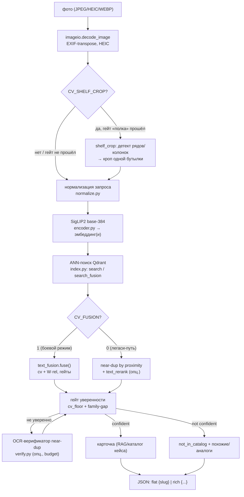
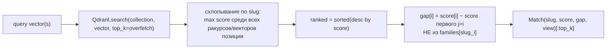
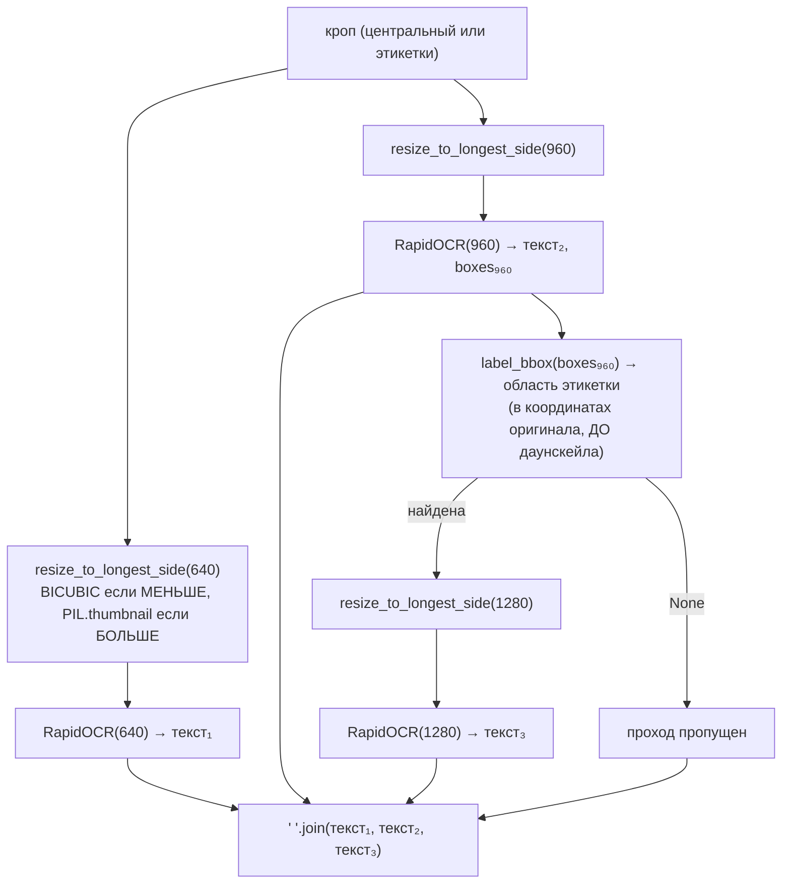
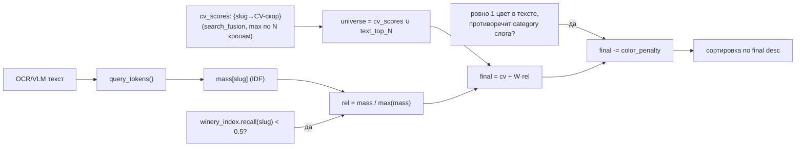
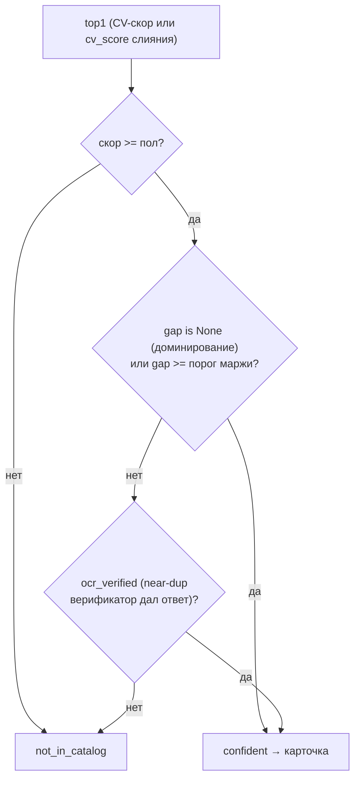
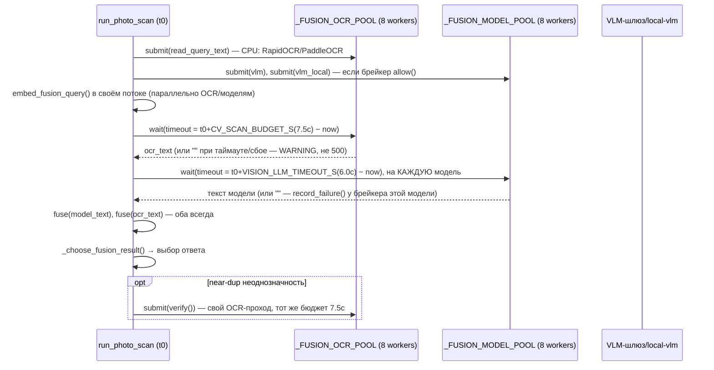

# Модели и алгоритмы сканера — «Свой Сомелье»

Автор: ml-lead. Дата: 22.09.2026. Основание: контракт `contracts/image-scan.md` (v0.4.14,
владелец — architect) и отчёты `reports/`, `qa/scan-eval-runs/`. Все цифры ниже —
измеренные и подтверждены ссылкой на источник; где источники расходятся, приведены оба
числа. Секреты (адрес GPU-шлюза, ключи) нигде не указаны — только имена env-переменных.

**Что НЕ входит в этот файл** (описано отдельно, здесь не дублируется):
- Общая архитектура системы и границы слоёв — `ARCHITECTURE.md`, `docs/architecture/HLD.md`
  / `LLD.md` (architect).
- RAG-поиск, сомелье-чат, гастропары — `docs/architecture/lld-rag-chat-pairing.md` (backend);
  здесь модели RAG упомянуты одной строкой со ссылкой (§1.6).
- API-контракт, схемы ответов — `contracts/image-scan.md`, `contracts/openapi.yaml`.

Область этого файла — **модели и алгоритмы CV-пайплайна `packages/cv/` и
`apps/api/app/cv/`**: что именно исполняется на фото между `POST /v1/scan/photo` и
JSON-ответом, какими формулами, с какими проверенными числами.

## Содержание

1. [Карточки моделей](#1-карточки-моделей)
2. [Алгоритмы](#2-алгоритмы)
3. [Оценка точности](#3-оценка-точности)
4. [Что пробовали и почему отвергли](#4-что-пробовали-и-почему-отвергли)
5. [Ограничения и дальнейшие шаги](#5-ограничения-и-дальнейшие-шаги)

## 0. Обзор конвейера



Источник текста для слияния (RapidOCR + опционально VLM 27B / VLM 27B через шлюз / Qwen3-VL-4B
локально) читается **параллельно** с ANN-поиском — раздел [2.9](#29-дедлайн-бюджет-раздельные-пулы-предохранитель).

---

## 1. Карточки моделей

### 1.1 SigLIP2 base-384 — визуальный энкодер

| | |
|---|---|
| Назначение | Эмбеддинг кадра/кропа → L2-нормированный вектор для ANN-поиска по каталогу (image-to-image; текстовая башня SigLIP2 не используется) |
| Чекпойнт | `google/siglip2-base-patch16-384` (env `CV_MODEL`, `packages/cv/cv/config.py:39`); выход — 768-мерный вектор (`.pooler_output`, `reports/g-report.md` §«Модель») |
| Размер на диске | 1.4 ГБ (измерено на этой машине: `~/.cache/huggingface/hub/models--google--siglip2-base-patch16-384`, `du -sh`) |
| Где исполняется | `packages/cv/cv/encoder.py::SiglipEncoder`; устройство автовыбором `pick_device()` — MPS > CUDA > CPU (`CV_DEVICE` — принудительно) |
| Задержка, один эмбеддинг | **CPU** (ams3, 4 vCPU, 3 потока torch): 0.93 с (`reports/cpu-path-study.md` §2). **MPS** (Mac, base-384): p50/p95 98.8/130.7 мс (`reports/g6-encoder.md` §1). **CPU** (Mac, base-384): p50/p95 173.9/240.7 мс (там же). Полный `search()` на боевом масштабе индекса (41949 векторов, MPS): p50/p95 100/155 мс (`reports/g3-real-index.md` §3) |
| Лицензия | Apache License 2.0 (модель Google на HuggingFace; не проверено отдельным юридическим ревью, стандартная карточка модели) |

**Индекс D1** (боевой на момент написания, `cv_index_version = case-20260921-d1-b384`,
подтверждено живым `/v1/healthz` — `reports/architect-submission-audit.md`): **2058 позиций,
14394 векторов** (≈7 ракурсов/позицию — 1 реальный + 6 синтетических; `reports/d1-ref-collisions.md`).
Backend хранения — Qdrant embedded (env `IMAGE_INDEX_MODE=qdrant_embedded|pgvector`,
`packages/cv/cv/config.py:27-36`; pgvector объявлен «прод-профилем», не реализован — контракт).

Эволюция индекса (для контекста истории точности §3.2):

| Версия | Позиций | Ракурсов/поз. | Векторов | Модель | Источник |
|---|---:|---:|---:|---|---|
| `case-20260916` | 1676 | 25 (1 real + 24 synth) | 41 949 | base-224 | `reports/g3-real-index.md` |
| `case-20260917` | 1982 | ~25 | 49 650 | base-224 | `reports/f3-synthetic-baseline.md` |
| `case-20260921-d1-b384` (D1, боевой) | 2058 | ~7 (1 real + 6 synth) | 14 394 | **base-384** | `reports/d1-ref-collisions.md` |

D1 — не только смена чекпойнта (G6 рекомендовал base-384 после замера на реальных фото,
§1.1 ниже и §4), но и ручная чистка коллизий имён файлов эталонов (69 слогов разобраны
глазами, 15 исправлено, 5 честно отклонены, 118 чужих доп.-ракурсов убрано — `reports/d1-ref-collisions.md`).
На тех же 62 живых фото каталога это дало **top-1 64.5%→71.0%, top-5 80.6%→87.1%** (та же
модель/6 ракурсов, только эталоны).

**Почему base-384, не base-224 (боевой по умолчанию в раннем коде) и не large-256.**
На синтетике (self-match holdout, n=374) ранжирование одно (base-224 63.9%, large-256
57.2% > base-384 56.4%), но на **46 реальных фото** порядок переворачивается: base-384
**76.1%/91.3%** (top1/top5, norm+raw) против base-224 69.6%/89.1% и large-256 63.0%/93.5%
— large переобучен под синтетику аугментатора (`reports/g6-encoder.md`). Цена —
+126 мс к embed на CPU (47.5→173.9 мс), несущественно на фоне лимита 10 с. `so400m`
(giant) не проверен до конца — только embed-бенч (296-692 мс), полный индекс не
досчитан в рамках волны (там же, «Не сделал»).

**Аугментатор** (`packages/cv/cv/augment.py`, по мотивам arXiv:2404.08820 — Huang et al.,
та же задача, «распознавание этикетки по одному эталонному фото»): классический (не-GAN)
рендер N согласованных ракурсов из одного эталона — эталон как текстура на цилиндре,
перспективный ray-casting (yaw/pitch/roll/дистанция/FOV), ламбертова подсветка по кривизне,
композит с процедурным фоном (полка/рука/нейтральный фон), блики/расфокус/шум/экспозиция
поверх; детерминировано (`numpy.random.Generator(seed)`). Библиотечный дефолт —
`AUGMENT_VIEWS_PER_REF=24` (DoD: ≥20, `cv/config.py:43`), используется CLI `build-index` по
умолчанию и инкрементальным `add()` (+N позиций/день); D1-ребилд явно взял 6 ракурсов —
несоответствие с DoD зафиксировано как технический долг в §5.

### 1.2 RapidOCR — быстрый многомасштабный OCR

| | |
|---|---|
| Назначение | Источник текста этикетки для `CV_FUSION_TEXT_SOURCE=ocr` (дефолт) — самый дешёвый CPU-путь текста, без сети |
| Модели | Детектор `ch_PP-OCRv5_det_mobile` (mobile, не server — server 2.0 с и не лучше по точности на слабом CPU, `reports/ocr_rapid.py` докстринг); распознаватель `eslav_PP-OCRv5_rec_mobile` (кириллица+латиница ОДНИМ алфавитом — источник гомоглифов, §2.4) |
| Размер | Детектор 4.6 МБ, распознаватель 7.5 МБ (ONNX, измерено на этой машине: `packages/cv/.venv/lib/python3.12/site-packages/rapidocr/models/{ch_PP-OCRv5_det_mobile,eslav_PP-OCRv5_rec_mobile}.onnx`) — на 2-3 порядка меньше SigLIP2/PaddleOCR-server |
| Где исполняется | `packages/cv/cv/ocr_rapid.py::RapidOcrReader`; ONNX Runtime, CPU (ускоритель в коде не настраивается) |
| Пороги детектора | `CV_OCR_DET_BOX_THRESH=0.3` (дефолт движка 0.6), `CV_OCR_DET_UNCLIP=2.0` (дефолт движка 1.5) — «чувствительный детектор», собирает строки вразрядку мелкими капителями («ПОЛУСЛАДКОЕ», «WINEMAKER'S SELECTION»); порог распознавания (score, не детектора) `DEFAULT_SCORE_THRESH=0.5` |
| Задержка | **CPU** (ams3 4 vCPU): 0.34 с/кроп 640px (детектор mobile) против 4.0 с у PaddleOCR на том же входе — **12× быстрее** (`reports/cpu-path-study.md`) — не зависит от бага oneDNN paddlepaddle 3.3.1. RSS процесса целиком с rapid (2 масштаба + весь остальной сервис) — 1248 МБ против 1918 МБ с paddle (−35%, `reports/h2-rapidocr.md`) |
| GPU/Mac | Не использует GPU/MPS — чисто CPU-движок, тот же порядок задержки на Mac |
| Лицензия | RapidOCR (RapidAI) — Apache License 2.0 (проект на GitHub); модели PP-OCRv5 — PaddleOCR/PaddlePaddle, тоже Apache 2.0 |

Три масштаба в конвейере, один экземпляр движка **на масштаб** (не один движок с
параметром на вызов — `Det.limit_side_len` это параметр КОНСТРУКТОРА рантайма
`rapidocr==3.9.2`, не вызова): `CV_OCR_RAPID_SIZES=640,960` (объединение текстов) + третий
проход `CV_OCR_LABEL_SIZE=1280` по кропу этикетки (§2.3). Полная формула/псевдокод — §2.3.

### 1.3 PaddleOCR — OCR-верификатор near-dup (доп. карточка, вне явного списка брифа)

Не входит в список брифа явно, но остаётся в боевом пути — `LabelVerifier.verify()`
(`packages/cv/cv/verify.py`) всегда использует PaddleOCR (не RapidOCR) для своего
собственного fallback-прохода near-dup верификации, и это движок по умолчанию кода
(`CV_OCR_ENGINE=paddle`, молчаливой смены на `rapid` нет — контракт v0.4.14 §2).

| | |
|---|---|
| Назначение | (а) движок по умолчанию для чтения текста запроса при `CV_OCR_ENGINE=paddle`; (б) **всегда** — собственный OCR-проход `LabelVerifier.verify()` для near-dup различения (год/объём/категория/тип/цвет), независимо от `CV_OCR_ENGINE` |
| Модели | `PP-OCRv5_mobile_det` (дев/боевой дефолт) или `PP-OCRv5_server_det` (тяжелее); распознаватель `eslav_PP-OCRv5_mobile_rec` — тот же алфавит ESLAV, что у RapidOCR |
| Размер | mobile-детектор 4.8 МБ, распознаватель 7.7 МБ (измерено: `~/.paddlex/official_models/`) |
| Где исполняется | CPU (paddlepaddle); засечка: oneDNN отключён на ams3 из-за бага paddlepaddle 3.3.1 (`cv/verify.py` докстринг) |
| Задержка | 320px вход: ~420 мс; 448px: ~800 мс (`reports/g-report.md`, дев-машина); на ams3 CPU — 2.3-3.0 с p95 в изоляции (`reports/g5-accuracy.md`); ~4.0 с/кроп 640px на слабом CPU (`reports/cpu-path-study.md`) |
| Бюджет | ≤700 мс p95 для `verify()` целиком (контракт v0.4.4) — не всегда держится под нагрузкой Mac (флейк `test_verify_p95_latency_budget`, `reports/h1-cpu-path.md`) |
| Лицензия | Apache License 2.0 (проект PaddleOCR/PaddlePaddle) |

### 1.4 VLM 27B через наш GPU-шлюз

| | |
|---|---|
| Назначение | Чтение полей этикетки JSON-промптом — самый точный источник текста слияния (§2.8) |
| Модель | В отчётах фигурирует как «27B» / «Qwen 27B» (`reports/cpu-path-study.md` §1, `reports/devops-stand-vlm.md`); код по умолчанию называет модель `qwen3.8-27b` (env `VISION_LLM_MODEL`, `apps/api/app/config.py:380`) — **то же имя**, что дефолт чат-LLM сомелье (`reports/backend-llm-openai.md`: `LLM_MODEL=qwen3.8-27b`) — вероятно один и тот же мультимодальный чекпойнт на шлюзе обслуживает и чат, и чтение этикетки (не подтверждено отдельно, обе конфигурации совпадают по имени модели) |
| Где исполняется | Удалённо, наш GPU-сервер, OpenAI-совместимый шлюз (`apps/api/app/cv/vision_llm.py`, env `VISION_LLM_URL`/`VISION_LLM_KEY` — **адрес и ключ не публикуются нигде, включая этот файл**) |
| Размер | Не наш ресурс — эксплуатируется отдельной инфраструктурой, вес модели не в этом репозитории |
| Задержка (GPU) | Контракт v0.4.13 §6 (62 фото, ранняя точка): медиана 4.0 с (источник `vlm` один). Дедлайн — `VISION_LLM_TIMEOUT_S=6.0` с от начала запроса (было 6.5, §2.9). Живой стенд (hack-v12+VLM, весь пайплайн incl. паралл. RapidOCR): p50/p95/max **3264/3567/4528 мс** — НИЖЕ конфигурации без VLM (4227/4955/5949) на том же стенде; причина ускорения при добавлении сетевого вызова не доказана (`reports/devops-stand-vlm.md`, риск 1) |
| Лицензия | Не наша зона — модель и веса эксплуатируются на инфраструктуре шлюза, вне этого репозитория; лицензию отдельно не проверяли |

Промпт, JSON-формат ответа и склейка текстов — идентичный код для gateway-модели и
локальной (§2.8), различаются только `url`/`key`/`model`.

### 1.5 Qwen3-VL-4B MLX на Mac (служба local-vlm)

| | |
|---|---|
| Назначение | Локальное (без сети) чтение этикетки на Apple Silicon — источник `vlm_local` |
| Модель | `mlx-community/Qwen3-VL-4B-Instruct-4bit` (4-битная MLX-квантизация; env `VISION_LLM_LOCAL_MODEL`, дефолт в `apps/api/app/config.py:383`) |
| Размер | ~3 ГБ резидентной RAM при постоянной загрузке (`~/ClaudeWorkspace/local-vlm/README.md`); кэш чекпойнта на диске этой машины неполный/не измерен достоверно |
| Где исполняется | Отдельная служба `~/ClaudeWorkspace/local-vlm` (launchd, автостарт), OpenAI-совместимый API на `127.0.0.1:8093/v1` (порт публично зафиксирован как занятый службой в `ORCHESTRATION.md` — не секрет), Apple Silicon GPU через MLX; офлайн, ничего не уходит с Mac |
| Задержка (Mac) | ~3 с/фото на Apple M5 16 ГБ (`local-vlm/README.md`); запросы обрабатываются по одному, очередь при параллельных |
| CPU | Не предназначена — на CPU без Apple GPU «мультимодальные модели такого размера работают десятки секунд на картинку» (`local-vlm/README.md`) — это ДРУГОЙ рантайм и ДРУГОЕ измерение, чем «2B/4B на CPU» из §4 п.6 (там — llama.cpp GGUF на ams3, не MLX) |
| Лицензия | Qwen3 (Alibaba/Qwen team) — публично распространяется под Apache License 2.0 для большинства размеров линейки; отдельно не проверяли для этого конкретного чекпойнта/конвертации MLX |

Вклад в точность (62 живых фото каталога, контракт v0.4.13 §6): `vlm_local` одна —
**91.9%** top-1, 2.9 с медиана.

### 1.6 Модели RAG — одной строкой

Гибридный поиск (BM25 + вектор `paraphrase-multilingual-MiniLM-L12-v2`, реранкер
`jina-reranker-v2-base-multilingual`, кэш `packages/rag/.fastembed_cache/`) и сомелье-чат
(тот же класс GPU-шлюза, чат-модель `qwen3.8-27b` по умолчанию через `openai`-драйвер,
`reports/backend-llm-openai.md`) — архитектура, алгоритмы ранжирования и промпты см.
**`docs/architecture/lld-rag-chat-pairing.md`** (backend), здесь не дублируются.

### Сводная таблица

| Модель | Назначение | Размер | Исполнение | Задержка | Лицензия |
|---|---|---|---|---|---|
| SigLIP2 base-384 | Визуальный эмбеддинг | 1.4 ГБ, 768-dim | CPU/MPS/CUDA | 0.93с CPU(ams3) / 99-131мс MPS(Mac) / 174-241мс CPU(Mac) | Apache 2.0 |
| RapidOCR (mobile det + eslav rec) | Текст этикетки, CPU-путь | 4.6+7.5 МБ ONNX | CPU (ONNX Runtime) | 0.34с/кроп 640px (ams3) | Apache 2.0 |
| PaddleOCR (mobile) | near-dup verify() + дефолт-движок | 4.8+7.7 МБ | CPU | 420мс(320px)-4.0с(640px) | Apache 2.0 |
| VLM 27B (шлюз) | Текст этикетки, максимум точности | вне репозитория | удалённый GPU | 4.0с медиана (ранняя точка) / p50 3.26с (стенд, весь пайплайн) | не наша зона |
| Qwen3-VL-4B MLX (local-vlm) | Текст этикетки офлайн на Mac | ~3 ГБ RAM резидентно | Apple GPU (MLX) | ~3с/фото (M5) | Apache 2.0 (предположительно) |
| RAG (эмбеддинг+реранкер+чат-LLM) | Доп-функционал после скана | — | — | — | см. lld-rag-chat-pairing.md |

---

## 2. Алгоритмы

### 2.1 Предобработка кадра и кропы

**Центральный кроп.** Доли ширины/высоты полного кадра `(x0,y0,x1,y1) = (0.15, 0.05, 0.85, 0.98)`
— одна и та же константа `CENTER_CROP` в трёх независимых модулях (`cv/verify.py`,
`apps/api/app/cv/vision_llm.py`, `cv/ocr_rapid.py` через импорт из `verify.py`) — центральная,
целиком видимая бутылка, тот же вход видят и OCR, и VLM:

```python
def _center_crop(image_arr):
    h, w = image_arr.shape[:2]
    x0, y0, x1, y1 = (0.15, 0.05, 0.85, 0.98)
    return image_arr[int(h*y0):int(h*y1), int(w*x0):int(w*x1)]
```

**Кроп этикетки (детектор, для эталонов/CV-нормализации).** `cv/normalize.py::detect_label_region()`
— НЕ нейросеть, классический CV: находит силуэт бутылки против фона рамки кадра (медиана+MAD,
устойчиво к пёстрым фонам полки), берёт нижние ~2/3 силуэта (капсюль/горлышко всегда сверху):

```text
detect_label_region(image):
    bbox = _foreground_bbox(image)         # силуэт vs фон рамки, None если фон неоднороден
    if bbox is None:
        return fallback_region(w, h)        # центрально-нижняя часть кадра, НИКОГДА не бросает
    x, y, bw, bh = bbox
    y0 = y + 0.30*bh                        # капсюль/горлышко
    y1 = y + 0.94*bh                        # тонкая полоса основания
    x0, x1 = x - 0.05*bw, x + bw + 0.05*bw
    return order_corners([[x0,y0],[x1,y0],[x1,y1],[x0,y1]])
```

Затем `unwarp_label()`: перспективное выравнивание 4 углов в прямоугольник + приближённая
обратная развёртка цилиндра (`_cylinder_unbend_map`, смешивает identity с `sin(x·π/2)`,
`strength=0.35`) → канонический квадратный канвас `NORM_SIZE_DEFAULT=448`. Затем
`normalize_illumination()` — CLAHE на L-канале (LAB, **намеренно мягкий** `clipLimit=1.2`,
не учебниковые 2.5 — агрессивная версия роняла self-match с ~96% до ~84%, `reports/g-report.md`)
+ мягкий серый мир (gain ∈ [0.92, 1.08]).

**Мультикроп N∈{2,8} векторов запроса слияния** (`cv/index.py::embed_fusion_query`,
`CV_FUSION_CROPS`, дефолт 2): N=2 — нормализованный кроп детектора этикетки + весь кадр без
нормализации (максимум по обоим при поиске). N=8 добавляет три центральных кропа полного
кадра «как есть» и «через normalize_query» — `cwide=(0.15,0.05,0.85,0.98)` (=`CENTER_CROP`),
`cmid=(0.25,0.20,0.75,0.90)`, `ctight=(0.30,0.35,0.70,0.85)`. Один батч `encode_batch()`.
Боевой стенд (4 vCPU) — N=2 (N=8 ≈7с только эмбеддинги, не укладывается); Mac/дев — N=8.

**Кроп этикетки внутри кропа бутылки, для OCR** (`cv/label_crop.py::label_bbox()`, без новой
модели-детектора) — кластеризует боксы, УЖЕ найденные детектором текста RapidOCR на масштабе
`max(sizes)`, вокруг «затравки» (крупный бокс ближе к центру и к 0.58 высоты кропа):

```text
label_bbox(boxes, scores, w, h):
    cand = [b for b,s in zip(boxes,scores)
            if s >= 0.5 and 0.18w <= center_x(b) <= 0.82w and height(b) >= 0.008h]
    if not cand: return None
    seed = argmax(area(b)/max_area - 1.5 * dist_to(0.5w, 0.58h))
    inside = {seed}
    repeat until stable:
        add b to inside if gap_y(b, inside) <= 6·median_height(cand)
                          and overlap_x(b, inside, slack=0.1w) > 0
    box = bbox(inside) + margins(18% ширины, 15% высоты)
    box = grow_to_min(box, min_w=0.45w, min_h=0.32h, down_bias=0.7)  # шапка винодельни сверху
    return box
```

Найдено на 100/100 живых фото и 1985/2058 эталонов (медиана 16% кадра); `None` — законный
исход (нет проваливающего фолбэка на весь кроп — измерено отдельно, не помогает).

### 2.2 ANN-поиск



`overfetch = max(top_k * SEARCH_OVERFETCH(8), top_k+10)` — ANN идёт по **ракурсам** (много
точек на позицию), без оверфетча после схлопывания может остаться меньше top_k уникальных
slug'ов. Косинусная близость (векторы L2-нормированы, Qdrant `Distance.COSINE`).

`gap` — не отрыв от следующего кандидата по списку, а от первого кандидата **вне семьи
top-1** (`cv/families.py`, near-dup перепись F3, `case-data/families.json`, 165 семей/364
слога). Слаг без записи в переписи — «семья из одного себя». Фолбэк на эпсилон-цепочку
(`CV_GROUP_EPSILON=0.03`) — только когда файла переписи нет вовсе. `gap=None` означает
**доминирование** (в top-K нет чужой семьи), не провал — см. гейт §2.7.

`search_fusion()` — то же самое, но по нескольким query-векторам разом (максимум по всем) +
объединение с `extra_slugs` (точный `scroll()`-запрос Qdrant по фильтру `slug in (...)`, не
ANN-приближение) — текстовые кандидаты вне CV top-K иначе не видны слиянию.

### 2.3 OCR в масштабах 640/960 + 1280 по кропу, бикубика



Три **независимых** экземпляра `RapidOCR(params=...)` — один на масштаб (не один движок с
параметром на вызов: `Det.limit_side_len` — параметр КОНСТРУКТОРА рантайма, переключает
загруженную конфигурацию детектора, не разовое поведение вызова, проверено по исходнику
`rapidocr==3.9.2`). Третий проход переиспользует боксы масштаба 960 — новой детекции нет.

**Бикубика для мелких входов** (`_resize_to_longest_side`, в отличие от старого
`_downscale_to_longest_side`, который только уменьшал): кроп МЕНЬШЕ целевой стороны →
`PIL.Image.resize(..., BICUBIC)` увеличивает; БОЛЬШЕ/РАВНО → прежнее `PIL.thumbnail()`
уменьшение. НЕ `cv2.resize(..., INTER_AREA)` — расхождение фильтров даёт до 18-27/255
разницы пикселей и на границе разрешимости роняет целые распознанные слова (H2, разобрано
побитово на живых фото). Применяется **безусловно**, без env, перед КАЖДЫМ из трёх
проходов — офлайн на сжатых «мессенджером» фото (1000px) даёт **+3.2 п.п. (88.7%→91.9%,
+2/62 фото)**, 0 регрессий (`reports/h3-label-crop-ocr.md` §6).

Деградация — на импорте/конструкторе/вызове движка: warning + пустая строка для
пострадавшего масштаба, не исключение (один масштаб может отказать, конкатенация того, что
реально распозналось).

### 2.4 Нормализация текста

**Гомоглифы OCR** (`cv/text_fusion.py::homoglyph_variant()`, безусловно, не за флагом) — движок
ESLAV пишет кириллицу латинскими двойниками:

| Таблица | Символы | Пример | Найдено/добавлено |
|---|---|---|---|
| `_UP` (заглавные лат.→кир.) | `ABCEHKMOPTXY → АВСЕНКМОРТХУ` | CAMAPA→САМАРА | исходная |
| `_LOW` (строчные лат.→кир.) | `aceopxyui → асеорхуии` (u И i → и) | Py6iH→Рубин | `i` добавлена H2, +1 фото |
| `_DIG` (цифра→буква) | `3→З, 0→О, 6→б` | PO3E→РОЗЕ | исходная |
| `_GREEK` (заглавные греч.→кир., 16 букв) | `ΛΓΠΔΦΑΒΕΗΚΜΟΡΤΥΧ → ЛГПДФАВЕНКМОРТУХ` | OΛEΓ→ОЛЕГ | первые 5 — H1, **+3.2 п.п. изолированно**; расширено до 16 правкой тимлида (разбор hack-v6 «Табия/Олег», смешанный кириллица+греческий токен) |

Правило замены: ВСЕ буквы токена обязаны быть «двойниковыми» (по одному из алфавитов) —
`Pinot` не трогается (латиница валидна сама по себе). Перевод греческого — ДО разбора
латинских/цифровых вариантов (смесь алфавитов приводится к кириллице первой). Проверено на
500 реальных VLM-текстах — 0 изменений (греческая правка гейтирована источником `ocr`).

**Токенизация** (`query_tokens()`): английские маркеры сахара (`semi-dry→polusuhoe`,
`brut→bryut`...) заменяются ДО токенизации → сплит по `[\s·,;:/|()"«»]+` → для каждого «сырого»
токена генерируются варианты (сам + гомоглиф + греческий-перевод + гомоглиф-от-перевода) →
каждый вариант проходит `cv.text_rerank.tokenize()` (транслитерация с обеих сторон) → цифры
короче года (`19xx`/`20xx`) отбрасываются, токены короче 3 символов отбрасываются.

**IDF** (`TextIndexV2`, сглаженная формула): `idf[t] = log((n+1)/(df[t]+1)) + 1.0`, где `n` —
число слогов каталога кейса, `df[t]` — число слогов, содержащих токен `t` (поля
`name+winery+grape+category+sugar`, ~2100 слогов).

**Нечёткость** (`token_sim(q, c)`, потокенная, не на всей строке):

```text
token_sim(q, c):
    if q == c: return 1.0
    if q.isdigit() or c.isdigit() or min(len(q),len(c)) < 4: return 0.0
    r = rapidfuzz.ratio(q, c) / 100
    if r >= 0.8: return r
    if len(q)>=5 and len(c)>=5 and (c.startswith(q) or q.startswith(c)): return 0.85
    return 0.0
```

Recall/масса кандидата: `best[c] = max(token_sim(t,c) for t in query_tokens)` (один раз на
словарь, не на пару слог×токен); `mass = Σ idf[t]·best[t]` по документным токенам слога,
`recall = mass / Σ idf[t]` по всем токенам слога.

### 2.5 Формула слияния



**Формула** (`cv/text_fusion.py::fuse()`): `final = cv_score + W · rel`, где `rel =
mass(slug) / max(mass)` этого запроса (0, если текст не задел кандидата). Библиотечный
дефолт `W=0.2` (`DEFAULT_W`), **боевое/измеренное значение `W=0.3`**
(`CV_FUSION_W=0.3`, `infra/ams3/somelye.env.example:19` — явный env-оверрайд дефолта
Settings; всё офлайн- и живое измерение H1-H3/ml-lead шло тоже на 0.3).

`cv_score` кандидата — максимум по N входам запроса слияния (§2.1). Слогу **без эталона в
индексе** — заглушка `cv = cv_top1 − CV_PAD(0.03)` (иначе текст не может поднять то, чего CV
не видит вовсе — конкурировать не с чем). Кандидатная вселенная: CV top-`50`
(`DEFAULT_ANN_TOP_K`) ∪ текст top-`30` (`DEFAULT_TEXT_TOP_N`) по `mass`.

**Гейт «винодельня не подтверждена»** (`winery_index`, отдельный `TextIndexV2(fields=("winery",))`):
recall кандидата по полю `winery` < `winery_recall_floor(0.5)` → `rel *= unconfirmed_winery_w`
ДО подстановки в `final`. Вес по источнику текста (`apps/api/app/cv/service.py`):

| `text_source` | `unconfirmed_winery_w` | Эффект |
|---|---:|---|
| `ocr` (и фолбэк `vlm*→ocr`) | `CV_FUSION_OCR_UNCONFIRMED_W = 0.5` | офлайн 87.1%→88.7% |
| `vlm`/`vlm_local`/`vlm_both` | `CV_FUSION_UNCONFIRMED_WINERY_W = 1.0` (= без эффекта) | гейт там ВРЕДЕН (офлайн 95.2%→93.5%) |

**Алиасы винодельни** (`load_winery_index()`, `case-data/winery_aliases.json`, вручную
подтверждённые группы написаний одного производителя — например «Поместье Голубицкое» / 
«Golubitskoe Estate») — для слога из группы `winery_index` считает recall по
ОБЪЕДИНЕНИЮ токенов всех строк группы, а не только по строке этого конкретного SKU. Не
строится автоматически по редкости токена — разбор (`qa/real_photos_winery_alias.py`)
показал, что редкие токены часто родовые слова брендинга («estate», «vineyards», «семейная» —
у РАЗНЫХ производителей). Единственный подтверждённый случай — Голубицкое, +1 фото (95.2%→96.8%
на CPU-пути с гейтом; §3.2 hack-v10).

**Штраф цвета** (`CV_FUSION_COLOR_PENALTY=0.05`, библиотечный дефолт `fuse()`=0 — `apps/api`
передаёт 0.05 явно всегда): ровно один цвет назван текстом этикетки (бел/красн/розов) и
противоречит известному цвету кандидата (каталог, поле «Категория») → `final -= 0.05`.
Разбор промаха «Мускатель белый»→розовый; офлайн 56→57/62.

**Гейт уверенности слияния** (внутри `fuse()`, поле `FusionResult.confident` — используется
только режимом `confident_else_cv` §2.10, НЕ финальным UI-гейтом §2.7 напрямую): `cv_score(top1)
>= CV_FUSION_CV_FLOOR(0.80)` И (`family_gap(final) >= CV_FUSION_GAP_FLOOR(0.03)` ИЛИ `gap is None`
= доминирование).

### 2.6 Семьи близнецов и verify()

`case-data/families.json` (перепись F3, `qa/case_census.py::build_families()`) — union-find
по 3 эвристикам: (а) год-в-slug — общий остаток после снятия `19xx/20xx`; (б) общий
файл-эталон — гарантированная семья; (в) похожее название той же винодельни (Левенштейн,
порог абсолютный и зажатый длиной короткой строки — 2-буквенные коды сорта `Belmas` иначе
ловились ложно) + **вето** по непересекающемуся сорту винограда. Итог: **165 семей / 364
слога** из 2103 (`reports/f3-case-census.md` §2).

`LabelVerifier.verify()` (`cv/verify.py`) вызывается, когда несколько кандидатов ANN/слияния
лежат в пределах `CV_VERIFY_PROXIMITY(0.04)` от top1 по **сырому** CV-скору (не по семье —
диагноз «Мускатель Массандра», §4 п.2 контракта, разные названия одной линейки перепись не
склеивает). Скоринг — 5 **независимых** измерений, никакое не поглощает другое:

```text
score(candidate) = 0
if candidate.vintage in ocr.years:              score += 2   # год из БД, приоритет
elif candidate.name_years ∩ ocr.years:          score += 2   # год из текста name
if candidate.name_volumes ∩ ocr.volumes:        score += 1   # 0.75/750/0.5/500/1.5/1500 (л/мл)
if candidate.name_categories ∩ ocr.categories:  score += 1   # брют/сухое/полусладкое/резерв...
if candidate.name_wine_types ∩ ocr.wine_types:  score += 1   # портвейн/мускат/мускатель/кагор/херес/мадера
if candidate.name_colors ∩ ocr.colors:          score += 1   # белый/красный/чёрный/розовый
# победитель — СТРОГО больше всех остальных; иначе (ничья/все 0) → None (воздержание)
```

`None` — законный исход контракта («API оставляет ANN-топ, честная деградация»), не только
на нечитаемом фото, но и при неоднозначности. `CV_VERIFY_DEBUG=1` — структурированный лог
решения в stderr, идентичная арифметика с боевой веткой (`match_candidates_trace`).

### 2.7 Гейт уверенности UI: family-gap и CV

Ровно **два** параллельных гейта (легаси-путь `CV_FUSION=0` и боевой `CV_FUSION=1`), одна и
та же форма условия, разные пороги и разная база скора:

| | легаси (`run_photo_scan`) | слияние (`_run_photo_scan_fusion`) |
|---|---|---|
| Скор-пол | `top.score >= CV_ABS_FLOOR(0.82)` | `ranked_top[0].cv_score >= CV_FUSION_CV_FLOOR(0.80)` (**CV-скор, НЕ blended final**) |
| Маржа | `top.gap is None` (доминирование) **ИЛИ** `top.gap >= CV_MARGIN_FLOOR(0.02)` | `chosen_result.gap is None` **ИЛИ** `>= CV_FUSION_GAP_FLOOR(0.03)` (gap по **final**, между семьями) |
| Обход маржи | `ocr_verified` (успешная OCR-верификация near-dup обходит проверку по марже/gap, НЕ по полу) | то же самое |



Пол (`CV_ABS_FLOOR`/`CV_FUSION_CV_FLOOR`) и маржа (`CV_MARGIN_FLOOR`/`CV_FUSION_GAP_FLOOR`) —
**независимые** рычаги (калибровка F2 доказала, что один глобальный скоровый порог не
разделяет позитив/импостеров без неприемлемой цены — 0.55→FPR 100%, 0.9→FNR 66.7%,
equal-error 0.85→8.9%/26.7%, `qa/scan-eval-runs/not-in-catalog-calibration/`). Оба порога
— официально «стартовые точки» до приватного датасета (контракт v0.4.9), финал ждёт
полевой dev-сплит.

### 2.8 VLM: промпт, JSON, склейка текстов

Идентичный код для gateway-модели (`vlm`) и локальной (`vlm_local`) —
`apps/api/app/cv/vision_llm.py::read_label_or_raise()`, различаются только `url`/`key`/`model`.

**Подготовка изображения** (`prepare_image`): `CENTER_CROP` (те же доли §2.1) → `PIL.thumbnail`
до `image_size` (`VISION_LLM_IMAGE_SIZE=1024` — замер: 768px заметно хуже точность при экономии
~0.5с) → JPEG q90 → base64.

**Промпт** (дословно, `PROMPT` в коде):

```text
На фото винные бутылки. Смотри только на центральную бутылку, которая видна целиком.
Прочитай этикетку и ответь строго одним JSON без пояснений:
{"winery": "", "name": "", "grapes": "", "color": "", "sugar": "", "vintage": ""}.
Русские надписи — кириллицей, латинские — латиницей. Чего не видно — пустая строка.
```

Запрос — Chat Completions (`{model, messages:[{role:user, content:[{type:text,...},
{type:image_url, image_url:{url:"data:image/jpeg;base64,..."}}]}], max_tokens:120,
temperature:0}`), `Authorization: Bearer <key>` если ключ задан (локальный сервер — без
авторизации).

**Разбор ответа**: `_JSON_RE = r"\{.*\}"` (терпит обёртку в ```json```) → `json.loads` →
`fields_to_text()` объединяет непустые значения полей `(winery, name, grapes, color, sugar,
vintage)` через пробел — эта строка идёт в `text_fusion.query_tokens()` наравне с текстом OCR.

**Склейка текстов** (`_fusion_text_and_vectors`): при `CV_FUSION_TEXT_SOURCE=vlm_both` —
`model_text = " ".join(got["vlm"], got["vlm_local"])` (обе модели ответили). При
`CV_FUSION_MERGE_MODEL_TEXT=1` (доп. флаг, задача ML-1) — OCR-текст ДОБАВЛЯЕТСЯ к тексту
модели(ей) через пробел (не только фолбэк на случай «ни одна модель не ответила»): офлайн
96.8% против 95.2% у одной `vlm` (`reports/ml-lead-plan.md`).

Тело ответа шлюза читается **чанками по 1 байту**, не одним `resp.read()` — обнаружено, что
`http.client.HTTPResponse.read(amt)` клампит `amt` до `Content-Length` ответа (десятки-сотни
байт JSON), из-за чего дедлайн ни разу не проверялся до полного чтения тела при «медленной
выдаче» шлюза (`_read_response_within_deadline`, §2.9).

### 2.9 Дедлайн 6 с, бюджет 7.5 с, раздельные пулы, предохранитель



**Якорь времени** — `t0 = time.monotonic()` в начале `run_photo_scan()` (не вход в
подфункцию) — раньше `VISION_LLM_TIMEOUT_S` считался от входа в `_fusion_text_and_vectors()`
и терял время, уже потраченное на шаги до текстовой ветки (корень хвоста задержек p50/p95/max
4.4/6.6/9.1с, `reports/devops-hack-v13.md`).

- **`CV_SCAN_BUDGET_S=7.5`** с — бюджет ожидания OCR-текста **и** near-dup `verify()`
  (`_verify_with_budget`, свой отдельный OCR-проход) от `t0`. До этой правки `verify()` не
  имел таймаута вовсе ни в одном из двух путей ответа — найдено: rich-фото 14.6 с на сервере
  против 3.4 с у flat того же фото (тот же общий шаг для обоих режимов).
- **`VISION_LLM_TIMEOUT_S=6.0`** с (было 6.5) — дедлайн **каждой** модели отдельно, от `t0`.
- **Раздельные пулы**: `_FUSION_OCR_POOL`/`_FUSION_MODEL_POOL` (по 8 потоков) — раньше был
  один общий пул; зависший сетевой запрос к шлюзу мог занять поток, которого ждёт CPU-OCR
  следующего запроса (тот же процесс).
- **Предохранитель** (`_ModelBreaker`, свой на `"vlm"`/`"vlm_local"`): `VISION_LLM_BREAKER_FAILS=3`
  сбоя/таймаута ПОДРЯД → открыт на `VISION_LLM_BREAKER_COOLDOWN_S=60` с (следующие сканы
  пропускают эту модель без отправки запроса вовсе — не тратят дедлайн, не занимают поток).
  «Ровно один» пробный скан после паузы — атомарно под локом двигает `_opened_until` вперёд
  ДО результата пробы, конкурентные вызовы в ту же миллисекунду видят «ещё открыт». Честный
  пустой ответ модели — НЕ сбой (иначе гейт путает серию нечитаемых фото со сломанным
  шлюзом) — различается через `VisionLLMError` (`read_label_or_raise` против старого
  `read_label`, который схлопывает оба случая в `""`).
- Поток, который перестали ждать (таймаут), **не отменяется** — Python не умеет прервать
  блокирующий вызов в чужом потоке; продолжает работать в фоне пула (открытый риск —
  накопление зависших CPU-OCR потоков на 4 vCPU, см. §5).

Живая проверка предохранителя (заглушка-адрес, `reports/qa-auto-scan-budget.md`): 60/60
ответов HTTP 200 со слагом, первые 3 фото 6.13-6.49 с (полный дедлайн), затем брейкер держит
0.5-1.4 с — механизм подтверждён.

### 2.10 Правило выбора: confident_else_cv против merge, max_score, agree_*

`_run_photo_scan_fusion` всегда считает **два** полных ответа слияния на одних и тех же
CV-векторах/кандидатной вселенной: `local_result = fuse(ocr_text)` (только OCR, без модели) и
`model_result = fuse(label_text)` (модель/склейка). `_choose_fusion_result(model, local, mode)`:

```text
if mode == "merge" or not local.ranked:       return model            # дефолт кода
if not model.ranked:                          return local
if mode == "max_score":
    return local if local.top.final_score > model.top.final_score else model
if mode == "confident_else_cv":
    return model if model.confident else local     # НЕ зависит от согласия слогов
if local.top.slug == model.top.slug:          return model             # согласны
if mode == "agree_else_cv" and local.top.cv_score > model.top.cv_score:
    return local
return model                                   # agree_else_llm / неизвестный mode / расхождение
```

**Измерено** (`qa/real_photos_choose_rule.py`, ml-lead, 62 живых фото каталога + 38 честных
NONE, боевая `cv.text_fusion.fuse()`, исправленный прогон после регенерации OCR-кэша —
`reports/ml-lead-choose-rule.md`):

| Правило | Точность (62 фото) | Устойчивость к галлюцинации модели (потеря фото, искажение 10/30/100%) |
|---|---:|---:|
| `merge` (дефолт кода) | 59/62 = 95.2% | −3/−6/−16 |
| `max_score` | 59/62 = 95.2% | −1/−3/−5 |
| `agree_else_llm` | 59/62 = 95.2% | −6/−18/−57 |
| `agree_else_cv` | 59/62 = 95.2% (93.5% без алиаса винодельни) | **0/0/0** (но не чинит фото, где модель права, а CV — нет) |
| **`confident_else_cv`** | **60/62 = 96.8%** (в обоих состояниях алиаса) | −1/−6/−10 |

`confident_else_cv` строго лучше `merge` на чистых 62 (не просто не хуже) — доверяет модели,
ТОЛЬКО когда её собственный гейт уверенности (§2.5) пройден, иначе локальный ответ,
независимо от согласия слогов. Остаток 2/62 (Литавщук, Курмыши) не чинится ни одним
правилом слияния текста — см. §3.3.

**Статус (22.09):** библиотечный/код-дефолт `CV_FUSION_CHOOSE="merge"`
(`apps/api/app/config.py:332`); на боевом стенде ams3 явно выставлен `confident_else_cv` с
hack-v15 (решение тимлида, `qa/scan-eval-runs/real-photos-stand/README.md`) — код и env
здесь расходятся осознанно, это не баг.

---

## 3. Оценка точности

### 3.1 Методика

Источник истины — `case.md` (ТЗ) + `agents/ml-lead.md`: приватная проверка кейсодержателя —
**только вина из каталога кейса**, считается **исключительно top-1 по слагу** (сверка с
закрытой таблицей), таймаут **10 с/фото** (`curl --max-time 10`, `case-data/eval/participant_test.sh`),
точность важнее скорости. Рабочий стенд-прокси — **100 живых фото организаторов**
(`case-data/real-photos`), из них **62 фото — вино есть в каталоге** (размечено вручную,
`reports/l-real-labels-part{1,2}.md`), 38 — честный `not_in_catalog`. Одно фото на этой
выборке = **1.6 п.п.** (62 знаменатель), разброс между волнами ±1-3 п.п. — см. §3.2
«Риски измерения». Инструменты: `qa/real_photos_serve.py --flat-only` (гонит 100 фото через
живой API) → `qa/real_photos_eval.py --served` (top-1/top-5 по разметке).

### 3.2 История версий hack-v5…v15

Источник — `qa/scan-eval-runs/real-photos-stand/README.md` (канонический снимок, каждая
строка — реальный прогон на стенде ams3, 4 vCPU), перекрёстно подтверждено `reports/devops-hack-v{9..15}.md`.

| Версия | Что изменилось | top-1 (62 фото) | top-5 | p50/p95/max, мс |
|---|---|---:|---:|---:|
| hack-v5 | ANN + верификатор, индекс base-224 (легаси-путь, без слияния текста) | 51.6% | — | — |
| hack-v6 | (первая волна CPU-пути слияния, до H1-H3) | 87.1% (54/62) | — | 3504/3911/4397 |
| hack-v7 | (промежуточный) | 91.9% (57/62) | — | 3526/3950/4391 |
| hack-v8 | + проход OCR по кропу этикетки 1280px, бикубика для мелких фото | 91.9% (57/62) | — | 4126/4791/5718 |
| hack-v9 | чувствительный детектор текста (`box_thresh 0.3/unclip 2.0`) | 93.5% (58/62) | — | 4204/5096/6585 |
| hack-v10 | алиас винодельни «Голубицкое» (§2.5) | **95.2%** (59/62) | — | 4186/4798/5812 |
| hack-v11 | frontend-подсказка + `CV_SHELF_CROP`-обвязка (флаг выкл., CV-путь не тронут) | 95.2% (59/62) | — | 4276/4977/6631 |
| hack-v12 | Swagger/OpenAPI (docs-only) | 95.2% (59/62) | — | 4227/4955/5949 |
| hack-v12 + VLM 27B (env) | `CV_FUSION_TEXT_SOURCE=vlm` через GPU-шлюз (только env, без тега) | **96.8%** (60/62) | — | 3264/3567/4528 |
| hack-v13 | LLM-драйвер сомелье-чата (CV/OCR-путь не тронут) | 96.8% (60/62) | **98.4%** (61/62) | 4412/6634/9139 |
| hack-v14 | чат-роутинг с фильтрами, прогрев RAG (скан-путь не тронут) | 96.8% (60/62) | 98.4% (перенос) | 4584/6889/7373 |
| hack-v15 | бюджет скана 7.5с, предохранитель, `CV_FUSION_CHOOSE=confident_else_cv` (§2.9-2.10) | **96.8%** (60/62) | не переизмерялся | **4370/5180/6921** |

Ни один прогон hack-v6…v15 не превысил лимит 10 с ни на одном фото. **Важная оговорка
контракта (v0.4.14 п.5):** офлайн-число чувствительного детектора текста — **95.2%**
(56→59/62) — на живой стенд-приёмке не воспроизведено как принятая цифра CPU-пути;
принятая цифра CPU-**без-модели** пути — **91.9%** (hack-v8). 93.5% (офлайн-цель кропа
этикетки) тоже не вошла в контракт — офлайн-обоснование читало пережатый JPEG контакт-листа,
не оригинал (`reports/h3-label-crop-ocr.md` §5, разобрано побитово).

**Риски измерения (контракт v0.4.14, открыты):** живые числа H1/H2 стабильно ниже офлайн на
1-3 п.п. по трём частично проверенным причинам — (а) SigLIP2 на MPS не даёт бит-точной
воспроизводимости эмбеддинга между запусками (аналог CUDA-недетерминизма), на узком CV-зазоре
near-dup пары достаточно перевернуть argmax; (б) офлайн-снимки не всегда пересчитаны на том
же индексе, что боевой; (в) H3 нашла конкретный случай подмены оригинала пережатым артефактом.
Рекомендация: пересчитывать офлайн-снимки непосредственно перед сравнением с живым API.

### 3.3 Теоретический потолок каталога и разбор недостижимых фото

На фиксированной 62-фото панели **потолок текстового слияния — 60/62 = 96.8%**
(`confident_else_cv`, §2.10, и независимо — комбинация OCR+модель): выше не поднимает
**ни один** источник текста, включая идеальную (человеческую) транскрипцию
(`reports/ml-lead-plan.md`, `reports/ml-lead-choose-rule.md`). Два оставшихся промаха:

- **Литавщук (91.43)** — масса истины (11.1) МЕНЬШЕ, чем у ложного топа «Кубань-Вино»
  (14.06) — совпадение по слову «Кубань»+«вино», которые буквально часть НАСТОЯЩЕГО названия
  чужой винодельни, не шум; катал. запись латиницей («Litavshchuk vineyards & winery») не
  матчится с кириллическим OCR «винодельня» — разные письменности, транслитерация мостит
  только буквы, не решает лексику. CV почти ничья (0.7384/0.7417). Отключение гейта
  винодельни не помогает — разрыв в массе, не в гейте.
- **Курмыши (95.76)** — mass/recall/rel **идентичны** у истины и топа в ЛЮБОМ источнике
  текста (одна линия, два SKU различаются ТОЛЬКО иллюстрацией на этикетке, текст один и тот
  же) — решает исключительно CV-скор (0.8418 против 0.8739 у чужого) — визуальная, не
  текстовая проблема.

Оба задокументированы одинаково во всех 5 замеренных источниках текста (OCR-объединение,
Qwen3-VL-4B, VLM 27B, обе модели вместе, человек-читатель) — не артефакт конкретного
источника.

**Потолок каталога целиком (2103 позиции, не только 62-фото панель)** — производная величина
(не прямое измерение на приватном датасете, тот появится только на контрольном звонке),
но с точной, воспроизводимой формулой: доля слогов каталога, у которых вообще ЕСТЬ пригодный
эталон. Два близких числа с разных этапов чистки данных:

- **97.7%** = 2054/2103 (`reports/f4-data-hygiene.md`: перегенерация `slug_refs.json` после
  добора 73 слогов вручную — usable по `case_ref_triage.py` выросло 94.2%→97.7%).
- **97.9%** = 2058/2103 (`reports/d1-ref-collisions.md`: после дополнительной ручной чистки
  коллизий имён файлов эталонов, D1-индекс, §1.1).

`TEAM.md` и `reports/ml-lead-plan.md` округляют это до «**97-98%**» без разбивки по этапам.
`docs/strategy/tco.md` и `docs/product/strategy.md` используют более точные 97.7-97.9% как
знаменатель «% от достижимого». **Точная арифметика продуктовых слайдов**
(`docs/product/slides-7-11.md`, дословно: «Наш CPU-путь закрывает **97.4%** потолка, путь с
моделью — **99.1%** потолка»): `97.4% = 95.2 / 97.7` (боевой CPU-путь с моделью на стенде,
§3.2, делённый на потолок каталога), `99.1% = 96.8 / 97.7` (боевой путь с VLM). Это деление
двух независимо измеренных чисел на потолок покрытия эталонами — не отдельное измерение
точности каталога целиком, а способ нормировать «сколько мы теряем не по вине алгоритма».

Отдельная оговорка честности: команда также использует число «**человек-читатель
96.8%**» (`TEAM.md`) как синоним потолка текстового слияния на 62-фото панели
(`reports/ml-lead-plan.md`: «доводят соответствующий путь до потолка человека-читателя...
60/62=96.8%») — но методика самого «человеческого чтения» (кто читал, сколько раз, как
фиксировался ответ) нигде отдельно не описана; число есть, документированной методики
измерения нет — фиксирую как есть, не домысливаю.

### 3.4 CPU против GPU

Источник — `docs/strategy/tco.md` (architect, полный отчёт с ценами и допущениями;
`reports/architect-tco.md` — сопроводительный отчёт того же автора). **Важная развилка
постановки вопроса, дословно из `docs/strategy/tco.md`:** «На хакатоне GPU-шлюз (модель
~27B) — уже существующий общий ресурс, амортизированный между проектами: предельная цена
его использования сейчас — трафик и время ответа, не полная цена GPU. Эта таблица отвечает
на **другой** вопрос — сколько стоит поднять сравнимый GPU-узел **с нуля**, для отдельного
заказчика, который не может вечно занимать чужой сервер». То есть цифры ниже — не «сколько
нам стоит VLM сегодня» (нам — почти ничего сверх трафика), а «сколько будет стоить заказчику
повторить это решение на своей инфраструктуре».

**Числа точности в TCO относятся к состоянию ДО hack-v15** (91.9%/95.2%, не 96.8%/98.4%) —
задокументированное известное расхождение (`reports/product-requirements-check-sync.md`:
«architect пересчитает при случае»); порядок величины ₽/скан от этого не меняется.

| № | Конфигурация | top-1 (62 фото) | % потолка (÷97.7) | Медиана/p95 | ₽/1000 сканов (1000/день) |
|---|---|---:|---:|---:|---:|
| 1 | VDS 4 vCPU, без GPU (= стенд ams3) | 91.9% | 94.1% | 4.13/4.79с | **60₽** |
| 2 | VDS 16 vCPU (тот же CPU-путь) | ~90-93% (оценка, не измерено) | ~92-95% | ~1-3с (оценка) | 753₽ |
| 3 | Сервер 2×RTX3090, модель ~27B (`vlm`) | 93.5% живой API | 95.7% | 4.0с медиана | 1638₽ (покупка)/2180₽ (аренда −35%) |
| 4 | Mac mini/Studio, Qwen3-VL-4B (`vlm_local`) | 91.9% | 94.1% | 2.9с | 69₽ (Mac mini, покупка) |
| 5 | Гибрид 1+3 (CPU-стенд + GPU-шлюз) | 93.5% | 95.7% | 4.0с (доминирует шлюз) | 1698₽/2240₽ |
| 6 | Гибрид 4+3 (Mac+GPU, `vlm_both`) | 95.2% живой/96.8% офлайн-потолок | **97.4%/99.1%** | 5.3с (4.4-5.3) | 1707₽ (покупка)/2249₽ (аренда) |

Конфигурация 2 (16 vCPU) не измерена нигде в проекте — чистая экстраполяция из
`reports/cpu-path-study.md` §3. Цена дополнительной десятой доли процента сверх CPU-пути —
**≈50₽/1000 сканов за 0.1 п.п.** (покупка GPU) до ≈102₽ (аренда без скидки). Покупка
2×RTX3090 (1 235 129₽ с НДС — допущение о классе железа, эквивалентном нашему GPU-шлюзу, НЕ
подтверждённая спецификация, точный состав шлюза — секрет) окупается против аренды за
**14.4-24.4 мес.** в зависимости от условий предоплаты. При 10 000 сканов/день конфигурация
1 упирается в измеренный потолок пропускной способности (750-870/ч) при пиковой нагрузке —
нужен второй инстанс или конфигурация 2.

**Латентность: контринтуитивный факт.** CPU-путь БЕЗ модели медленнее на слабом стенде
(RapidOCR CPU — доминирующая статья, §1.2), чем путь С сетевым вызовом к GPU-шлюзу на том
же стенде — hack-v12+VLM p50 3264мс против hack-v12 без VLM p50 4227мс (§3.2); причина не
доказана (правдоподобная гипотеза — параллельный RapidOCR+CV на слабом 4-vCPU CPU и был
исходным узким местом, не сеть).

---

## 4. Что пробовали и почему отвергли

**1. Кроп этикетки как основной вход OCR** (не как третий проход-добавка — тот принят, §2.3).
`reports/label-crop-study.md`: кроп этикетки САМ ПО СЕБЕ хуже кропа бутылки на всех читалках —
RapidOCR 640+960: **79.0%** против 90.3% у кропа бутылки; Qwen3-VL-2B 69.4/74.2% против
72.6/87.1%; Qwen3-VL-4B 75.8/79.0% против 75.8/87.1%. Причина — детектор видит только шапку с
названием винодельни («ТАБИЯ винодельня»), мелкое название и сахар в кластер боксов не
попадают (тот же класс ограничения, что закрывает §2.1 `label_bbox`). **Статус: отвергнут как
основной вход**, принят как добавка (§2.3, +1.6 п.п. изолированно на офлайн, живой API — не
воспроизведено, контракт v0.4.14 п.3).

**2. Отдельный индекс «этикетка→этикетка» и каскад ступеней.** `reports/label-crop-study.md`:
только индекс этикеток — 32/62=51.6% (хуже, чем даже голый CV по бутылке, 44/62=71.0%);
каскад «сначала этикетка, если уверена — иначе полный цикл» — **82-89% против 90.3%
полного цикла при ЛЮБЫХ порогах T/G** (перебор). Причина: у половины эталонов каталога
бутылка снята целиком в сцене, этикетка вырезается мелкой и искажённой — SigLIP сравнивает
общий «дизайн» этикетки, а близнецы линейки различаются только словом, которое на таком
мелком кропе не читается визуальным энкодером. Побочный полезный сигнал: когда обе ступени
согласны (31/62), они верны во ВСЕХ 31 случаях — использовано как сигнал уверенности для
интерфейса, не для метрики. **Статус: отвергнут полностью** как отдельный путь ранжирования.

**3. Зум строк (line/row zoom) при OCR.** Реализовывался и отдельно отвергнут — прототип
`qa/real_photos_ocr_zoom.py` (докстринг): второй проход «зум по боксам» — детектор на 960px
даёт боксы отдельных СТРОК, каждая строка вырезается ИЗ ОРИГИНАЛА в полном разрешении и
распознаётся отдельно (мелкие строки увеличиваются бикубически до рабочей высоты
распознавателя) — то есть не «увеличить всё фото», а перераспознать каждую найденную строку
поодиночке в нативном разрешении. Вердикт зафиксирован в сообщении коммита `6b3ba15`
(«qa: опыт «зум строк из оригинала» (распознавание боксов в родном разрешении, бикубика) —
минус, узкое место детектор») — числового отчёта с n/62 для этого конкретного эксперимента в
`reports/` не заведено, только качественный вердикт в commit message; честно фиксирую
отсутствие количественного отчёта, не выдумываю цифру. Причина отказа дословно из коммита —
«узкое место детектор»: если детектор на уменьшенном кадре промахнулся мимо строки или не
нашёл её вовсе, перераспознавание НАЙДЕННОЙ рамки в большем разрешении не помогает — проблема
на предыдущем шаге конвейера, не в разрешении распознавателя. Отдельно измерен и **тоже
отвергнут** более грубый вариант той же идеи — третий проход по ВСЕЙ области этикетки (не
по отдельным строкам) при масштабе 1600px против принятых 1280px: офлайн **+0 фото**
(`reports/h3-label-crop-ocr.md` §5, `qa/real_photos_cpu_path.py --union ...+lab_rapid_1280`
vs `...1600`). **Статус: отвергнуто** (оба варианта — построчный зум и зум всей области
крупнее 1280px).

**4. «Два флоу с top-5».** Честный результат прицельного поиска: однозначного, всеми
источниками подтверждённого референта под этим названием в проекте нет — три кандидата,
без домысливания единого ответа:

- Буквальная фраза «два потока» встречается один раз (`agents/H3-label-crop-ocr.md`,
  «обсуждение схемы «два потока» (22.09)») — по контексту синоним уже разобранного и
  отвергнутого п.2 (индекс этикеток vs полный цикл), не отдельная идея про top-5.
- `qa/vlm/choose.py`/`choose_gw.py` (`qa/vlm/README.md`): модель выбирает вино среди top-K
  кандидатов слияния вместо готового top-1. Итог — хуже слияния для top-1 (точного числа с
  n/62 в `reports/` не сохранилось, только качественный вывод в `qa/vlm/README.md`), но
  «ответ модели совпал с top-1 слияния» — полезный сигнал уверенности для интерфейса.
- `qa/real_photos_two_readers.py`: слияние ДВУХ VLM-читателей (локальная 4B + шлюз 27B)
  пятью схемами сравнения (`single_A/single_B/union/mean_rel/max_gap/agree_else_B`);
  схема `union` даёт **96.8%** — то же число, что «одна модель + бесплатный OCR»
  (`vlm`/`vlm_local` + text_fusion) — то есть вторая, более дорогая модель оказалась
  избыточна: тот же потолок достижим дешевле, без двух платных VLM-вызовов на фото
  (`agents/ML-1-ocr-vlm-merge-winery-alias.md`). Это не «схема плоха», а «схема дороже
  без выигрыша» — другая причина отказа, чем у остальных пунктов этого раздела.

**Статус:** ни один из трёх кандидатов не задокументирован количественно как «два флоу,
каждый со своим top-5» буквально — ближайшая по названию находка (первая) уже покрыта п.2,
ближайшая по механике (третья) отклонена по цене, а не по качеству. Если имелось в виду что-то
ещё — в `reports/`/`agents/`/`qa/` под этим именем не нашлось.

**5. gemma3:4b.** `qa/vlm/read_labels_ollama.py`, `qa/vlm/README.md`: **85.5%** top-1 против
95.2% у локальной Qwen3-VL-4B (MLX), **6.9 с/фото против ~3 с**. Хуже И по точности, И по
скорости на том же классе задачи (`reports/h1-cpu-path.md` также упоминает эксперимент).
**Статус: отвергнут** — не взят.

**6. 2B/4B на CPU** (это ДРУГОЙ рантайм, чем принятая MLX-служба local-vlm §1.5 — здесь речь о
`llama.cpp`/GGUF-квантизации на слабом CPU ams3, `reports/cpu-path-study.md` §2-3):
Qwen3-VL-2B Q4 — 4.7-8.4 с/фото (448-640px, ams3 4 vCPU); Qwen3-VL-4B Q4 — «не помещается
рядом со стендом (7.3 ГБ RAM), оценка ×2 к 2B» (≈10-17 с). На CPU при разумном кропе (≤640px)
обе модели читают ХУЖЕ двухмасштабного RapidOCR (72.6-87.1% против 90.3%) — маленькая модель
поверх OCR прибавки не даёт; при кропе, где модель наконец обгоняет OCR (~1024px), время
уходит за лимит 10 с на 16 vCPU-оценке (15-25 с). Попутные находки: сборка `llama.cpp` с
OpenVINO на ams3 падает (Illegal instruction — нет нужных инструкций CPU);
`llama-mtmd-cli` грузит модель на каждый запуск (23-40 с) — мерить только через
`llama-server`; серия 4B-экспериментов выдавила память стенда в swap. **Статус: отвергнут**
для CPU-без-GPU конфигурации.

**7. Обучение своей модели.** Не «отвергнуто по отрицательному результату обучения» —
обучение **физически ни разу не запускалось**, сознательно отложено по документированной
лестнице мер (`qa/acceptance.md` §9(д), решение оркестратора после ревью 04: «гигиена приёма
дешевле, и её ошибки маскируют домен-ошибки — чинить сверху вниз, не всё сразу»; та же
лестница повторена в `ml-handoff/RECIPE.md` §3): 1) интейк-гигиена — сделано; 2)
OCR-верификатор/tie-break — сделано; 3) фотометрия/больший ГОТОВЫЙ чекпойнт (ОДНА
env-переменная `CV_MODEL=siglip2-large/so400m`, без обучения вовсе) — частично сделано
(переход base-224→base-384, §1.1); 4) fine-tune — **последним шагом**, не запускался. Сквозной
запрет через ВСЕ волны CV-агентов, от первой до последней: `reports/g-report.md` («Обучение/
дообучение модели — не делал… решение об обучении — за оркестратором»), `reports/g3-real-index.md`
(«Обучение/дообучение не запускал»).

Roadmap (`agents/M1-ml-handoff.md`: «хак-решение → пакет ML-ребятам на дообучение») —
вместо обучения силами команды подготовлен **пакет передачи** для внешней ML-команды
постфактум хакатона: `ml-handoff/{README,DATA,RECIPE,EVAL,BASELINES}.md`, дословно
(`ml-handoff/README.md`): «Мы ничего не обучали в рамках этого пакета». Целевая цифра пакета —
top-1 (flat) 90-100%; текущий zero-shot задел на момент пакета — raw top-1 **69.4%**/top-5
89.9% на синтетике (`reports/f3-synthetic-baseline.md`), match-rate реального API (с гейтом)
top-1 **41.6%**/top-5 89.8% (`qa/scan-eval-runs/case-20260917-final-b7/report.md`) — разрыв
6.8%→41.6% ЦЕЛИКОМ закрыт калибровкой порогов, без единого шага обучения («почти исчерпанный
резерв» калибровки, `ml-handoff/README.md`) — чтобы дойти до 90%+, требуется поднять именно
**raw top-1 ranking** намного выше 69.4%, calibration этого больше не даёт.

Инфраструктура подготовлена и реально прогнана (не только спроектирована):
`ml-handoff/scripts/make_triplets.py` на реальном `case-data` даёт **1982 якоря → 332 с
hard-негативом из семьи (150/165 семей дали негатив) → 8028 позитивов / 8392 негатива →
34011 развёрнутых триплетов** (`reports/m1-ml-handoff.md`) — рецепт по мотивам
arXiv:2404.08820 (batch-all triplet learning поверх SigLIP2 image tower, adapter-head как
более дешёвая первая ступень против полного fine-tune).

Конкретная, измеренная причина НЕ запускать СЕЙЧАС (не абстрактная осторожность) — риск
переобучения на студийный домен эталонов подтверждён числом на ТЕКУЩЕЙ zero-shot модели:
полочный стресс-тест (7 реальных фото плотных полок) — **7/7 фото сошлись в ОДИН и тот же
ложный топ-1** независимо от содержимого полки, с высоким score (0.82-0.90) и заметным gap
(0.06-0.12) — «уверенно ошибся», не «честно не нашёл» (`reports/g3-real-index.md` §7).
Дообучение ИСКЛЮЧИТЕЛЬНО на синтетических рендерах студийных эталонов усилило бы этот риск, а
честный holdout-контроль переобучения требует полевого датасета, которого физически не было
в поставке (`ml-handoff/README.md`, DATA.md §1) — протокол `RECIPE.md` §4 прямо требует
заморозить holdout ДО тюнинга и первым прогоном мерить zero-shot без единой правки, что
физически невыполнимо без данных. **Статус: сознательно отложено**, не отвергнуто по
данным — следующий кандидат-шаг лестницы после уже сделанного base-384.

**8. Нарезка полки** (детект отдельных бутылок на фото ЦЕЛОЙ полки, кроп перед стандартным
конвейером). Эволюция с ДВУМЯ раундами живой приёмки, каждый со своей регрессией — не
простое «да/нет».

**v1, прототип** (`reports/ml-lead-shelf-crop.md`, офлайн): RapidOCR детекция боксов → ряд
(плотность боксов) → колонки (разрывы X-покрытия/Sobel-фолбэк) → раздел Вороного → «одна
бутылка», ближайшая к X-центру. **Гейт «это полка»** (колонок≥2 И боксов в ряду≥30) —
обязателен: БЕЗ гейта (`--always`) катастрофа **32/62=51.6%** (−43.6 п.п.) на 62 фото
каталога — сегментация портит студийные фото-не-полки. С гейтом — офлайн **59/62=95.2%, 0
регрессий**; на 8 целевых полевых — top-1 **1/8→2/8** (F10 починен), визуально верный центр
5/8, промах на соседа по границе Вороного 2/8.

**v1, живая приёмка ML-2** (`reports/ml-eng-ml2.md`) — офлайн-прирост НЕ подтвердился, зато
нашлась РЕГРЕССИЯ, которую офлайн не поймал:

| | флаг выкл. | `CV_SHELF_CROP=1` (v1) |
|---|---:|---:|
| 62 фото каталога, top-1 | 59/62=95.2% | **58/62=93.5%** (−1.7 п.п., регрессия) |
| 8 полевых целевых, top-1 | 1/8 | 1/8 (офлайн +1 НЕ подтвердился) |
| 22 NONE, ложно уверенных | 0/22 | **1/22** (новый ложный `confident`, F09) |

Причина (фото 87.88, near-dup Массандра Мускатель): гейт ложно сработал на ОДНОЙ бутылке со
сложной вёрсткой этикетки (2 настоящих OCR-разрыва внутри одной этикетки приняты за границу
колонок), кроп срезал ~38% кадра, near-dup переключился на соседа по семье. Решение по итогу
ML-2: **`CV_SHELF_CROP` остаётся ВЫКЛЮЧЕН**.

**v2-гейт, прототип** (`reports/ml-lead-shelf-gate-v2.md`, офлайн) — доп. сигнал именно
против этого класса ложных срабатываний: **D = (охват текста ряда по X)/(высота ряда) ≥1.2**
— 0 ложных срабатываний на всех 100 фото организаторов (запас 0.09 над максимумом),
закрывает регрессию ML-2 (`text_aspect=1.06<1.2` на этом самом фото), ценой recall на
полевых (17→12/32 «полок»), сохраняя 6/8 целевых.

**v2, живая приёмка ML-3** (`reports/ml-eng-ml3.md`) — регрессия ML-2 закрыта полностью и
воспроизводимо, но нашлась НОВАЯ регрессия ТОГО ЖЕ КЛАССА на другом фото:

| | флаг выкл. | v1+v2 (`MIN_TEXT_ASPECT=1.2`) |
|---|---:|---:|
| 62 фото каталога, top-1 | 59/62=95.2% | 59/62=95.2%, **0 расхождений** (регрессия 87.88 закрыта) |
| 22 NONE полевых, ложно уверенных | 0/22 | **1/22** (F09 — настоящая полка из 5 бутылок, гейт сработал КАК СПРОЕКТИРОВАНО, но геометрический X-центр кадра лёг на СОСЕДНЮЮ бутылку, не на целевую — тот же класс off-by-one, что риск границы Вороного в v1) |
| 8 полевых целевых, top-1 | 1/8 | 1/8 — **без прироста ни на одном фото** |

Итоговое решение ML-3 дословно: «Критерии тимлида не выполнены (2 из 4: поле-8 не
сдвинулось, 22-NONE получил новую регрессию того же класса, что закрывали) →
`CV_SHELF_CROP` остаётся ВЫКЛЮЧЕН в коде и в infra». Диагностический факт «система не
отличает полку от одной бутылки» переиспользован не как CV-решение, а как **UX-подсказка**
на фронтенде («одна бутылка крупно в центре кадра», `reports/frontend-post-scan.md`,
основание — `reports/qa-auto-field-photos.md`: top-1 на фото целой полки 1/8=12.5% против
93.5% на фото одной бутылки тем же конфигом).

**Статус: код (оба гейта v1+v2) в main, дефолт `CV_SHELF_CROP=false`**
(`apps/api/app/config.py:348-349`) — отвергнут как боевая CV-фича после ДВУХ независимых
раундов живой приёмки с ДВУМЯ разными регрессиями одного класса (геометрический X-центр не
совпадает с «правильной» бутылкой на границе Вороного), не просто «не успели принять».

---

## 5. Ограничения и дальнейшие шаги

**Пороги — стартовые точки, не финальная калибровка.** `CV_ABS_FLOOR`/`CV_MARGIN_FLOOR`/
`CV_VERIFY_PROXIMITY` (легаси-путь) и `CV_FUSION_CV_FLOOR`/`CV_FUSION_GAP_FLOOR` (боевой)
калибровались на impostor-холдауте + свипе синтетики + 62-фото панели (контракт v0.4.5-v0.4.9)
— официально ждут полевого dev-сплита приватного датасета, которого до контрольного звонка
физически нет.

**D1-индекс расходится с DoD по числу ракурсов — проверено, решение принято (22.09).** DoD
контракта — «из 1 эталона ≥20 согласованных ракурсов» (библиотечный дефолт
`AUGMENT_VIEWS_PER_REF=24` держит это для CLI `build-index` и инкрементального `add()`), но
боевой D1-ребилд (§1.1) построен на **6** ракурсах — конфигурация конкретного эксперимента
ml-lead/оркестратора (`reports/d1-ref-collisions.md`, «держим постоянными... 6 ракурсов»).
Эффект пересборки на 20 ракурсах измерен офлайн (ml-engineer, `reports/
ml-eng-index-20-views.md`, коммит `d38cd76`): top-1/top-5 ПОБИТОВО идентичны на 62 живых
фото, 12 кропах бутылок и 8 полевых кадрах (CV-скор +0.002…0.005 — шум), ценой диск ×3,
память ×3 (2.11 ГБ против 0.71 ГБ), ANN-поиск ×5–7 (59 мс против 10 мс), сборка ≈87 мин —
на стенде ams3 это увело бы пиковую память процесса почти к пределу cgroup. Синтетическое
плато после 6-7 ракурсов (`reports/g6-encoder.md`) подтвердилось и на реальных, D1-очищенных
эталонах. **Решение тимлида: боевой индекс на 6 ракурсах не менять** — расхождение с буквой
DoD остаётся, но осознанно, не по недосмотру; архитектурное обоснование —
`docs/architecture/HLD.md` ADR-15, `contracts/image-scan.md` DoD (v0.4.16).

**MPS-недетерминизм SigLIP2** (§3.2 «Риски измерения») — не пофикшено, не исследован флаг
детерминизма PyTorch/MPS (если такой вообще существует, `reports/h2-rapidocr.md` предложение 1).

**Зависший CPU-OCR ест ядра следующего запроса.** Таймаут (§2.9) ограничивает ОЖИДАНИЕ, не
исполнение — поток пула продолжает работать в фоне на 4 vCPU стенда. Предложение
ml-engineer (не сделано, зона ONNX-настроек вне `apps/api/app/cv/*`): `OMP_NUM_THREADS=1`
для ONNX Runtime/RapidOCR + уменьшить `_FUSION_OCR_POOL.max_workers` с 8
(`reports/ml-eng-scan-budget.md` риск 1).

**`text_source` нигде не виден снаружи процесса** — ни в rich-ответе, ни в архиве сканов, ни
в логах на успехе (только warning на сбой) — затрудняет живую диагностику, какой источник
текста реально отработал на конкретном фото (`reports/devops-stand-vlm.md`).

**Публичный полевой датасет кейсодержателя так и не приехал** (`reports/f3-case-census.md`
§6) — весь фундамент §3 держится на 100 живых фото организаторов как лучшем доступном
прокси, не на итоговой приватной выборке.

**Полки/множественные бутылки в кадре остаются слабым местом продукта** — `CV_SHELF_CROP`
испробован и отвергнут дважды живой приёмкой (§4 п.8), текущая мера — только UX-подсказка
на фронтенде, не CV-решение; новый заход потребует решать off-by-one границы Вороного
(геометрический X-центр кадра ≠ «правильная» бутылка), не только гейт «это полка».

**Следующие кандидаты по цене/выигрышу** (из брифа ML-1, `reports/ml-lead-plan.md`): резервов
в тексте на текущей 62-фото панели больше нет (потолок 96.8% исчерпан, §3.3) — дальнейший
рычаг лежит либо в CV (visual-only случай Курмыши), либо за пределами этой панели (потолок
каталога 97-98%, §3.3), либо в лестнице мер `ml-handoff/RECIPE.md` (больший чекпойнт → затем
fine-tune, §4 п.7).
