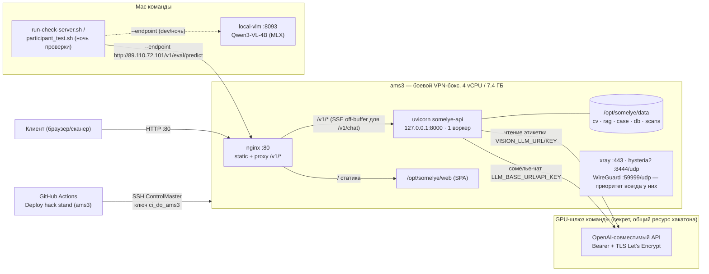
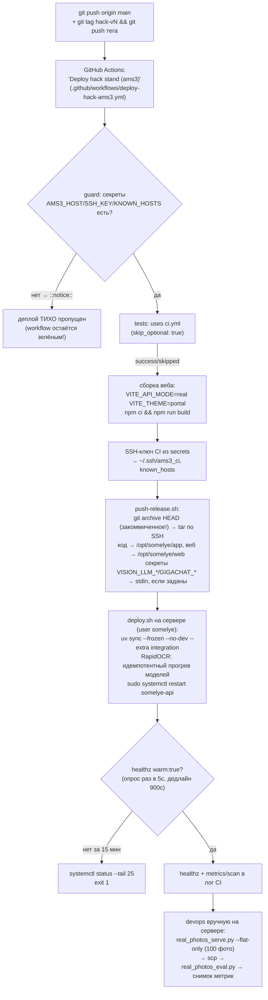

# Эксплуатация стенда «Свой Сомелье»

Раздел эксплуатации по задаче тимлида (22.09, решение Вячеслава; §10 добавлен 26.09 по задаче
проброса витрины). Пишет и держит в актуальном состоянии — devops (зона `infra/`, стенд ams3,
`qa/scan-eval-runs/real-photos-stand/`). Ссылаются: `docs/architecture/HLD.md`,
`docs/architecture/LLD.md` (architect). Источники (все прочитаны целиком перед написанием):
`infra/ams3/{README.md,bootstrap.sh,push-release.sh,deploy.sh,
sync-data.sh,somelye-api.service,nginx-somelye.conf,shelf-upstream.conf,somelye.env.example,pull-scans.sh}`,
`.github/workflows/{deploy-hack-ams3.yml,ci.yml}`, `apps/api/app/{config.py,routers/health.py,
routers/metrics.py}`, `packages/{cv,rag,llm}/**/config.py`, `ORCHESTRATION.md`, `TEAM.md`,
`agents/BOARD.md`, `reports/devops-hack-v9.md`…`v15.md`, `reports/devops-stand-vlm.md`,
`reports/qa-auto-rehearsal-{mac,stand-v10}.md`, `docs/strategy/tco.md`,
`case-data/eval/participant_test.sh` (вне git); для §10 — `apps/shelf-finder/docs/server-api.md`,
`apps/shelf-finder/server/README.md`, `apps/web/src/lib/shelfAvailability.ts`,
`apps/web/src/app/shelf/{ShelfScreen,ShelfUnavailableScreen}.tsx`,
`reports/frontend-shelf-gate.md`, живая проверка `sudo -n -l`/`ls -la /etc/nginx/...` на ams3
(26.09). Секреты и адрес GPU-шлюза в этом файле не приводятся ни в каком виде — только имена
переменных и транспорт (правило `.claude/agents/devops.md`).

## 1. Топология

### 1.1 Стенд ams3

Боевой VPN-бокс `exit-ams3` (Ubuntu 26.04, 4 vCPU, 7.4 ГБ RAM, swap 4 ГБ/`vm.swappiness=10` —
`bootstrap.sh`). Правило бокса одно: **VPN важнее стенда** (раздел 8). Стенд слушает только `:80`
(nginx) и `127.0.0.1:8000` (uvicorn, наружу не торчит).

| Компонент | Где | Детали |
|---|---|---|
| nginx | `:80` → `/etc/nginx/sites-enabled/somelye` | статика SPA из `/opt/somelye/web` + прокси `/v1/*` на `127.0.0.1:8000`; `/v1/chat` отдельно — `proxy_buffering off` (SSE) и `proxy_read_timeout 300s`, остальные `/v1/` — `60s`; `client_max_body_size 26m` (фото этикеток); `/v1/shelf/*` и `/shelf-ui/*` — проброс на сервис витрин по `$shelf_upstream` (`/etc/nginx/conf.d/shelf-upstream.conf`), выключен пустым значением по умолчанию — раздел 10 |
| systemd `somelye-api` | `apps.main:app` | uvicorn, **1 воркер**, пользователь `somelye`, `WorkingDirectory=/opt/somelye/app/apps/api`, `EnvironmentFile=/opt/somelye/somelye.env`, `Restart=on-failure`/`RestartSec=5`, `TimeoutStartSec=900` |
| Ограничения unit'а | делят бокс с VPN | `MemoryHigh=4500M`/`MemoryMax=5500M` (замер: 3.2 ГБ в работе, пик 3.9 ГБ), `CPUWeight=40` (VPN — 100 по умолчанию), `Nice=5`; `OMP_NUM_THREADS=3`/`MKL_NUM_THREADS=3` из 4 vCPU — одно ядро гарантированно свободно под VPN |
| Пути | `/opt/somelye/` | `app/` (код, из `git archive`), `web/` (собранный SPA), `venv/` (uv, вне git), `data/{cv,rag,case,db,fastembed,models/{hf,paddlex},scans}`, `somelye.env` (600, только `somelye`), `.ssh/authorized_keys` (ключ CI) |
| sudo | `/etc/sudoers.d/somelye` | ровно 3 команды без пароля: `systemctl restart/is-active/status somelye-api` — ничего больше |

### 1.2 GPU-шлюз команды

OpenAI-совместимый шлюз (LiteLLM) на GPU-сервере команды — **общий ресурс, амортизированный между
проектами хакатона**, не наш выделенный сервер. TLS — Let's Encrypt, проверяется штатно (не
отключать никогда). Авторизация — Bearer-ключ. Используется ДВУМЯ независимыми путями с разными
парами переменных на одном физическом адресе:

- **чтение этикетки** (`packages/cv`, слияние CV+текст) — `VISION_LLM_URL`/`VISION_LLM_KEY`,
  модель по умолчанию `qwen3.8-27b` (`VISION_LLM_MODEL`), дедлайн `VISION_LLM_TIMEOUT_S`;
- **сомелье-чат** (`packages/llm`, драйвер `openai`) — `LLM_BASE_URL`/`LLM_API_KEY`, та же модель
  по умолчанию.

Адрес шлюза и оба ключа — секрет и в этом документе не пишутся (раздел 5); IP самого стенда
(`89.110.72.101`) — публичный, писать можно (используется во всех отчётах команды открыто).

### 1.3 Mac команды

Рабочая машина: локальная служба `local-vlm` (`com.local-vlm.server`, **порт 8093**, не трогать) —
Qwen3-VL-4B на MLX, используется только режимами `vlm_local`/`vlm_both` при разработке и на ночь
проверки; на самом ams3 (Linux) локальной модели нет. Порты `8080`/`8091`/`8092` — чужие процессы,
тоже не трогать; свои временные сервисы — на свободных портах ≥ 8770 (или явно указанный свободный,
как `8081` в ночной репетиции), гасить за собой. Здесь же живёт `infra/local-check/run-check-server.sh`
(dev-стенд для репетиций, `vlm_both`/`CROPS=8` дефолтами скрипта) и официальный
`case-data/eval/participant_test.sh` (вне git, кейсодержателя).

### 1.4 GitHub Actions

Полностью управляемый CI/CD-узел между репозиторием и ams3 — раздел 2.

### 1.5 Диаграмма



## 2. Выкат

### 2.1 Пайплайн (тег → прод)



Тег `hack-v*` или ручной `workflow_dispatch` (есть аварийный вход `skip_tests: true`) —
`concurrency: {group: deploy-hack-ams3, cancel-in-progress: false}`, то есть параллельные выкаты
**встают в очередь**, не отменяют друг друга. `guard` пропускает деплой молча (`::notice::`), если
хотя бы один из трёх обязательных секретов пуст — **workflow при этом остаётся зелёным**: не
путать «CI зелёный» с «выкат состоялся» после ротации/переименования секретов (раздел 5.2).

### 2.2 Подтверждение выката — НЕ по файлам

Единственный надёжный способ, использованный во всех волнах hack-v9…v15:

```bash
ssh -i ~/.ssh/ci_do_ams3 -o ControlPath=/tmp/somelye-%r@%h somelye@89.110.72.101 \
  'systemctl show -p ExecMainStartTimestamp,ExecMainStartTimestampMonotonic somelye-api'
curl -s http://89.110.72.101/v1/healthz   # warm:true, cv_index_version/rag_index_version
```

`ExecMainStartTimestampMonotonic` строго растёт при каждом рестарте (надёжнее секундной точности
wall-clock варианта) — если он не изменился, рестарта не было, даже если CI показал success.
`index_version` в ответе — deprecated-алиас `rag_index_version` (оставлен для обратной
совместимости контракта); `cv_index_version` — отдельное поле, читается из живого манифеста
индекса, не из env-плейсхолдера.

### 2.3 Время старта и прогрев

- Общий бюджет запуска процесса — `TimeoutStartSec=900` (unit) и тот же дедлайн 900 с
  (15 мин) в цикле опроса `deploy.sh` (шаг 5 с).
- Изолированно измеренное время старта процесса (не всего CI-пайплайна) — **~20 с (±5 с по шагу
  опроса)**, hack-v14: старый прогрев CV-энкодера/verifier'а + новый прогрев RAG-ретривера
  (`warm_up_retriever`). RAG-прогрев синхронный и блокирует приём соединений до готовности, но
  формально не входит в булеву пару `image_index_warm AND label_verifier_warm`, из которых
  собирается поле `warm` в `/v1/healthz` — на практике разрыва нет (до ответа на `healthz` процесс
  уже принял соединение, то есть весь синхронный старт, включая RAG, уже прошёл), но это не
  доказано отдельным тестом именно на RAG-путь.
- RapidOCR (`CV_OCR_ENGINE=rapid`) прогревается ДО рестарта, в `deploy.sh`, идемпотентно, под тем
  же пользователем `somelye` — первый боевой запрос не должен ловить холодную загрузку моделей
  из сети; сбой прогрева (сети нет именно сейчас) не роняет деплой — откладывается на первый
  боевой rapid-запрос.
- Модели PaddleOCR (движок near-dup verify(), независимо от `CV_OCR_ENGINE`) прогреваются самим
  процессом при старте — отдельно не прогреваются в `deploy.sh`.
- Наблюдаемые интервалы между волнами (`ExecMainStartTimestamp`, МСК, только код без данных):
  hack-v9 04:55:53 → v10 06:28:53 → v11 08:27:19 → v12 13:57:51 → v13(env) 14:20:47 →
  v13(тег) 14:47:10 → v14 15:53:22 → v15 17:04:55 — интервал между push тега и `warm:true`
  укладывался в единицы минут во всех волнах (пример v13: ~142 с).

### 2.4 Откат

```bash
DEPLOY_REF=<хороший коммит> bash infra/ams3/push-release.sh 89.110.72.101
```

`push-release.sh` всегда берёт `git archive` от указанного `DEPLOY_REF` (по умолчанию `HEAD`) —
откат кода не трогает данные/индексы на сервере (те доставляет только `sync-data.sh`, раздел 3).
`PUSH_ONLY=1` — залить код и веб без рестарта (например, готовить откат заранее). Индекс/данные
откат не затрагивает — если откатывается волна, менявшая `CV_MODEL`/индекс, нужно синхронно
откатить и `somelye.env`/данные (ручной шаг, единого скрипта на этот случай нет).

## 3. Данные и индексы

### 3.1 `sync-data.sh` — что и куда

Разово и после каждой пересборки индекса **на Mac** (пересборка на ams3 не делается — ~45 минут
CPU на боевом VPN-боксе). 7 шагов, ~3.9 ГБ (индекс + модели):

1. CV-индекс (`qdrant/`, `rsync --delete --exclude .lock`) → `/opt/somelye/data/<CV_INDEX_DST>/qdrant`
2. RAG-индекс → `/opt/somelye/data/rag/` (без варианта `--dst`, см. 3.3)
3. Модели fastembed (RAG) → `/opt/somelye/data/fastembed/`
4. SigLIP2 — обе версии энкодера (224 и **384**, 1.4 ГБ, боевой с 21.09) → `/opt/somelye/data/models/hf/hub/`
5. PaddleOCR (`~/.paddlex/official_models`) → `/opt/somelye/data/models/paddlex/`
6. Метаданные кейса (`slug_refs.json`, `families.json`, `strapi_output0709.csv`,
   `winery_aliases.json`) + `eval_report_snapshot.json` → `/opt/somelye/data/case/` и корень `data/`
7. Карточка кейса (`case_catalog.json`, `thumbs/`) → `/opt/somelye/data/case/`

### 3.2 Смена CV-индекса без простоя

Встроенный (embedded) Qdrant читает файлы индекса напрямую в процессе — **новый индекс нельзя
заливать поверх работающего**. Порядок:

```bash
CV_INDEX_DIR=packages/cv/data-d1 CV_INDEX_DST=cv-d1 infra/ams3/sync-data.sh 89.110.72.101   # 1: едет в cv-d1, стенд читает старый cv/
# 2: в /opt/somelye/somelye.env — CV_DATA_DIR=/opt/somelye/data/cv-d1 и CV_MODEL под энкодер нового индекса
bash infra/ams3/push-release.sh 89.110.72.101   # 3: тег hack-vN или просто рестарт — новый процесс стартует на новом индексе
```

Проверка — `cv_index_version` в `/v1/healthz`; старый каталог удалять только после подтверждения.
`CV_MODEL` **обязан** совпадать с энкодером, которым строился индекс (сейчас
`google/siglip2-base-patch16-384`, индекс `case-20260921-d1-b384`) — рассинхрон молча портит
качество поиска, а не падает с ошибкой.

### 3.3 Смена RAG-индекса без простоя (пробел закрыт 22.09, `infra/ams3/sync-data.sh`)

Тот же embedded-Qdrant, то же ограничение «один процесс на каталог» (ловушка 7.4.2) — тот же
blue/green, что у CV в 3.2, но теперь скриптом, не руками (до 22.09 индекс меняли дважды подряд
вручную rsync+sed+restart, второй раз — hack-v16, риск зафиксирован там же). `RAG_INDEX_DIR`/
`RAG_INDEX_DST` (дефолты — `packages/rag/data` и `rag`, по образцу `CV_INDEX_DIR`/`CV_INDEX_DST`)
управляют шагом 2/7 заливки; `switch-rag`/`rollback-rag` — новые подкоманды того же `sync-data.sh`,
делают остальное сами:

```bash
RAG_INDEX_DIR=packages/rag/data-v2 RAG_INDEX_DST=rag-20261001 infra/ams3/sync-data.sh 89.110.72.101
# 1: едет в /opt/somelye/data/rag-20261001, стенд продолжает читать старый; проверка целостности
#    (labels.jsonl построчно + manifest.json version, лок/удал) гейтит шаг — расхождение = exit 1
infra/ams3/sync-data.sh switch-rag 89.110.72.101 rag-20261001
# 2: бэкап somelye.env (.bak-before-rag-<таймстамп>), предыдущее значение RAG_DATA_DIR — в файл
#    /opt/somelye/data/.rag_data_dir.prev на сервере, sed, sudo systemctl restart, тот же цикл
#    ожидания healthz warm, что deploy.sh (127.0.0.1:8000, дедлайн 900с), сверка rag_index_version
#    с manifest.json целевого каталога, печать ExecMainStartTimestampMonotonic (см. 2.2)
infra/ams3/sync-data.sh rollback-rag 89.110.72.101
# откат ОДНОЙ командой на каталог из .rag_data_dir.prev — та же процедура (бэкап/рестарт/healthz);
# повторный вызов — тумблер туда-обратно (как cd -). DRY_RUN=1 перед любой из трёх форм — только
# печать (rsync -n / без sed и рестарта), ничего не меняет ни на диске, ни в env, ни в сервисе.
```

Старые каталоги (`rag/`, `rag-<версия>/`) **не удаляются автоматически никогда** — только видны
через `du -sh` в выводе `switch-rag`/`rollback-rag`; чистка — ручное решение отдельно от скрипта.
Проверено 22.09 на живом стенде (dry-run + один настоящий цикл на уже боевом `rag-20260922`,
отчёт — дополнение к `reports/devops-hack-v16.md`): идемпотентно (тот же каталог повторно —
`rag_index_version` не поменялся, `20260922.1` до/после), рестарт реальный
(`ExecMainStartTimestampMonotonic` 160568946863→162407788575), `healthz warm:true`, контрольный
вопрос в `/v1/chat` («Какое красное подать к стейку?») — содержательный ответ с 3 цитатами за 6с,
не заглушка.

### 3.4 Снимок метрик и `/v1/metrics/scan`

`GET /v1/metrics/scan` отдаёт `{index_version, f1_top1, f1_top5, match_rate, eval_set,
measured_at}` из JSON-файла по пути `CV_EVAL_REPORT_PATH` (на стенде —
`/opt/somelye/data/eval_report_snapshot.json`) — до первого снимка все поля `null`, эндпоинт без
авторизации. Обновление на каждом выкате (обязанность devops, `TEAM.md`):

```bash
# на сервере: прод-трафик через nginx :80, не localhost-порт мимо прокси
cpulab/real_photos_serve.py --api http://127.0.0.1 --src /opt/somelye/cpulab/real-photos --flat-only --timeout 30
scp somelye@89.110.72.101:.../stand-hack-vN.jsonl case-data/real-photos-labels/served/
# на Mac
qa/real_photos_eval.py --served .../stand-hack-v{N-1,N}.jsonl   # top-1/top-5, percentile
# обновить qa/scan-eval-runs/real-photos-stand/{README.md,eval_report_snapshot.json}, закоммитить
# залить на стенд (бэкап .bak-before-hack-vN рядом, никогда не перезаписывать без бэкапа):
scp qa/scan-eval-runs/real-photos-stand/eval_report_snapshot.json somelye@89.110.72.101:/opt/somelye/data/eval_report_snapshot.json
```

Перцентили — линейная интерполяция, тот же метод, что `qa/scan_eval.py:_percentile` (важно
пересчитывать одним и тем же методом при сравнении волн — README ранее один раз разошёлся в
округлении, не в данных). Текущее боевое число (hack-v15, 22.09): **top-1 96.8% (60/62)**, p50/p95/max
flat_ms **4370/5180/6921 мс** (лимит приватной проверки — 10 000 мс).

## 4. Справочник env стенда

Только имена, смысл, дефолт кода и фактическое значение на стенде (hack-v15, 22.09) — **без
значений секретов** (строка «секрет» вместо значения, наличие проверяется `grep -c`, см. ловушку
7.4.3).

| Переменная | Смысл | Дефолт кода | Значение стенда |
|---|---|---|---|
| `IMAGE_PROVIDER` | бэкенд CV-конвейера | `mock` | `real` |
| `VERIFIER_PROVIDER` | near-dup OCR-верификатор | `mock` | `real` |
| `RAG_PROVIDER` | бэкенд RAG | `mock` | `real` |
| `RAG_MODE` | embedded/сетевой Qdrant | `embedded` | `embedded` |
| `RAG_DATA_DIR` | путь данных RAG-индекса | `packages/rag/data` | `/opt/somelye/data/rag` |
| `RAG_FASTEMBED_CACHE` | кэш моделей fastembed | `packages/rag/.fastembed_cache` | `/opt/somelye/data/fastembed` |
| `CV_DATA_DIR` | путь CV-индекса (qdrant) | `packages/cv/data` | `/opt/somelye/data/cv` (индекс `case-20260921-d1-b384`) |
| `CV_MODEL` | энкодер CV, обязан = энкодеру индекса | `google/siglip2-base-patch16-224` | `google/siglip2-base-patch16-384` |
| `CV_FUSION` | слияние CV + текст этикетки по всему каталогу | `0` (выкл) | `1` |
| `CV_FUSION_W` | вес текстового сигнала в слиянии | `0.2` | `0.3` |
| `CV_FUSION_CROPS` | 2\|8 query-векторов слияния | `2` | `2` (пин явной строкой — на Mac dev `8`) |
| `CV_OCR_ENGINE` | движок OCR-фолбэка (`paddle`\|`rapid`) | `paddle` | `rapid` |
| `CV_OCR_RAPID_SIZES` | масштабы RapidOCR (объединение текстом) | `640,960` | `640,960` (пин явной строкой) |
| `CV_OCR_LABEL_SIZE` | 3-й проход — кроп этикетки, `0`=выкл | `1280` | `1280` (пин явной строкой) |
| `CV_OCR_DET_BOX_THRESH` / `CV_OCR_DET_UNCLIP` | пороги детектора текста (чувствительность) | `0.3` / `2.0` | не заданы (= дефолт кода) |
| `CV_FUSION_TEXT_SOURCE` | источник текста: `ocr`\|`vlm`\|`vlm_local`\|`vlm_both` | `ocr` | `vlm` |
| `CV_FUSION_MERGE_MODEL_TEXT` | текст OCR ДОБАВЛЯЕТСЯ к тексту модели, не только фолбэк | `0` | `1` |
| `CV_FUSION_CHOOSE` | правило выбора локальный/модельный ответ | `merge` | `confident_else_cv` |
| `CV_SHELF_CROP` | сегментация полки на бутылки (ML-2/ML-3) | `0` | не задана (= `0`; регрессия на каталоге, не включать) |
| `VISION_LLM_URL` / `VISION_LLM_KEY` | шлюз чтения этикетки — адрес/ключ | нет (`None`) | **секрет**, через CI (5.2) |
| `VISION_LLM_MODEL` | модель чтения этикетки | `qwen3.8-27b` | дефолт (не переопределена) |
| `VISION_LLM_TIMEOUT_S` | дедлайн модели ОТ НАЧАЛА запроса | `6.0` | `6.0` (пин явной строкой, было `6.5`) |
| `VISION_LLM_BREAKER_FAILS` | сбоев подряд до открытия предохранителя | `3` | не задана (= дефолт) |
| `VISION_LLM_BREAKER_COOLDOWN_S` | пауза предохранителя, с | `60` | не задана (= дефолт) |
| `CV_SCAN_BUDGET_S` | общий бюджет OCR/verify ОТ НАЧАЛА запроса | `7.5` | не задана (= дефолт) |
| `CASE_DATA_DIR` | метаданные кейса (алиасы, каталог) | — | `/opt/somelye/data/case` |
| `CV_EVAL_REPORT_PATH` | источник `/v1/metrics/scan` | `../../packages/cv/eval/report.json` | `/opt/somelye/data/eval_report_snapshot.json` |
| `HF_HOME` | кэш моделей HuggingFace | — | `/opt/somelye/data/models/hf` |
| `HF_HUB_OFFLINE` / `TRANSFORMERS_OFFLINE` | запрет сетевых обращений к HF в проде | — | `1` / `1` |
| `PADDLE_PDX_CACHE_HOME` | кэш моделей PaddleOCR | — | `/opt/somelye/data/models/paddlex` |
| `PADDLE_PDX_ENABLE_MKLDNN_BYDEFAULT` / `FLAGS_use_mkldnn` | обход бага oneDNN на этом CPU | — | `0` / `0` (см. `infra/ams3/README.md`, ценой ~2.5-3с вместо 0.5с на верификацию) |
| `DATABASE_URL` | SQLite | `sqlite:///./svoy_somelye.db` | `sqlite:////opt/somelye/data/db/somelye.db` |
| `JWT_SECRET` | подпись токенов гостя | dev-заглушка | **секрет**, генерируется `bootstrap.sh` (`openssl rand -hex 32`), не покидает сервер |
| `LLM_PROVIDER` | `mock`\|`gigachat`\|`openai` (драйвер чата) | `mock` | `openai` (Qwen3.8-27b через шлюз) с hack-v13; ручное переключение тимлидом |
| `LLM_BASE_URL` / `LLM_API_KEY` | шлюз чата — адрес/ключ (драйвер `openai`) | нет | **секрет**, ставится ВРУЧНУЮ по SSH (5.2, ДРУГОЙ транспорт, чем `VISION_LLM_*`) |
| `LLM_MODEL` | модель чата | `qwen3.8-27b` | дефолт (не переопределена) |
| `GIGACHAT_CA_BUNDLE` | корень Минцифры для TLS к GigaChat | нет | `/opt/somelye/certs/russian_trusted_root_ca.pem` (путь не секрет, отпечаток сверен по 2 источникам) |
| `GIGACHAT_AUTH_KEY` | ключ GigaChat (опционально) | нет | **секрет**, не задан на 22.09 (используется `openai`-путь) |
| `OMP_NUM_THREADS` / `MKL_NUM_THREADS` | параллелизм CPU-инференса | — | `3` / `3` (из 4 vCPU — 1 ядро под VPN) |
| `TOKENIZERS_PARALLELISM` | подавление предупреждений HF | — | `false` |
| `SCAN_ARCHIVE_DIR` | архив сканов интерфейса — ВРЕМЕННЫЙ режим | не задана (выкл) | `/opt/somelye/data/scans` — выключить до передачи ссылки вне команды (раздел 6.4) |
| `CORS_ORIGINS` | разрешённые origin | localhost:5173/4173 | не переопределена (same-origin через nginx, в проде не задействовано) |

## 5. Секреты

### 5.1 Транспорт — только stdin по SSH

Ни один секрет не передаётся аргументом командной строки (виден в `ps`/истории) и не печатается
в лог/чат/отчёт. Канонический приём — конвейер в `read -r` на сервере:

```bash
printf '%s\n%s\n' "$VISION_LLM_URL" "$VISION_LLM_KEY" | ssh ... \
  'read -r u; read -r k; sed -i "/^VISION_LLM_URL=/d; /^VISION_LLM_KEY=/d" somelye.env; printf "VISION_LLM_URL=%s\nVISION_LLM_KEY=%s\n" "$u" "$k" >> somelye.env'
```

Ни в GitHub, ни в git — репозиторий публичный (после открытия жюри). Проверка присутствия секрета
БЕЗ печати значения — `grep -c '^KEY=' somelye.env` (число совпадений, не значение) — но см. ловушку
7.4.3 про exit-код этой команды.

### 5.2 Два независимых пути — не перепутать

| Секрет | Подсистема | Транспорт |
|---|---|---|
| `VISION_LLM_URL`/`VISION_LLM_KEY` | чтение этикетки, `packages/cv` | **GitHub Secrets** (repository-level, не environment!) → `push-release.sh` на каждом выкате автоматически |
| `GIGACHAT_AUTH_KEY` | чат, `packages/llm` (GigaChat) | **GitHub Secrets** → `push-release.sh` автоматически |
| `LLM_BASE_URL`/`LLM_API_KEY` | чат, `packages/llm` (драйвер `openai`) | **нет секрета GitHub под них (пока)** — только ручной SSH-stdin, переживает выкаты (`deploy.sh` env не трогает), но НЕ восстанавливается автоматически на новом сервере |

Уровень секретов GitHub — **Repository**, не Environment: деплой-джоба не объявляет
`environment:`, секреты окружения ей физически не видны (частая ошибка настройки). Три
обязательных (`AMS3_HOST`, `AMS3_SSH_KEY`, `AMS3_KNOWN_HOSTS`) — без них `guard` тихо
пропускает весь деплой, и CI остаётся **зелёным** (раздел 2.1) — при ротации ключа CI задеть
внимательно эту джобу.

### 5.3 TLS — не отключать никогда

Шлюз VLM/чата — TLS Let's Encrypt, проверяется штатно. Отдельно — сертификат Минцифры
(`GIGACHAT_CA_BUNDLE`) нужен ТОЛЬКО клиенту GigaChat (цепочки Сбера не в обычных доверенных
хранилищах); отпечаток `D2:6D:2D:...:CE:CF:31` сверен по двум независимым источникам. Путь к
файлу — не секрет, сам сертификат публичный (корень Минцифры).

### 5.4 Перевыпуск ключа GPU-шлюза после хака

Открытый пункт из `agents/BOARD.md` («Нужно от Вячеслава», п.5, 22.09) — **не выполнено на
22.09**. Процедура (когда решение принято): перевыпустить ключ на шлюзе → обновить
`VISION_LLM_KEY` (секрет GitHub, подхватится следующим тегом/выкатом автоматически) → обновить
`LLM_API_KEY` (ручной SSH-stdin, раздел 5.1/5.2, НЕ подхватится автоматически) → проверить живым
запросом (`/v1/scan/photo` с `text_source=vlm` в сайдкаре архива и `/v1/chat` с непустым ответом,
`is_mock_stub=false`).

### 5.5 Бэкапы `somelye.env` — то же секретное содержимое

`.bak-before-hack-vN`/`.bak-before-vlm`/`.bak-before-llm` на сервере накапливаются и НИКОГДА не
чистились (сложившаяся практика проекта) — каждый содержит секреты того же уровня
чувствительности, что живой `somelye.env` (600, тот же владелец). Не копировать эти файлы куда-либо
за пределы сервера бездумно вместе с обычным аудитом/диагностикой.

## 6. Наблюдаемость

### 6.1 `GET /v1/healthz`

`{status, index_version /* deprecated-алиас rag_index_version */, rag_index_version,
cv_index_version, warm}` — `warm` = AND(`image_index_warm`, `label_verifier_warm`), выставляется
один раз при старте процесса (`create_app()` → `warm_up_*`). Без авторизации.

### 6.2 `GET /v1/metrics/scan`

`{index_version, f1_top1, f1_top5, match_rate, eval_set, measured_at}` — читает файл
`CV_EVAL_REPORT_PATH` (раздел 3.4), без авторизации, все поля `null` до первого снимка.

### 6.3 Логи — journalctl пользователю `somelye` недоступен

Подтверждено на hack-v15 (не в группах `adm`/`systemd-journal`, других лог-файлов у сервиса нет).
Доступно только через белый список sudoers: `sudo systemctl status somelye-api --no-pager` (хвост
последних строк, не полная история). Дополнительный слепой пункт: успешные вызовы VLM (и чтение
этикетки, и чат) **не логируются вовсе** — только `warning` на сбой/фолбэк
(`app/cv/vision_llm.py:110,113`) — поле `text_source` (какой источник текста реально выиграл)
не попадает ни в rich-ответ (`routers/scan.py`), ни в сайдкар архива сканов (`cv/archive.py`), ни в
лог на успехе — источник виден только косвенно (тайминги, точность, отсутствие warning).
Предложение к контракту (зона architect/ml-lead, не devops): вывести `text_source` хотя бы в архив.

### 6.4 Архив сканов — ВРЕМЕННЫЙ режим

`SCAN_ARCHIVE_DIR=/opt/somelye/data/scans` — каждое фото, отсканированное через интерфейс, попадает
в `confident/`/`unsure/`/`failed/` + JSON-сайдкар (предсказание, топ-5+скоры, пустое поле
`verified_slug` для ручной сверки); фото перекодируется без EXIF/GPS. Скриптовые режимы (`?flat=1`,
`/v1/eval/predict`) НЕ архивируются — это приватная выборка кейсодержателя. Только на время сбора
контрольной выборки — **в проде этого режима нет**; выключить: строку `SCAN_ARCHIVE_DIR`
удалить из `somelye.env` + `sudo systemctl restart somelye-api`, сделать это ДО
того, как ссылка на стенд попадёт кому-то за пределами команды. Забрать архив:
`bash infra/ams3/pull-scans.sh 89.110.72.101` → `case-data/stand-scans/` (вне git).

## 7. Ранбуки

### 7.1 Ночь проверки (`reports/qa-auto-rehearsal-mac.md`)

1. Поднять локальный стенд на СВОБОДНОМ порту (8080/8091/8092/8093 — чужие, не трогать):
   `PORT=8081 infra/local-check/run-check-server.sh` (или следующий свободный ≥ 8770).
2. Ждать `Application startup complete` + `curl http://127.0.0.1:$PORT/v1/healthz` → `warm:true`
   (≈7-8 с от старта, лог `cv_fusion warm-up`/`retriever warm-up`).
3. 2-3 холостых скана: `curl -F image=@<фото> http://127.0.0.1:$PORT/v1/eval/predict`.
4. Официальный скрипт, порт ОБЯЗАТЕЛЬНО явной строкой (ловушка 7.4.5):
   ```bash
   bash case-data/eval/participant_test.sh --images-dir case-data/real-photos \
     --manifest <манифест> --endpoint http://127.0.0.1:$PORT/v1/eval/predict \
     --output <новый файл — старый скрипт не перезапишет>
   ```
5. Сбой GPU-шлюза/локальной модели во время прогона — **ничего не делать руками**, предохранитель
   сам переключает на локальный путь (7.2); `/v1/eval/predict` всегда HTTP 200.
6. После: `kill` свой процесс, порт свободен; проверить `com.local-vlm.server` (`state=running`,
   `/v1/models` 200) не тронут.

### 7.2 Сбой шлюза и предохранитель

Независимый счётчик на КАЖДУЮ модель (`vlm` — GPU-шлюз, `vlm_local` — Mac): `VISION_LLM_BREAKER_FAILS`
(дефолт 3) сбоев/таймаутов ПОДРЯД → предохранитель открывается на `VISION_LLM_BREAKER_COOLDOWN_S`
(дефолт 60 с) → следующие сканы пропускают эту модель без ожидания дедлайна → по истечении паузы
один пробный скан: успех закрывает предохранитель, неудача открывает заново на тот же срок.
`/v1/eval/predict`/`/v1/scan/photo` остаются HTTP 200 даже при недоступности ОБЕИХ моделей (ответ
уходит на локальный CV+OCR путь, правило `CV_FUSION_CHOOSE`). Подтверждено офлайн
(`launchctl bootout` локальной 4B на ночной репетиции — 15/15 HTTP 200, брейкер открылся ровно на
3-м сбое) и офлайн-скриптом на самом адресе шлюза (`reports/qa-auto-scan-budget.md`: 60/60,
предохранитель 0.5-1.4 с после открытия). **Живой хаос-тест на самом ams3 не выполнен** (hack-v15,
п.5 задания) — попытка временно испортить `VISION_LLM_URL` через SSH заблокирована классификатором
автономного режима сессии («Remote Shell Writes»), откат подготовлен (`trap ... EXIT`), но команда
изменения ни разу не ушла на сервер. Нужно разовое разрешение на этот Bash-паттерн или ручной шаг
Вячеслава — механизм косвенно доказан (офлайн + предохранитель по коду), но не переподтверждён
живой аварией именно на проде.

### 7.3 Рестарт стенда

```bash
ssh -i ~/.ssh/ci_do_ams3 -o ControlPath=/tmp/somelye-%r@%h somelye@89.110.72.101 \
  'sudo systemctl restart somelye-api'
# или полный выкат: bash infra/ams3/push-release.sh 89.110.72.101
```

Ждать `ExecMainStartTimestampMonotonic` (2.2) + `healthz warm:true`; `deploy.sh` сам печатает
`systemctl status --no-pager | tail -25`, если рестарт не удался за 900 с. `journalctl` не читается
(6.3) — при подозрении на OOM единственный источник — паттерн деградации (сервис ушёл в
`Restart=on-failure`-цикл); правило при OOM — **убавить `MemoryMax` в unit'е, не наоборот** (VPN
всегда в приоритете на общем боксе).

### 7.4 Пять известных ловушек

1. **`pgrep -f` ловит сам себя.** Цикл ожидания вида `until ! pgrep -f "шаблон"` находит СОБСТВЕННУЮ
   командную строку (шаблон записан в ней же) и ждёт вечно — так повисли три наблюдателя за сборкой
   G6 (`ORCHESTRATION.md`). Ждать по PID (`while kill -0 $PID 2>/dev/null`), по файлу-маркеру/логу,
   либо экранировать один символ шаблона (`pgrep -f "[g]6_build_index"`).
2. **Встроенный Qdrant — один процесс на каталог данных.** Второй процесс на том же
   `packages/cv/data*/qdrant`/`packages/rag/data` либо тихо отдаёт пустые ответы, либо падает 500 —
   без ошибки при старте в обоих случаях. Параллельный живой API — только на СВОИХ копиях обоих
   каталогов (без файла `.lock`), гасить и освобождать порт после себя.
3. **`grep -c` и `&&`/`set -e`.** `grep -c ПАТТЕРН файл` печатает число совпадений (даже `0`), но
   возвращает **exit-код 1**, если совпадений ноль — а именно ноль часто и есть желанный ответ
   («0 ошибок в логе», «переменной нет — и это правильно»). В цепочке `grep -c ... && next` или под
   `set -e` это молча обрывает скрипт/пропускает следующий шаг ровно тогда, когда всё в порядке.
   Проверять напечатанное число, не полагаться на код возврата (`grep -c ... || true`, если код
   важен только для «команда выполнилась»).
4. **`participant_test.sh` пишет `--output` только в самом конце.** Каждая строка ответа уходит в
   ВРЕМЕННЫЙ файл в `mktemp -d` по ходу прогона, но `mv` во внешний `--output` происходит только
   ПОСЛЕ последней строки (конец скрипта); прерывание (Ctrl-C, обрыв сети, таймаут) на любой
   середине — `trap ... EXIT` чистит временный каталог, и итоговый файл не появляется вовсе, не
   частично. Скрипт также отказывается перезаписывать уже существующий `--output`
   (`[ ! -e "$output" ] || die`) — каждый повтор нужен под новым именем файла. Не прерывать прогон,
   данные которого нужны; дать доработать до конца или начинать чистый повтор.
5. **Флаг `--endpoint`.** Дефолт скрипта — `http://127.0.0.1:8080/v1/eval/predict`, а порт 8080 на
   Mac команды занят ЧУЖИМ процессом (раздел 1.3/`ORCHESTRATION.md`). Забытый `--endpoint` не
   падает с ошибкой — тихо шлёт 100 живых запросов не туда. Команду с портом держать готовой
   текстом (копировать, не печатать по памяти на созвоне).

## 8. Правила боевого бокса ams3

Бокс — боевой VPN-выход (`exit-ams3`): Reality/xray на `:443/tcp`, hysteria2 на `:8444/udp`,
WireGuard `wg0` на `:59999/udp`, реплика control-plane на `127.0.0.1:8090`. **Никогда на этом
боксе:**

- не трогать фаервол — ни `ufw`, ни `iptables`, ни `nftables` (любое правило рискует отрезать
  WireGuard-клиентов);
- не ставить Docker (политика `FORWARD=DROP` при установке ломает форвардинг WG сразу);
- не занимать порты `443`/`8444`/`59999` и не перезапускать/переконфигурировать
  `xray`/`hysteria`/`wg-quick`/`newvpn-*` — стенд живёт строго на `:80` (nginx) и `127.0.0.1:8000`
  (uvicorn, наружу не торчит); `127.0.0.1:8090` (VPN control-plane) тоже не трогать, хоть порты и
  не пересекаются;
- не пересобирать CV-индекс на самом ams3 (45 минут CPU на общем боксе) — только на Mac, доставка
  готового — `sync-data.sh`;
- сеть/память/CPU уже отгорожены системд (`MemoryHigh`/`MemoryMax`, `CPUWeight=40` против дефолтных
  100 у VPN, `Nice=5`, потоки инференса `OMP_NUM_THREADS=3` из 4 vCPU) — не поднимать эти лимиты
  без явного пересчёта под общий бюджет бокса;
- `sudo` пользователю `somelye` — ровно 3 команды из `/etc/sudoers.d/somelye`, ничего сверх списка;
- **один SSH-канал**: `ControlMaster=auto`/`ControlPath=/tmp/somelye-%r@%h` на ВСЕ скрипты — fail2ban
  режет частые новые соединения; SSH на ams3 — только роль devops и тимлид (`ORCHESTRATION.md`),
  остальные роли работают на локальных копиях или просят devops.

## 9. TCO — кратко

Полная методика, источники цен (с датой обращения) и допущения — `docs/strategy/tco.md`
(architect, 22.09). Голые цифры без переизмерения здесь не дублируются, только ориентир: боевая
конфигурация 1 (= этот стенд, 4 vCPU без GPU) — **91.9% top-1** (94.1% потолка каталога) при
**~60 ₽/1000 сканов** — самая дешёвая конфигурация, в 25-35 раз дешевле любой GPU-конфигурации;
текущий боевой режим на момент замера `tco.md` (CPU-стенд + общий GPU-шлюз, `vlm`) поднимает
точность до **93.5-95.2%** (в зависимости от участия Mac) — снимок раньше по времени в тот же
день, чем итоговое боевое число hack-v15 **96.8%** из раздела 3.4 (`CV_FUSION_MERGE_MODEL_TEXT`/
`CV_FUSION_CHOOSE` дособраны позже 22.09, `tco.md` не переиздавался); фактическая предельная цена
GPU-шлюза сейчас — трафик/время ответа, не полная аренда (ресурс общий на хакатон, не выделенный).
Точка перегиба аренда→покупка выделенного GPU-узла — 14-24 месяца в зависимости от условий
предоплаты (`docs/strategy/tco.md` §4). Решение по объёму/конфигурации для продакшена вне
хакатона — вне мандата этого документа.

## 10. Проброс сервиса витрин (shelf-finder, апстрим Потапа, задача тимлида 26.09)

> **Решение Вячеслава 26.09: проброс НЕ включаем.** Сервис витрин остаётся на стороне его
> автора — он сам настраивает авторизацию, лимиты инференса и доступ. Раздел ниже описывает
> готовую, но выключенную конфигурацию: апстрим пуст, `/v1/shelf/health` отвечает 404, пункт
> «Витрина» во фронте скрыт автоматически. Действий на стенде не требуется.

Второй разработчик (Михаил/Potap) держит отдельный сервис распознавания витрин
(`apps/shelf-finder/server`, свой Python-пакет `shelf_api`, порт 8086, GPU 24 ГБ — НЕ этот
CPU-стенд) с собственным контрактом (`apps/shelf-finder/docs/server-api.md`,
`apps/shelf-finder/server/README.md`): `POST /v1/shelf/scan`, `GET /v1/shelf/health`,
`GET /v1/shelf/catalog`, плюс свой веб-интерфейс. Сервис сам просит проксировать `/v1/shelf/*` и
`/shelf-ui/*` с того же домена (иначе нужен CORS), пропускать фото до 20 МБ/24 Мпикс, ждать ответ
не меньше 60 с (клиентский таймаут сервиса — 45 с) и понимает ровно один запрос одновременно —
второй получает `503` с `Retry-After` сам сервис, без участия nginx.

Раздел «Витрина» во фронте теперь содержит интегрированный сценарий сомелье
([описание](../product/shelf-sommelier.md)). Доступность проверяется по JSON health:
`ready=true`, `state=ready`, целому `catalogSize>=0` и boolean `busy`, а не только по HTTP 200.
Повторный опрос каждые 5 с, кеш готовности 30 с/отказа 5 с. Уже открытый экран
сохраняет фото при временном отказе. Для новых API и UI нужна совместная выкладка;
`/v1/sommelier/shelf-selection` проксируется в основной API, не в shelf upstream.
Исторические решения о выключенном production-пробросе ниже не изменяют сами себя
при локальном запуске. Состояние production повторно здесь не проверялось.

**С 26.09 (вечер) весь проброс, КРОМЕ `/v1/shelf/health`, закрыт HTTP Basic-авторизацией**
(решение Вячеслава, продолжение `reports/devops-shelf-proxy.md`) — без пароля через наш домен
можно было бы бесплатно гонять чужой GPU Михаила (риск уже описан в §10.6 ниже, ещё до появления
адреса). Исключение для health обязательно: под паролем `apps/web/src/lib/shelfAvailability.ts`
получал бы `401` вместо `200 application/json`, решал бы, что сервиса нет, и раздел «Витрина» не
появился бы в меню НИКОГДА, даже после включения проброса. Детали реализации — §10.1, пароль — §10.7.

### 10.1 Устройство (уже в git, выключено по умолчанию)

`infra/ams3/nginx-somelye.conf` — locations `/v1/shelf/` и `/shelf-ui/` читают переменную
`$shelf_upstream`; она объявлена ОТДЕЛЬНЫМ файлом `infra/ams3/shelf-upstream.conf`
(`/etc/nginx/conf.d/shelf-upstream.conf` на сервере). Файл использует `map`, а не `set`: `conf.d`
у этой коробки подключается ВНУТРИ `http{}` (`nginx.conf`: `include /etc/nginx/conf.d/*.conf;`,
проверено `grep` на сервере 26.09), а `set` в http-контексте не проходит `nginx -t` («"set"
directive is not allowed here») — `map` там штатна. Пустое значение (репозиторная версия) — все три
location ниже отвечают `return 404;` ДО `proxy_pass`, т.е. ведут себя как честный вызов `apps/api`
сегодня, а не как SPA-фолбэк. `/v1/shelf/` длиннее общего `/v1/` — nginx всегда матчит самый
длинный префикс НЕЗАВИСИМО от порядка блоков в файле, так что основной путь (`/v1/` → `apps/api`)
гарантированно не задет, даже если порядок locations в файле когда-нибудь поменяют.

`GET /v1/shelf/health` — ОТДЕЛЬНЫЙ точный блок `location = /v1/shelf/health` (точный `=`-матч
приоритетнее префиксного `/v1/shelf/` независимо от места в файле, так что расположение блока не
важно), БЕЗ `auth_basic`. `/v1/shelf/` и `/shelf-ui/` защищены `auth_basic` +
`auth_basic_user_file /etc/nginx/.htpasswd-shelf` — пароль, см. §10.7. Проверка `$shelf_upstream = ""`
и `auth_basic` в одной location не конфликтуют по фазам: `if`/`return` — директивы
`ngx_http_rewrite_module`, выполняются на фазе rewrite; `auth_basic` — модуль `ngx_http_auth_basic_module`,
фаза access, которая у nginx ВСЕГДА идёт СЛЕДУЮЩЕЙ после rewrite независимо от порядка директив в
файле конфига. Значит при выключенном апстриме `return 404` в `if`-блоке гарантированно срабатывает
раньше, чем nginx успел бы проверить пароль — 404 для гостя, не запрос логина. Это не только
теоретическое рассуждение о фазах nginx: 26.09 проверено живым `curl` на изолированном экземпляре
nginx 1.28.3 (слушал только `127.0.0.1`, не боевой стенд) во всех комбинациях апстрим×пароль×путь —
health всегда без пароля (200 при включённом апстриме, 404 при выключенном, никогда `WWW-Authenticate`),
`/v1/shelf/scan` и `/shelf-ui/` при включённом апстриме — 401 без учётных данных, 200/passthrough с
верным паролем, 401 с неверным, при выключенном — 404 без запроса пароля на обоих. Отдельно
проверены оба формата хэша пароля (apr1 через `openssl passwd`, bcrypt через тот же алгоритм, что
даёт `htpasswd -B`) — оба корректно различают верный/неверный пароль на этой версии nginx. Отдельно
проверено поведение при ОТСУТСТВУЮЩЕМ `auth_basic_user_file` (реальное состояние до создания
файла root'ом, §10.3 шаг 2): первый запрос без `Authorization` всё равно честно получает 401 (nginx
проверяет наличие заголовка раньше, чем пытается открыть файл), но с ЛЮБЫМ введённым паролем —
403 (`open() ... failed (2: No such file or directory)` в error-логе), не 200 и не 500 — то есть
до появления файла паролей путь недоступен НИКОМУ, включая того, кто угадает или знает будущий
пароль.

`infra/ams3/bootstrap.sh` ставит `shelf-upstream.conf`, только если его ещё нет на сервере (как
`somelye.env`) — повторный bootstrap (пересборка стенда с нуля) не откатит уже включённый адрес
обратно в выключенное состояние, а на чистом сервере воспроизведёт безопасный дефолт.

**Обычный выкат (`push-release.sh`→`deploy.sh`) nginx вообще не трогает** — `git archive` везёт
код `apps/api`/`packages`/`contracts`/`infra`/`pipeline/*` в `/opt/somelye/app`, веб-сборку в
`/opt/somelye/web`, `deploy.sh` делает `uv sync` и рестарт `somelye-api`; ни один из них не пишет
в `/etc/nginx/*` и не дёргает `nginx reload`. Значит locations из раздела 10.1 переживут ЛЮБОЙ
последующий тег `hack-vN` без переустановки — единственный путь их потерять — заново прогнать
`bootstrap.sh`, и именно для этого случая существует защита абзацем выше.

### 10.2 Данные, нужные от владельца сервиса до включения

- хост:порт или готовый URL (сервис по умолчанию слушает `:8086`);
- схема — `http` (если сервис в той же приватной сети/VPN, что и ams3) или `https` (если уже
  выставлен через TLS);
- нужна ли авторизация — контракт сервиса на 26.09 ничего не требует; если Михаил добавит токен,
  он подставляется строкой `proxy_set_header Authorization ...` в те же `location`, значение —
  секрет, транспорт как у `VISION_LLM_KEY` (раздел 5);
- подтверждение, что `GET /v1/shelf/health` отвечает именно `200`+`application/json` в готовом
  состоянии — это ЕДИНСТВЕННЫЙ признак, по которому фронт отличает живой сервис (раздел преамбулы
  выше).

### 10.3 Включение — нужен root (пробел прав, важно)

Проверено 26.09 (`ssh somelye@ams3 'id; sudo -n -l'`): пользователь `somelye` (ключ CI
`ci_do_ams3`, единственный доступ у devops-роли) состоит только в группе `somelye`, `/etc/nginx/*`
целиком `root:root 644/755`, а `sudoers.d/somelye` разрешает РОВНО 3 команды `systemctl
{restart,is-active,status} somelye-api` (раздел 1.1/8) — ни записи в `/etc/nginx`, ни `nginx -t`,
ни `systemctl reload nginx` в этот список не входят, и devops-агент их себе не выписывает (правка
`sudoers`/системных настроек — вне его мандата). Значит собственно включение делает Вячеслав (или
любой, у кого есть root на ams3). Три независимые части, все нужны:

```bash
# на сервере, от root:

# 1) файл сайта — обычный выкат (push-release.sh→deploy.sh) nginx НЕ трогает (§10.1 выше), и
#    bootstrap.sh кладёт его только один раз при первой установке стенда. Если auth_basic и
#    location = /v1/shelf/health из этой правки (26.09) ещё не попали на сервер — синхронизировать
#    явно (идемпотентно, безопасно гонять повторно ДО и ПОСЛЕ любых будущих правок этого файла):
scp infra/ams3/nginx-somelye.conf root@89.110.72.101:/etc/nginx/sites-available/somelye

# 2) файл паролей — команда и детали §10.7 ниже. Создать/обновить ДО reload: nginx -t/reload
#    проходят и без этого файла (отсутствие не ловится проверкой конфига). Без файла первый запрос
#    без Authorization всё равно честно получит 401 (просьбу ввести пароль — nginx проверяет
#    заголовок раньше, чем открывает файл), но ЛЮБОЙ введённый пароль даст 403, а не проход
#    (открыть отсутствующий auth_basic_user_file нечем) — проверено живым curl, §10.1.

# 3) адрес сервиса витрин — как и раньше:
cp /etc/nginx/conf.d/shelf-upstream.conf /etc/nginx/conf.d/shelf-upstream.conf.bak-$(date +%F)
printf 'map $host $shelf_upstream {\n    default "http://<host>:<port>";\n}\n' \
  > /etc/nginx/conf.d/shelf-upstream.conf   # https:// вместо http://, если у сервиса TLS

nginx -t && systemctl reload nginx
```

Если включать чаще одного раза захочется без участия root — вариант для Вячеслава: добавить в
`/etc/sudoers.d/somelye` ещё 2 команды (`/usr/bin/nginx -t`, `/usr/bin/systemctl reload nginx`) —
тогда весь цикл включи/выключи становится самообслуживанием devops. Это расширение прав на боевом
VPN-боксе, поэтому решение и применение — за Вячеславом, не самовольно.

### 10.4 Проверка

```bash
curl -s -o /dev/null -w '%{http_code} %{content_type}\n' http://89.110.72.101/v1/shelf/health
# ожидание: 200 application/json, БЕЗ запроса пароля (200 text/html = включение не удалось, это
# SPA-фолбэк)
curl -s -o /dev/null -w '%{http_code}\n' http://89.110.72.101/v1/shelf/scan
# ожидание: 401 без -u — пароль на месте (см. §10.7, если получили не 401)
curl -s -u '<логин>:<пароль>' -o /dev/null -w '%{http_code}\n' http://89.110.72.101/v1/shelf/scan
# ожидание: НЕ 401 (конкретный код на GET без файла — уже дело сервиса Михаила)
curl -s http://89.110.72.101/v1/healthz   # основной путь не задет: status ok, warm:true
```

и в браузере — `/app/shelf`: пункт «Витрина» в нижней навигации появляется сам, без пароля и без
единого выката веба (гейт — живой запрос `/v1/shelf/health` из браузера, раздел преамбулы выше); её
содержимое (`/shelf-ui/` во фрейме) один раз за сессию вкладки спросит логин/пароль — ожидаемо,
§10.7.

### 10.5 Выключение / откат

Тем же файлом: `default "";` (репозиторная версия `shelf-upstream.conf` — готовый выключенный
плейсхолдер) → `nginx -t && systemctl reload nginx`. `/v1/shelf/health` снова честно `404`, раздел
«Витрина» снова скрыт без единой правки веба. Файл паролей (§10.7) трогать не нужно — выключенный
апстрим и так отвечает 404 до авторизации на всех трёх locations (подтверждено живым тестом, §10.1).

### 10.6 Риск и минимальная защита — решено (HTTP Basic, §10.7)

После включения ЛЮБОЙ, кто знает домен стенда (он публичный на время хака), сможет слать фото на
чужой GPU-сервис через НАШ прокси — не только жюри и не только фото вина. Уже заложено в locations
раздела 10.1 (гигиенический минимум сам по себе, не полная защита): `client_max_body_size 20m`
именно на `/v1/shelf/` (сервис и сам режет 413 после этого предела, но обрубать на границе нашего
nginx дешевле для обеих сторон), `proxy_connect_timeout 5s`/`proxy_read_timeout 60s` (не держим
соединения дольше контракта сервиса), и то, что сервис в любом случае не обслуживает больше одного
запроса параллельно (503 остальным — это его собственная защита от перегрузки, не наша). Этого
недостаточно от главной угрозы — случайных/массовых обращений на публичный URL без спроса, поэтому
26.09 (вечер) Вячеслав решил закрыть `/v1/shelf/` (кроме health) и `/shelf-ui/` HTTP
Basic-авторизацией — общий логин/пароль, известный команде и жюри, а не токен на стороне
shelf-сервиса (Михаилу ничего менять не нужно) и не `allow`/`deny` по IP (не подходит для публичного
жюри). Реализация, честная граница защиты (нет TLS на этом стенде — пароль виден пассивному
наблюдателю сети, см. риск ниже) и как отключить на время демо — §10.7.

### 10.7 Пароль для витрины (HTTP Basic, с 26.09)

**Что в git:** `infra/ams3/nginx-somelye.conf` — `auth_basic "Shelf access";` +
`auth_basic_user_file /etc/nginx/.htpasswd-shelf;` в locations `/v1/shelf/` и `/shelf-ui/` (один и
тот же realm в обеих — один ввод пароля в браузере закрывает и `/shelf-ui/`, и её собственные
запросы к `/v1/shelf/scan`: `ShelfScreen.tsx` грузит `/shelf-ui/?engine=server&embedded=1` во
`<iframe>`, а полноценный сервис витрин внутри фрейма сам ходит на `/v1/shelf/scan` тем же
origin — HTTP Basic браузер кеширует по origin+realm, не по фрейму). `location = /v1/shelf/health`
— без этих строк вовсе. Файла `/etc/nginx/.htpasswd-shelf` в репозитории нет и быть не должно.

**Файл паролей создаёт root на сервере** (пробел прав — §10.3 выше, тот же):

```bash
apt-get install -y apache2-utils            # даёт htpasswd; один раз, на этой коробке пока не стоит
htpasswd -Bc /etc/nginx/.htpasswd-shelf <логин>       # -c создаёт файл; спросит пароль дважды, без эха
htpasswd -B /etc/nginx/.htpasswd-shelf <второй логин> # добавить ещё одного — БЕЗ -c (иначе перезапишет файл)
```

Без сети на пакет — та же запись через `openssl` (формат `apr1` вместо bcrypt, тоже без пароля в
истории/на экране):

```bash
printf '<логин>:%s\n' "$(openssl passwd -apr1)" > /etc/nginx/.htpasswd-shelf
```

Логин и пароль выбирает Вячеслав. **Пароль передаётся Михаилу тем же каналом, что и остальные
секреты** (раздел 5) — не в репозиторий, не в общий чат открытым текстом.

**Проверено 26.09** на изолированном экземпляре nginx 1.28.3 этой же коробки (слушал только
`127.0.0.1` на непривилегированном порту, боевой стенд не трогал, поднят и остановлен в рамках
одной проверки): оба формата хэша (`apr1` через `openssl passwd`, и bcrypt тем же алгоритмом, что
даёт `htpasswd -B`, — сравнение сделано напрямую через Python `bcrypt`, так как `apache2-utils` на
коробке пока не установлен) корректно различают верный и неверный пароль — 401 без учётных данных
и с неверным паролем, 200/passthrough с верным. Отдельно проверено, что `location = /v1/shelf/health`
не запрашивает пароль ни при включённом, ни при выключенном апстриме, и что выключенный апстрим
(`$shelf_upstream = ""`) на ВСЕХ трёх locations по-прежнему отвечает `404` до запроса пароля (фаза
rewrite раньше фазы access, раздел 10.1) — 4 сочетания апстрим×наличие-файла-паролей прогнаны и
через `nginx -t` (раздел 10.1/отчёт devops), полная матрица поведения — живыми `curl`.

**В браузере** при заходе в «Витрину» стандартное окно логина ОС/браузера появляется ОДИН раз за
сессию вкладки — HTTP Basic кеширует ввод по origin+realm и сам подставляет его в последующие
запросы той же вкладки, включая `fetch`/XHR из `/shelf-ui/` (iframe в `ShelfScreen.tsx`) к
`/v1/shelf/scan`. Это ожидаемое поведение, не дефект. `/v1/shelf/health` окна логина не покажет
никогда — под паролем фронт решил бы, что сервиса нет, и раздел «Витрина» не появился бы в меню
вовсе (преамбула раздела 10).

**Отключить на время демо (если пароль помешает жюри):** в
`/etc/nginx/sites-available/somelye` закомментировать (или удалить) строки `auth_basic`/
`auth_basic_user_file` в ОБЕИХ locations (`/v1/shelf/` и `/shelf-ui/`), затем `nginx -t &&
systemctl reload nginx`; вернуть — раскомментировать и снова `reload`. Независимо от
`shelf-upstream.conf` (раздел 10.5) — пароль и сам проброс включаются/выключаются отдельно, в любом
сочетании.

**Честная граница защиты:** стенд живёт на голом `:80`, TLS нет (порт 443 занят VPN, раздел 1).
HTTP Basic передаёт логин/пароль в тривиально декодируемом base64 при каждом запросе — не в
открытом виде, но и не шифрованно. От пассивного наблюдателя на сетевом пути между клиентом и
сервером (или на самой публичной сети, если жюри и другие участники в общем Wi-Fi) пароль не
защищён. Защита именно от заявленной угрозы — случайных или массовых обращений на публичный URL,
которые не знают, что нужен пароль вообще, — не от целевой атаки со сниффингом. Признано достаточным
на срок хака решением Вячеслава; не переносить схему в продакшен без TLS.
