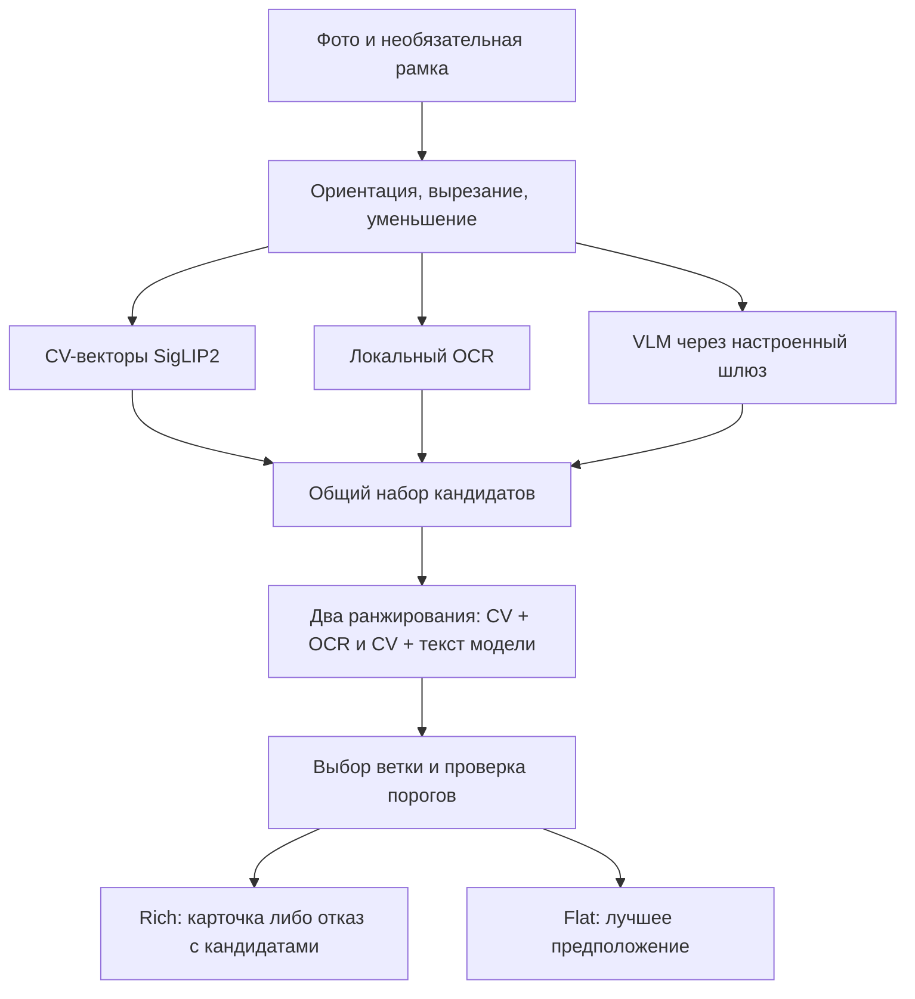

# Распознавание одной бутылки

Актуализация: 28.09.2026. Это основной сканер Vinchik; распознавание нескольких полок описано отдельно в [сценарии витрин](product/shelf-sommelier.md).

## Навигация

- [Эксплуатация: конфигурация, запуск, диагностика, выкладка и откат](label-recognition-operations.md).
- [Оценка качества: данные, метрики, воспроизведение и приёмка изменений](label-recognition-evaluation.md).
- [Подробный аудит](../reports/label-recognition-audit-2026-09-28.md) и [результаты исправлений](../reports/label-recognition-improvements-2026-09-28.md).
- [Контракт HTTP](../contracts/image-scan.md), [Docker quick-start](DOCKER_QUICKSTART.md), [архитектура native-серверов](../infra/native/README.md).

## Область действия

Аудит и параметры SigLIP2/OCR/VLM ниже относятся к `IMAGE_PROVIDER=real`, `CV_FUSION=1` — конфигурации двух проверяемых native-серверов. Проект также поддерживает `winescan` (отдельный адаптер, без этой fusion-ветки) и `mock`. Корневой `.env.example` выбирает `winescan`; метрики этого отчёта нельзя автоматически переносить на него. Исправление пользовательского прицела находится в общем HTTP-обработчике.

## Пользовательский путь и API

`POST /v1/scan/photo?flat=0`: multipart `image`, необязательный `box=x1,y1,x2,y2` в долях **ориентированного** кадра. Поиск использует SigLIP2, визуальный индекс каталога, RapidOCR и при настройке шлюза — VLM через LiteLLM. Ответ содержит одну подтверждённую карточку либо кандидатов для уточнения. `not_in_catalog=true` включает недостаточную уверенность: это не доказательство, что в каталоге вообще нет такого вина.

С пользовательским прицелом порядок обработки: EXIF-ориентация → вырезание из оригинала → уменьшение выбранной области до 1024 px по большей стороне. Без прицела уменьшается весь кадр. Например, рамка 20%×20% на 4000×3000 теперь сохраняет 800×600 вместо 205×153. Это сохранение разрешения, а не обещание определённого прироста accuracy.

`/v1/eval/predict` и `flat=1` сохраняют контракт лучшего предположения: низкая уверенность не обязательно обнуляет slug. Даже ошибка может дать HTTP 200 с пустым slug. Для проверки работоспособности используйте **rich**-запрос с известным ожидаемым вином, а не только статус HTTP.

## Кэш и эксплуатация

Кэш эмбеддингов — ускорение, не обязательная зависимость инференса. Повреждённая/недоступная запись считается промахом кэша; вектор пересчитывается. Запись происходит через отдельный временный файл и атомарную замену. Удалённый каталог создаётся заново; невозможность записи не отменяет готовый ответ.

| Настройка | Значение / назначение |
|---|---|
| `CV_EMBED_CACHE_DIR` | Явный путь к кэшу; не размещать внутри каталога релиза |
| Без явного пути | `$XDG_CACHE_HOME/vinchik/embeddings`, иначе `~/.cache/vinchik/embeddings` |
| Docker full | `/cache/cv` в постоянном томе `api_cache` |
| `CV_FUSION_NAME_GUARD` | По умолчанию `0`; экспериментальная проверка противоречащего названия |
| `RELEASE_SCAN_SMOKE_SLUG` | Ожидаемый slug контрольного эталона; по умолчанию `chateau-tamagne-nature-vert` |
| `RELEASE_SCAN_SMOKE_IMAGE` | Путь к эталону; по умолчанию `$CASE_DATA_DIR/thumbs/<slug>.webp` |

Новая версия ключа кэша учитывает форму и dtype изображения, схему обработки и версию Transformers; имя модели входит в имя файла. Старые записи не переиспользуются. Индекс каталога из-за этой правки пересобирать не требуется. Первые новые запросы считают эмбеддинги заново — не сравнивайте их время с повторными кэшированными фото.

## Проверка названия и диагностика

VLM-поля `winery`, `name`, `grapes`, `color`, `sugar`, `vintage` сохраняются отдельно от строки для ранжирования. Экспериментальный name guard может отклонить карточку, когда винодельня подтверждена, прочитано другое отличительное название, это название подтверждает независимый OCR, а название кандидата OCR не подтверждает. Пустой текст, один сорт винограда, общие слова и неизвестный алиас винодельни сами по себе не являются доказательством ошибки.

Guard не вызывает дополнительную LLM, не подменяет кандидата и не снижает floor. В режиме `0` конфликт записывается в лог без изменения ответа; при `1` rich предлагает уточнение, flat сохраняет лучшее предположение. Эта эвристика не заменяет полноценное сопоставление SKU/линейки/версии этикетки. Включать в production следует только по результатам приёмки, отдельно контролируя новые пропуски.

- `cv_fusion_sources: models=...` показывает наличие текста, пустого ответа или ошибки/дедлайна источника.
- `cv_fusion: ... chosen=local|model` показывает выбор ветки.
- `cv_identity: name_conflict=True applied=...` показывает срабатывание проверки имени.
- При `SCAN_ARCHIVE_DIR` архив содержит `model_label_fields` и `identity_rejection`; в публичный JSON эти внутренние поля не добавляются.

`source=ocr` не означает сбой LiteLLM: локальная ветка могла быть выбрана при успешно ответившей VLM. `matches[].score` может превышать 1; `confidence.top1_score` — визуальное сходство, а не вероятность правильного ответа. Пользовательский интерфейс не должен переводить их в «процент уверенности».

## Выкладка и тесты

Код выкладывается из зафиксированной Git-ревизии через `infra/ams3/push-release.sh`. В обычной выкладке API перезапускается. `SKIP_API_RESTART=1` разрешён только при неизменном runtime: обновляется веб, дерево работающего `app` сохраняется вместе с файлами процесса. При неудачной публикации веб откатывается, отметка коммита не меняется.

`infra/ams3/check-release.py` проверяет health/OpenAPI, реальный rich-скан эталона с ожидаемым slug, отказ на пустом изображении и готовность настроенной витрины. Отсутствие эталона или пустой/неправильный ответ блокируют активацию реального провайдера. Это smoke-проверка доступности, не оценка качества всего каталога.

```bash
# Из apps/api, как в CI: относительные пути данных рассчитаны на этот cwd.
cd apps/api
uv sync --frozen --all-extras --dev
uv run pytest tests -q
uv run pytest ../../packages/cv/tests/test_encoder.py ../../packages/cv/tests/test_identity.py -q
uv run pytest ../../infra/ams3/tests -q
```

[Исходный аудит](../reports/label-recognition-audit-2026-09-28.md) содержит 119 фото и исходные метрики. [Результаты доработки](../reports/label-recognition-improvements-2026-09-28.md) отделяют повторную оценку от прежнего результата и от состояния production. Фотографии, индексы и ключи хранятся вне Git; инструменты, обезличенные предсказания и SHA256 разметки — в репозитории.


## Последовательность вычислений

Описание относится к fusion-ветке провайдера `real`. Точный порядок задают [`run_photo_scan` и `_run_photo_scan_fusion`](../apps/api/app/cv/service.py), а не исторические результаты в комментариях.



1. HTTP-обработчик читает multipart-файл, проверяет размер и пользовательскую рамку. `box` задан относительно кадра после EXIF-ориентации. Общая обработка передаёт выбранную область движку; это не endpoint для выдачи всех бутылок на полке.
2. Fusion запускает получение визуальных векторов, локального OCR и настроенных модельных чтений. У модельного чтения есть дедлайн и отдельный circuit breaker. Если модель не дала пригодного текста, остаётся локальная ветка. Наличие удалённой GPU за LiteLLM не отменяет локальные вычисления CV/OCR.
3. Визуальный поиск дополняется текстовыми кандидатами: CV top-50 и до 30 текстовых кандидатов от каждого из модельного и локального текстов, с удалением повторов. Для текстовых кандидатов используется фильтрованный визуальный поиск. Это больше пяти карточек, возвращаемых клиенту.
4. На общих векторах и общем множестве кандидатов рассчитываются два результата: `local` с OCR и `model` с разрешённым модельным текстом. При `CV_FUSION_MERGE_MODEL_TEXT=1` в модельный текст добавляется OCR. Если модель не ответила, модельная ветка тоже может использовать OCR.
5. Базовая формула ранга — визуальное сходство плюс `W × относительный текстовый сигнал`; влияют также поправки на винодельню и цвет. Относительный текстовый максимум среди плохих кандидатов сам по себе не доказывает присутствие правильного вина в базе.
6. Выбирается ветка. При проверенном `confident_else_cv` берётся уверенный модельный результат, иначе локальный; это не сравнение двух калиброванных вероятностей. `merge` выбирает модельную ветку; `max_score` сравнивает итоговые баллы. Остальные режимы описаны непосредственно в `_choose_fusion_result`.
7. Для показа карточки проверяются визуальный floor и отрыв от следующей **другой семьи**. Опциональная near-dup OCR-проверка может снять ограничение по отрыву, но не по визуальному floor. Семейство визуально близких этикеток не равно точному SKU.
8. Вето «не бутылка» требует явного сигнала модели и ограничено визуальным потолком. Оно может убрать и flat-best-guess. Экспериментальный конфликт названия действует иначе: убирает только принятую rich-карточку, сохраняя лучшее предположение. В штатном режиме этот эксперимент выключен.
9. API собирает ответ и, если разрешено, сохраняет диагностический архив rich-запроса.

Число top-5 в публичном ответе не означает, что поиск проводился только среди пяти заранее выбранных вин. При отсутствии правильного эталона, неправильном чтении названия или иной версии этикетки правильный SKU может не попасть даже в расширенный набор.

## HTTP-контракт на практике

Примеры запускаются с локальным файлом изображения; адрес заменяется на нужный API. Для native-стенда запрос проходит через nginx, для Docker — через опубликованный порт из quick-start.

```bash
curl --fail-with-body -sS \
  -F 'image=@/path/to/label.jpg' \
  'http://127.0.0.1:8000/v1/scan/photo?flat=0'

curl --fail-with-body -sS \
  -F 'image=@/path/to/label.jpg' -F 'box=0.2,0.2,0.8,0.9' \
  'http://127.0.0.1:8000/v1/scan/photo?flat=0'

curl -sS -F 'image=@/path/to/label.jpg' \
  'http://127.0.0.1:8000/v1/eval/predict'
```

| Поле rich-ответа | Как читать |
|---|---|
| `slug`, `card` | Принятое решение и карточка; при отказе карточка не подтверждена |
| `not_in_catalog` | Решение не показывать уверенное совпадение; включает недостаточную уверенность |
| `matches` | Ранжированные кандидаты для оценки; в fusion балл смешивает CV и текст |
| `candidates` | Кандидаты с данными карточек для уточнения пользователем |
| `confidence.top1_score` | Визуальная составляющая, не процент вероятности |
| `confidence.gap` | Отрыв; интерпретация зависит от ветки и группировки семейств |
| `ocr_verified` | Результат предусмотренной OCR-верификации, не факт любого использования OCR |
| `timing_ms` | Внутреннее время обработки; не равно полной HTTP-задержке клиента |
| `similar`, `analogs` | Дополнительные варианты; не подтверждение совпадения исходной этикетки |

Явный `flat=0/1` важнее `SCAN_FLAT_DEFAULT`. Без параметра формат зависит от окружения — тесты качества должны указывать его явно. Flat возвращает объект вида `{"slug":"..."}`; отсутствие уверенности и техническая ошибка имеют разную природу, но flat может скрыть ошибку за пустым slug. Проверки доступности всегда выполняются через rich.

Неверная рамка в rich даёт HTTP 400, во flat игнорируется. Пустой или слишком большой файл в rich отклоняется; стандартный лимит API `SCAN_MAX_UPLOAD_BYTES=26214400` (25 MiB). У внешнего прокси могут быть собственные ограничения. HTTP 429/502 или HTML-ответ прокси нельзя считать корректным отказом модели: это техническая ошибка, которую нужно учитывать отдельно.

## Карта исходников

| Файл | Ответственность |
|---|---|
| [`apps/api/app/routers/scan.py`](../apps/api/app/routers/scan.py) | Multipart, рамка, rich/flat, архивирование |
| [`apps/api/app/config.py`](../apps/api/app/config.py) | Настройки API, fusion, VLM и дедлайны |
| [`apps/api/app/cv/service.py`](../apps/api/app/cv/service.py) | Оркестрация веток, выбор ответа, окончательные отказы |
| [`apps/api/app/cv/vision_llm.py`](../apps/api/app/cv/vision_llm.py) | Запрос изображения к VLM, разбор полей, `LabelText` |
| [`packages/cv/cv/encoder.py`](../packages/cv/cv/encoder.py) | SigLIP2 и необязательный дисковый кэш |
| [`packages/cv/cv/index.py`](../packages/cv/cv/index.py) | Визуальный индекс и поиск кандидатов |
| [`packages/cv/cv/text_fusion.py`](../packages/cv/cv/text_fusion.py) | Текстовый индекс, смешивание баллов, семьи |
| [`packages/cv/cv/identity.py`](../packages/cv/cv/identity.py) | Экспериментальная проверка конфликта имени |
| [`apps/api/app/cv/archive.py`](../apps/api/app/cv/archive.py) | Диагностические изображения и JSON sidecar |
| [`infra/ams3/check-release.py`](../infra/ams3/check-release.py) | Проверка реального инференса перед публикацией |

## Почему проверка названия пока выключена

`LabelText` совместим со строковыми потребителями ранжирования, но сохраняет отдельные поля VLM. Проверка конфликта требует подтверждённой винодельни, разных отличительных названий и подтверждения альтернативного названия независимым OCR. Смешанные ответы двух моделей не получают автоматического структурированного консенсуса.

Это оказалось недостаточно: на C32 VLM назвала вино `CAMAPA`, а OCR действительно прочитал ту же надпись. Оба источника подтвердили наличие текста «Самара», но не его роль — географическая надпись была принята за название. В результате правильная карточка «Курмыши» отклонялась. Эксперимент дал 60 вместо 61 верного принятого результата и не убрал шесть ложных совпадений. Поэтому `CV_FUSION_NAME_GUARD=0` — осознанное решение по измерению, а не незавершённая настройка.

Для повторного включения нужна новая проверка семантической роли названия/серии и отдельная приёмка на ранее не использованных кадрах. Простое исключение слова «Самара» под один контрольный пример не будет доказательством общего улучшения.
